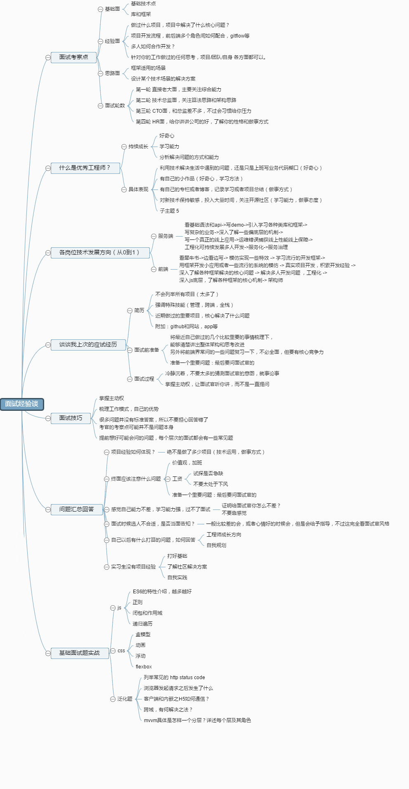

# 基础篇

> 前端基础题型，快速过一遍即可



## 一、HTML、HTTP、WEB综合问题

### 1 前端需要注意哪些SEO

* 合理的`title`、`description`、`keywords`：搜索引擎对这些标签的权重逐渐减小。在`title`中，强调重点即可，重要关键词不要超过2次，并且要靠前。每个页面的`title`应该有所不同。`description`应该高度概括页面内容，长度适当，避免过度堆砌关键词。每个页面的`description`也应该有所不同。`keywords`标签应列举出重要关键词即可。
  * 针对`title`标签，可以使用重要关键词、品牌词或描述页面内容的短语。确保标题简洁、准确地概括页面的主题，并吸引用户点击。
  * 在编写`description`标签时，应尽量使用简洁、具有吸引力的语句来概括页面的内容，吸引用户点击搜索结果。避免堆砌关键词，以自然流畅的方式描述页面
  * `keywords`标签已经不再是搜索引擎排名的重要因素，但仍然可以列举出与页面内容相关的几个重要关键词，以便搜索引擎了解页面的主题。
* 语义化的`HTML`代码，符合W3C规范：使用语义化的HTML代码可以让搜索引擎更容易理解网页的结构和内容。遵循W3C规范可以提高网页的可读性和可访问性，对SEO也有好处。
* 重要内容`HTML`代码放在最前：搜索引擎抓取HTML的顺序是从上到下，有些搜索引擎对抓取长度有限制。因此，将重要的内容放在`HTML`的前面，确保重要内容一定会被抓取。
* 重要内容不要用`js`输出：爬虫不会执行`JavaScript`，所以重要的内容不应该依赖于通过`JavaScript`动态生成。确保重要内容在`HTML`中静态存在。
* 少用`iframe`：搜索引擎通常不会抓取`iframe`中的内容，因此应该尽量减少`iframe`的使用，特别是对于重要的内容。
* 非装饰性图片必须加`alt`：为非装饰性图片添加`alt`属性，可以为搜索引擎提供关于图片内容的描述，同时也有助于可访问性。
* 提高网站速度：网站速度是搜索引擎排序的一个重要指标

### 2 ``的`title`和`alt`有什么区别

* `title`属性：`title`属性是HTML元素通用的属性，适用于各种元素，不仅仅是``标签。当鼠标滑动到元素上时，浏览器会显示`title`属性的内容，提供额外的信息或解释，帮助用户了解元素的用途或含义。对于``标签，鼠标悬停在图片上时会显示`title`属性的内容。

* `alt`属性：`alt`属性是``标签的特有属性，用于提供图片的替代文本描述。当图片无法加载时，浏览器会显示`alt`属性的内容，或者在可访问性场景中，读屏器会读取`alt`属性的内容。`alt`属性的主要目的是提高图片的可访问性，使无法查看图片的用户也能了解图片的内容或含义。除了纯装饰性图片外，所有``标签都应该设置有意义的`alt`属性值。

* **补充答案：**

  * `title`属性主要用于提供额外的信息或提示，是对图片的补充描述，可以用于提供更详细的说明，如图片的来源、作者、相关信息等。它不是必需的，但可以增强用户体验，特别是在需要显示更多信息时。
  * `alt`属性是图片内容的等价描述，应该简洁明了地描述图片所表达的信息。它对于可访问性至关重要，确保无障碍用户能够理解图片的含义，同时也是搜索引擎重点分析的内容。在设置`alt`属性时，应该避免过度堆砌关键词，而是提供准确、有意义的描述。

### 3 HTTP的几种请求方法用途

* `GET`方法：
  * 用途：发送一个请求来获取服务器上的某一资源。
  * 面试可能涉及的问题：
        1. GET方法的特点是什么？
            *GET方法是HTTP的一种请求方法，用于从服务器获取资源。
            * 它是一种幂等的方法，多次发送相同的GET请求会返回相同的结果。
        2. GET请求和POST请求的区别是什么？
            *GET请求将参数附加在URL的查询字符串中，而POST请求将参数放在请求体中。
            * GET请求的数据会显示在URL中，而POST请求的数据不会显示在URL中。
            *GET请求一般用于获取数据，而POST请求一般用于提交数据。
        3. GET请求可以有请求体吗？
            * 根据HTTP规范，GET请求不应该有请求体，参数应该通过URL的查询字符串传递。
        4. GET请求的参数如何传递？
            *GET请求的参数可以通过URL的查询字符串传递，例如：`/api/users?id=123&name=poetry`。
        5. GET请求的安全性和幂等性如何保证？
            * GET请求不会对服务器端的资源产生副作用，因此被视为安全的。
            * GET请求是幂等的，多次发送相同的GET请求不会对服务器端产生影响。
* `POST`方法：
  * 用途：向`URL`指定的资源提交数据或附加新的数据。
  * 面试可能涉及的问题：
        1. POST方法的特点是什么？
            *POST方法是HTTP的一种请求方法，用于向服务器提交数据。
            * 它不是幂等的，多次发送相同的POST请求可能会产生不同的结果。
        2. POST请求和GET请求的区别是什么？
            *POST请求将参数放在请求体中，而GET请求将参数附加在URL的查询字符串中。
            * POST请求的数据不会显示在URL中，而GET请求的数据会显示在URL中。
            *POST请求一般用于提交数据，而GET请求一般用于获取数据。
        3. POST请求的请求体如何传递数据？
            * POST请求的数据可以通过请求体以表单形式传递，或者以JSON等格式传递。
        4. POST请求的安全性和幂等性如何保证？
            *POST请求可能对服务器端的资源产生副作用，因此被视为不安全的。
            * POST请求不是幂等的，多次发送相同的POST请求可能会对服务器端产生影响。
* PUT方法：
  * 用途：将数据发送给服务器，并将其存储在指定的URL位置。与POST方法不同的是，PUT方法指定了资源在服务器上的位置。
  * 面试可能涉及的问题：
    * PUT方法的特点是什么？
      * PUT方法是HTTP的一种请求方法，用于将数据发送给服务器并存储在指定的URL位置。
      * 它是一种幂等的方法，多次发送相同的PUT请求会对服务器端产生相同的结果。
    * PUT请求和POST请求有什么区别？
      * PUT请求用于指定资源在服务器上的位置，而POST请求没有指定位置。
      * PUT请求一般用于更新或替换资源，而POST请求一般用于新增资源或提交数据。
    * PUT请求的幂等性如何保证？
      * PUT请求的幂等性保证是由服务器端实现的。
      * 服务器端应该根据请求中的资源位置来处理请求，多次发送相同的PUT请求会对该位置上的资源进行相同的更新或替换操作。
* `HEAD`方法
  * 只请求页面的首部
* `DELETE`方法
  * 删除服务器上的某资源
* `OPTIONS`方法
  * 它用于获取当前`URL`所支持的方法。如果请求成功，会有一个`Allow`的头包含类似`“GET,POST”`这样的信息
* `TRACE`方法
  * `TRACE`方法被用于激发一个远程的，应用层的请求消息回路
* `CONNECT`方法
  * 把请求连接转换到透明的`TCP/IP`通道

### 4 从浏览器地址栏输入url到显示页面的步骤

**基础版本**

* 浏览器根据请求的`URL`交给`DNS`域名解析，找到真实`IP`，向服务器发起请求；
* 服务器交给后台处理完成后返回数据，浏览器接收文件（`HTML、JS、CSS`、图象等）；
* 浏览器对加载到的资源（`HTML、JS、CSS`等）进行语法解析，建立相应的内部数据结构（如`HTML`的`DOM`）；
* 载入解析到的资源文件，渲染页面，完成。

**详细版**

1. 在浏览器地址栏输入URL
2. 浏览器查看**缓存**，如果请求资源在缓存中并且新鲜，跳转到转码步骤
    1. 如果资源未缓存，发起新请求
    2. 如果已缓存，检验是否足够新鲜，足够新鲜直接提供给客户端，否则与服务器进行验证。
    3. 检验新鲜通常有两个HTTP头进行控制`Expires`和`Cache-Control`：
        * HTTP1.0提供Expires，值为一个绝对时间表示缓存新鲜日期
        * HTTP1.1增加了Cache-Control: max-age=,值为以秒为单位的最大新鲜时间
3. 浏览器**解析URL**获取协议，主机，端口，path
4. 浏览器**组装一个HTTP（GET）请求报文**
5. 浏览器**获取主机ip地址**，过程如下：
    1. 浏览器缓存
    2. 本机缓存
    3. hosts文件
    4. 路由器缓存
    5. ISP DNS缓存
    6. DNS递归查询（可能存在负载均衡导致每次IP不一样）
6. **打开一个socket与目标IP地址，端口建立TCP链接**，三次握手如下：
    1. 客户端发送一个TCP的**SYN=1，Seq=X**的包到服务器端口
    2. 服务器发回**SYN=1， ACK=X+1， Seq=Y**的响应包
    3. 客户端发送**ACK=Y+1， Seq=Z**
7. TCP链接建立后**发送HTTP请求**
8. 服务器接受请求并解析，将请求转发到服务程序，如虚拟主机使用HTTP Host头部判断请求的服务程序
9. 服务器检查**HTTP请求头是否包含缓存验证信息**如果验证缓存新鲜，返回**304**等对应状态码
10. 处理程序读取完整请求并准备HTTP响应，可能需要查询数据库等操作
11. 服务器将**响应报文通过TCP连接发送回浏览器**
12. 浏览器接收HTTP响应，然后根据情况选择**关闭TCP连接或者保留重用，关闭TCP连接的四次握手如下**：
    1. 主动方发送**Fin=1， Ack=Z， Seq= X**报文
    2. 被动方发送**ACK=X+1， Seq=Z**报文
    3. 被动方发送**Fin=1， ACK=X， Seq=Y**报文
    4. 主动方发送**ACK=Y， Seq=X**报文
13. 浏览器检查响应状态吗：是否为1XX，3XX， 4XX， 5XX，这些情况处理与2XX不同
14. 如果资源可缓存，**进行缓存**
15. 对响应进行**解码**（例如gzip压缩）
16. 根据资源类型决定如何处理（假设资源为HTML文档）
17. **解析HTML文档，构件DOM树，下载资源，构造CSSOM树，执行js脚本**，这些操作没有严格的先后顺序，以下分别解释
18. **构建DOM树**：
    1. **Tokenizing**：根据HTML规范将字符流解析为标记
    2. **Lexing**：词法分析将标记转换为对象并定义属性和规则
    3. **DOM construction**：根据HTML标记关系将对象组成DOM树
19. 解析过程中遇到图片、样式表、js文件，**启动下载**
20. 构建**CSSOM树**：
    1. **Tokenizing**：字符流转换为标记流
    2. **Node**：根据标记创建节点
    3. **CSSOM**：节点创建CSSOM树
21. **[根据DOM树和CSSOM树构建渲染树 (opens new window)](https://developers.google.com/web/fundamentals/performance/critical-rendering-path/render-tree-construction)**:
    1. 从DOM树的根节点遍历所有**可见节点**，不可见节点包括：1）`script`,`meta`这样本身不可见的标签。2)被css隐藏的节点，如`display: none`
    2. 对每一个可见节点，找到恰当的CSSOM规则并应用
    3. 发布可视节点的内容和计算样式
22. **js解析如下**：
    1. 浏览器创建Document对象并解析HTML，将解析到的元素和文本节点添加到文档中，此时**document.readystate为loading**
    2. HTML解析器遇到**没有async和defer的script时**，将他们添加到文档中，然后执行行内或外部脚本。这些脚本会同步执行，并且在脚本下载和执行时解析器会暂停。这样就可以用document.write()把文本插入到输入流中。**同步脚本经常简单定义函数和注册事件处理程序，他们可以遍历和操作script和他们之前的文档内容**
    3. 当解析器遇到设置了**async**属性的script时，开始下载脚本并继续解析文档。脚本会在它**下载完成后尽快执行**，但是**解析器不会停下来等它下载**。异步脚本**禁止使用document.write()**，它们可以访问自己script和之前的文档元素
    4. 当文档完成解析，document.readState变成interactive
    5. 所有**defer**脚本会**按照在文档出现的顺序执行**，延迟脚本**能访问完整文档树**，禁止使用document.write()
    6. 浏览器**在Document对象上触发DOMContentLoaded事件**
    7. 此时文档完全解析完成，浏览器可能还在等待如图片等内容加载，等这些**内容完成载入并且所有异步脚本完成载入和执行**，document.readState变为complete，window触发load事件
23. **显示页面**（HTML解析过程中会逐步显示页面）

**详细简版**

1. 从浏览器接收`url`到开启网络请求线程（这一部分可以展开浏览器的机制以及进程与线程之间的关系）
2. 开启网络线程到发出一个完整的`HTTP`请求（这一部分涉及到dns查询，`TCP/IP`请求，五层因特网协议栈等知识）
3. 从服务器接收到请求到对应后台接收到请求（这一部分可能涉及到负载均衡，安全拦截以及后台内部的处理等等）
4. 后台和前台的`HTTP`交互（这一部分包括`HTTP`头部、响应码、报文结构、`cookie`等知识，可以提下静态资源的`cookie`优化，以及编码解码，如`gzip`压缩等）
5. 单独拎出来的缓存问题，`HTTP`的缓存（这部分包括http缓存头部，`ETag`，`catch-control`等）
6. 浏览器接收到`HTTP`数据包后的解析流程（解析`html`\-词法分析然后解析成`dom`树、解析`css`生成`css`规则树、合并成`render`树，然后`layout`、`painting`渲染、复合图层的合成、`GPU`绘制、外链资源的处理、`loaded`和`DOMContentLoaded`等）
7. `CSS`的可视化格式模型（元素的渲染规则，如包含块，控制框，`BFC`，`IFC`等概念）
8. `JS`引擎解析过程（`JS`的解释阶段，预处理阶段，执行阶段生成执行上下文，`VO`，作用域链、回收机制等等）
9. 其它（可以拓展不同的知识模块，如跨域，web安全，`hybrid`模式等等内容）

### 5 如何进行网站性能优化

* `content`方面
  * 减少`HTTP`请求：合并文件、`CSS`精灵、`inline Image`
  * 减少`DNS`查询：`DNS`缓存、将资源分布到恰当数量的主机名
  * 减少`DOM`元素数量
* `Server`方面
  * 使用`CDN`
  * 配置`ETag`
  * 对组件使用`Gzip`压缩
* `Cookie`方面
  * 减小`cookie`大小
* `css`方面
  * 将样式表放到页面顶部
  * 不使用`CSS`表达式
  * 使用`<link>`不使用`@import`
* `Javascript`方面
  * 将脚本放到页面底部
  * 将`javascript`和`css`从外部引入
  * 压缩`javascript`和`css`
  * 删除不需要的脚本
  * 减少`DOM`访问
* 图片方面
  * 优化图片：根据实际颜色需要选择色深、压缩
  * 优化`css`精灵
  * 不要在`HTML`中拉伸图片

**你有用过哪些前端性能优化的方法？**

* 减少`http`请求次数：`CSS Sprites`, `JS`、`CSS`源码压缩、图片大小控制合适；网页`Gzip`，`CDN`托管，`data`缓存 ，图片服务器。
* 前端模板 JS+数据，减少由于HTML标签导致的带宽浪费，前端用变量保存`AJAX`请求结果，每次操作本地变量，不用请求，减少请求次数
* 用`innerHTML`代替DOM操作，减少DOM操作次数，优化javascript性能。
* 当需要设置的样式很多时设置`className`而不是直接操作`style`
* 少用全局变量、缓存DOM节点查找的结果。减少IO读取操作
* 避免使用`CSS Expression`（css表达式)又称`Dynamic properties`(动态属性)
* 图片预加载，将样式表放在顶部，将脚本放在底部 加上时间戳
* 避免在页面的主体布局中使用`table`，`table`要等其中的内容完全下载之后才会显示出来，显示比`div+css`布局慢

**谈谈性能优化问题**

* 代码层面：避免使用`css`表达式，避免使用高级选择器，通配选择器
* 缓存利用：缓存`Ajax`，使用`CDN`，使用外部`js`和`css`文件以便缓存，添加`Expires`头，服务端配置`Etag`，减少`DNS`查找等
* 请求数量：合并样式和脚本，使用`css`图片精灵，初始首屏之外的图片资源按需加载，静态资源延迟加载
* 请求带宽：压缩文件，开启`GZIP`

**前端性能优化最佳实践？**

* 性能评级工具（`PageSpeed` 或 `YSlow`）
* 合理设置 `HTTP` 缓存：`Expires` 与 `Cache-control`
* 静态资源打包，开启 Gzip 压缩（节省响应流量）
* `CSS3` 模拟图像，图标`base64`（降低请求数）
* 模块延迟(defer)加载/异步(`async`)加载
* `Cookie` 隔离（节省请求流量）
* `localStorage`（本地存储）
* 使用 `CDN` 加速（访问最近服务器）
* 启用 `HTTP/2`（多路复用，并行加载）
* 前端自动化（`gulp/webpack`）

### 6 HTTP状态码及其含义

* `1XX`：信息状态码
  * `100 Continue` 继续，一般在发送`post`请求时，已发送了`http header`之后服务端将返回此信息，表示确认，之后发送具体参数信息
* `2XX`：成功状态码
  * `200 OK` 正常返回信息
  * `201 Created` 请求成功并且服务器创建了新的资源
  * `202 Accepted` 服务器已接受请求，但尚未处理
* `3XX`：重定向
  * `301 Moved Permanently` 请求的网页已永久移动到新位置。
  * `302 Found` 临时性重定向。
  * `303 See Other` 临时性重定向，且总是使用 `GET` 请求新的 `URI`。
  * `304 Not Modified` 自从上次请求后，请求的网页未修改过。
* `4XX`：客户端错误
  * `400 Bad Request` 服务器无法理解请求的格式，客户端不应当尝试再次使用相同的内容发起请求。
  * `401 Unauthorized` 请求未授权。
  * `403 Forbidden` 禁止访问。
  * `404 Not Found` 找不到如何与 `URI` 相匹配的资源。
* `5XX:` 服务器错误
  * `500 Internal Server Error` 最常见的服务器端错误。
  * `503 Service Unavailable` 服务器端暂时无法处理请求（可能是过载或维护）

### 7 语义化的理解

> 语义化是指在编写HTML和CSS代码时，通过恰当的选择标签和属性，使得代码更具有语义性和可读性，使得页面结构和内容更加清晰明了。语义化的目的是让页面具备良好的可访问性、可维护性和可扩展性。

**语义化的重要性体现在以下几个方面：**

1. **可访问性（Accessibility）**：通过使用恰当的标签和属性，可以提高页面的可访问性，使得辅助技术（如屏幕阅读器）能够更好地理解和解析页面内容，使得残障用户能够正常浏览和使用网页。
2. **搜索引擎优化（SEO）**：搜索引擎更喜欢能够理解和解析的页面内容，语义化的HTML结构可以提高页面在搜索引擎结果中的排名，增加网页的曝光和访问量。
3. **代码可读性和可维护性**：使用语义化的标签和属性，可以让代码更易于阅读和理解，提高代码的可维护性。开发人员可以更快速地定位和修改特定功能或内容。
4. **设备兼容性**：不同设备和平台对于网页的渲染和解析方式有所不同，语义化的代码可以增加网页在各种设备上的兼容性，确保页面在不同环境中的正确显示和使用。

**语义化在前端开发中的具体表现和实践包括以下几个方面：**

1. **选择合适的HTML标签**：在构建页面结构时，选择恰当的HTML标签来描述内容的含义。例如，使用`<header>`表示页面的页眉，`<nav>`表示导航栏，`<article>`表示独立的文章内容等。
2. **使用有意义的标签和属性**：避免滥用`<div>`标签，而是选择更具语义的标签来表达内容的含义。同时，合理使用标签的属性，如`alt`属性用于图像的替代文本，`title`属性用于提供额外的信息等。
3. **结构和层次化**：通过正确嵌套和组织HTML元素，构建清晰的页面结构和层次关系。使用语义化的父子关系，让内容的层级关系更加明确，便于样式和脚本的编写和维护。
4. **文本格式化**：使用合适的标签和属性来标记文本的格式和语义。例如，使用`<strong>`标签表示重要文本，`<em>`标签表示强调文本，`<blockquote>`标签表示引用文本等。
5. **无障碍支持**：考虑到残障用户的需求，使用语义化的标签和属性可以提高页面的可访问性。例如，为表格添加适当的表头和描述信息，为表单元素关联标签等。
6. **CSS选择器的语义化**：在编写CSS样式时，尽量使用具有语义的类名和ID，避免过于依赖元素标签选择器，以增强样式的可读性和可维护性。

通过遵循语义化的原则，我们能够构建出更具有可读性、可访问性和可维护性的前端代码，提高用户体验和开发效率。同时，也能够使网页在不同的环境和设备上保持一致的表现，增强网站的可持续性和可扩展性。

**总结**

* 用正确的标签做正确的事情！
* `HTML`语义化就是让页面的内容结构化，便于对浏览器、搜索引擎解析；
* 在没有样式`CSS`情况下也以一种文档格式显示，并且是容易阅读的。
* 搜索引擎的爬虫依赖于标记来确定上下文和各个关键字的权重，利于 `SEO`。
* 使阅读源代码的人对网站更容易将网站分块，便于阅读维护理解

### 8 介绍一下你对浏览器内核的理解？

浏览器内核是浏览器的核心组成部分，主要分为两个部分：渲染引擎（也称为布局引擎或渲染引擎）和 JavaScript 引擎。

* 渲染引擎：渲染引擎负责解析网页的 HTML、XML、图像等内容，并将其转换为可视化的网页形式展示给用户。它负责处理网页的布局、样式计算、绘制等任务。不同浏览器的内核对网页的解释和渲染方式可能会有差异，因此不同浏览器的渲染效果也会有所不同。常见的渲染引擎包括：
  * `WebKit`：主要用于 Safari 和 Chrome 浏览器。
  * `Gecko`：主要用于 Firefox 浏览器。
  * `Trident`：主要用于旧版本的 Internet Explorer 浏览器。
  * `Blink`：基于 WebKit，用于 Chrome、Opera 和部分 Chromium 浏览器。
* JavaScript 引擎：JavaScript 引擎负责解析和执行网页中的 JavaScript 代码，实现网页的动态交互和功能。不同浏览器的 JavaScript 引擎性能和特性也可能存在差异。常见的 JavaScript 引擎包括：
  * `V8`：用于 Chrome 和 `Opera` 浏览器，具有高性能和快速执行速度。
  * `SpiderMonkey`：用于 `Firefox` 浏览器。
  * `JavaScriptCore`：用于 `Safari` 浏览器。

> * 在早期，渲染引擎和 JavaScript 引擎没有明确的分离，它们在同一个内核中工作。随着时间的推移，JavaScript 引擎逐渐独立出来，使内核更专注于页面渲染和布局方面的任务。
> * 理解浏览器内核对于前端开发人员非常重要，因为不同的内核可能会对网页的解释和渲染产生影响，从而影响页面的布局、样式和交互效果。在开发过程中，需要考虑不同浏览器内核的差异，并进行兼容性测试和优化，以确保网页在不同浏览器上都能正确显示和运行。

### 9 html5有哪些新特性、移除了那些元素？

* `HTML5` 现在已经不是 `SGML` 的子集，主要是关于图像，位置，存储，多任务等功能的增加
  * 新增选择器 `document.querySelector`、`document.querySelectorAll`
  * 拖拽释放(`Drag and drop`) API
  * 媒体播放的 `video` 和 `audio`
  * 本地存储 `localStorage` 和 `sessionStorage`
  * 离线应用 `manifest`
  * 桌面通知 `Notifications`
  * 语意化标签 `article`、`footer`、`header`、`nav`、`section`
  * 增强表单控件 `calendar`、`date`、`time`、`email`、`url`、`search`
  * 地理位置 `Geolocation`
  * 多任务 `webworker`
  * 全双工通信协议 `websocket`
  * 历史管理 `history`
  * 跨域资源共享(CORS) `Access-Control-Allow-Origin`
  * 页面可见性改变事件 `visibilitychange`
  * 跨窗口通信 `PostMessage`
  * `Form Data` 对象
  * 绘画 `canvas`
* 移除的元素：
  * 纯表现的元素：`basefont`、`big`、`center`、`font`、 `s`、`strike`、`tt`、`u`
  * 对可用性产生负面影响的元素：`frame`、`frameset`、`noframes`
* 支持`HTML5`新标签：
  * `IE8/IE7/IE6`支持通过`document.createElement`方法产生的标签
  * 可以利用这一特性让这些浏览器支持`HTML5`新标签
  * 浏览器支持新标签后，还需要添加标签默认的样式
* 当然也可以直接使用成熟的框架、比如`html5shim`

**如何区分 HTML 和 HTML5**

* `DOCTYPE`声明、新增的结构元素、功能元素

### 10 `HTML5`的离线储存怎么使用，工作原理能不能解释一下？

* 在用户没有与因特网连接时，可以正常访问站点或应用，在用户与因特网连接时，更新用户机器上的缓存文件
* 原理：`HTML5`的离线存储是基于一个新建的`.appcache`文件的缓存机制(不是存储技术)，通过这个文件上的解析清单离线存储资源，这些资源就会像`cookie`一样被存储了下来。之后当网络在处于离线状态下时，浏览器会通过被离线存储的数据进行页面展示
* 如何使用：
  * 页面头部像下面一样加入一个`manifest`的属性；
  * 在`cache.manifest`文件的编写离线存储的资源
  * 在离线状态时，操作`window.applicationCache`进行需求实现

```js
CACHE MANIFEST
#v0.11
CACHE:
js/app.js
css/style.css
NETWORK:
resourse/logo.png
FALLBACK:
/offline.html
```

### 11 浏览器是怎么对`HTML5`的离线储存资源进行管理和加载的呢

* 在线的情况下，浏览器发现`html`头部有`manifest`属性，它会请求`manifest`文件，如果是第一次访问`app`，那么浏览器就会根据manifest文件的内容下载相应的资源并且进行离线存储。如果已经访问过`app`并且资源已经离线存储了，那么浏览器就会使用离线的资源加载页面，然后浏览器会对比新的`manifest`文件与旧的`manifest`文件，如果文件没有发生改变，就不做任何操作，如果文件改变了，那么就会重新下载文件中的资源并进行离线存储。
* 离线的情况下，浏览器就直接使用离线存储的资源。

### 12 请描述一下 `cookies`，`sessionStorage` 和 `localStorage` 的区别？

> `cookies`、`sessionStorage` 和 `localStorage` 都是在 Web 开发中用于在客户端存储数据的技术，但它们在以下方面存在区别：

**存储容量**

* `cookies`：通常存储容量较小，一般限制在4KB左右。
* `sessionStorage`：存储容量比 `cookies` 大，不同浏览器的限制有所不同，但一般可以存储5MB或更多的数据。
* `localStorage`：存储容量也较大，通常和 `sessionStorage` 相近，能满足大多数 Web 应用的存储需求。

**数据有效期**

* `cookies`：可以设置过期时间，若不设置，默认在浏览器关闭时失效。如果设置了过期时间，那么在过期时间之前，`cookies` 会一直存在于客户端，即使浏览器关闭后重新打开也依然有效。
* `sessionStorage`：数据仅在当前会话期间有效，当浏览器窗口关闭时，`sessionStorage` 中的数据会被自动清除。
* `localStorage`：数据没有自动过期时间，除非主动删除，否则数据会一直保存在客户端，即使浏览器关闭、电脑重启，数据依然存在。

**作用域**

* `cookies`：在同域名下的不同页面之间可以共享，但如果设置了 `Path` 属性，那么只有在指定路径下的页面才能访问该 `cookie`。此外，`cookies` 还可以通过设置 `Domain` 属性在不同子域名之间共享。
* `sessionStorage`：具有严格的页面级作用域，即只有在同一个浏览器窗口（或标签页）中打开的页面才能共享 `sessionStorage` 中的数据。不同浏览器窗口或标签页之间无法访问彼此的 `sessionStorage` 数据，即使它们来自同一个域名。
* `localStorage`：在同域名下的所有页面都可以共享 `localStorage` 中的数据，只要是在同一个浏览器中访问该域名，无论在哪个页面存储的数据，其他页面都可以读取和修改。

**与服务器的交互**

* `cookies`：每次向服务器发送请求时，浏览器会自动将同域名下的 `cookies` 发送到服务器，这可能会增加不必要的网络传输开销，尤其是当 `cookies` 数据量较大时。
* `sessionStorage` 和 `localStorage`：数据仅存储在客户端，不会自动发送到服务器。如果需要与服务器进行数据交互，需要通过 Ajax 等方式手动将数据发送到服务器。

**应用场景**

* `cookies`：常用于存储用户登录状态、购物车信息、用户偏好设置等。由于其会在每次请求时发送到服务器，所以也可以用于在客户端和服务器之间传递一些少量的必要信息。
* `sessionStorage`：适合存储一些临时数据，例如在一个多步骤的表单填写过程中，存储用户在当前页面填写的数据，当用户完成整个流程或关闭页面时，这些数据就不再需要了。
* `localStorage`：用于长期存储用户相关的数据，如用户的配置信息、离线缓存数据等。例如，一个 Web 应用可以将一些常用的静态资源存储在 `localStorage` 中，以便在离线状态下仍然能够访问应用的部分功能。

### 13 iframe有那些缺点？

`iframe`是一种在网页中嵌入其他网页或文档的标签，虽然它在某些情况下可以提供一些便利，但也存在一些缺点需要考虑：

* 阻塞主页面的 `onload` 事件：当页面中存在 `iframe` 时，`iframe` 的加载会阻塞主页面的 `onload` 事件触发。这可能会导致页面加载速度变慢，影响用户体验。
* 不利于 `SEO`：搜索引擎的爬虫程序通常不能很好地解读 `iframe` 内部的内容。因此，如果重要的页面内容被放置在 `iframe` 中，搜索引擎可能无法正确地索引和收录这些内容，从而影响网页的搜索引擎优化（SEO）。
* 连接限制和并行加载：`iframe` 和主页面共享连接池，而大多数浏览器对相同域的连接数有限制。这意味着当页面中包含多个 `iframe` 时，浏览器需要同时处理这些连接，可能会影响页面的并行加载能力，导致页面加载速度变慢。

**为了避免以上问题，可以考虑以下解决方案：**

* 尽量避免使用 `iframe`，特别是在主要内容部分。
* 如果必须使用 `iframe`，可以通过 `JavaScript` 动态地给 `iframe` 添加 `src` 属性值，而不是在静态 `HTML` 中指定。这样可以绕开阻塞主页面的 `onload` 事件。 对于需要被搜索引擎索引的重要内容，避免将其放置在 `iframe` 中。
* 考虑使用其他替代方案，如 `AJAX` 加载内容或使用现代的前端框架来实现类似的效果。
* 总之，`iframe` 在某些场景下可以提供方便，但在使用时需要注意其缺点，并根据具体情况进行权衡和选择。

### 14 WEB标准以及W3C标准是什么?

WEB标准是指由万维网联盟（World Wide Web Consortium，简称W3C）制定的一系列技术规范和指南，旨在确保网页在不同的浏览器和设备上具有一致的表现和行为。这些标准涵盖了HTML、CSS、JavaScript等前端技术，并规定了它们的语法、结构、样式以及交互行为等方面的规范。

W3C标准是由W3C组织制定和推广的一系列技术标准，旨在推动网络技术的发展和互操作性。W3C是一个国际性的标准化组织，由互联网行业的各大公司、研究机构和个人组成，致力于制定并推广互联网的开放标准。W3C标准包括HTML、CSS、XML、DOM、SVG等多个技术领域，并且不断更新和演进，以适应新的需求和技术发展。

**具体来说，WEB标准和W3C标准强调以下几个方面：**

* **标签闭合**：HTML标签必须按照规定的格式正确闭合，以确保页面结构的准确性和一致性。
* **标签小写**：HTML标签和属性应该使用小写字母，以避免浏览器解析错误。
* **不乱嵌套**：HTML标签应该按照正确的嵌套规则进行使用，不应该出现乱七八糟的嵌套结构，以确保页面结构的清晰和可维护性。
* **使用外链CSS和JS**：将CSS样式和JavaScript代码尽可能地放在外部文件中，并通过链接的方式引入，以实现结构、行为和表现的分离，提高代码的可重用性和可维护性。

通过遵循这些标准和规范，开发人员可以编写出更加规范、可靠和跨平台的网页，确保网页在不同的浏览器和设备上得到一致的显示和行为，提供更好的用户体验。此外，遵循WEB标准和W3C标准还有助于网页的可访问性、可维护性和可扩展性，同时推动互联网技术的进步和发展。

### 15 xhtml和html有什么区别?

* 一个是功能上的差别
  * 主要是`XHTML`可兼容各大浏览器、手机以及`PDA`，并且浏览器也能快速正确地编译网页
* 另外是书写习惯的差别
  * `XHTML` 元素必须被正确地嵌套，闭合，区分大小写，文档必须拥有根元素

### 16 Doctype作用? 严格模式与混杂模式如何区分？它们有何意义?

* `DOCTYPE`（文档类型声明）的作用是告知浏览器的解析器使用哪种`HTML`或`XHTML`规范来解析文档。
* 严格模式（标准模式）是指浏览器按照`HTML`或`XHTML`的规范严格解析和渲染页面，以确保页面在不同浏览器中具有一致的展示效果和行为。在严格模式下，浏览器会按照规范要求的方式处理`HTML`和`CSS`代码。
* 混杂模式（怪异模式或兼容模式）是指浏览器使用较宽松的解析方式来渲染页面，以模拟旧式浏览器的行为，以保证旧版网站的兼容性。在混杂模式下，浏览器可能会容忍一些不符合规范的`HTML`和CSS\`代码，导致页面展示和行为在不同浏览器中有差异。
* 通过`DOCTYPE`声明的类型来区分严格模式和混杂模式。当`DOCTYPE`声明为严格的`HTML`或`XHTML`规范时，浏览器会进入严格模式；当`DOCTYPE`声明缺失或格式不正确时，浏览器会进入混杂模式。
* 严格模式和混杂模式的意义在于确保页面在不同浏览器中的一致性和兼容性。严格模式使开发者能够使用更规范的`HTML`和`CSS`代码，减少兼容性问题，提高网页的可靠性和可维护性。混杂模式则用于支持旧版网站，以确保这些网站在新版浏览器中能够正确显示和运行。

### 17 行内元素有哪些？块级元素有哪些？ 空(void)元素有那些？行内元素和块级元素有什么区别？

* 行内元素有：`a` `b` `span` `img` `input` `select` `strong`等。
* 块级元素有：`div` `ul` `ol` `li` `dl` `dt` `dd` `h1` `h2` `h3` `h4`等标题标签、`p` 段落标签等。
* 空元素（void元素）是指没有内容的HTML元素。常见的空元素包括：`<br>` 换行元素、`<hr>` 水平线元素、`` 图片元素、`<input>` 输入框元素、`<link>` 样式表引用元素、`<meta>` 元数据元素等。
* 行内元素不可以设置宽高，不独占一行，它们会按照从左到右的顺序排列，并尽可能占据内容所需的空间。
* 块级元素可以设置宽高，独占一行，会自动换行。块级元素会在页面上以独立的块形式展现，并占据其父元素的整个宽度。

请注意，这是以Markdown源文件格式输出的回答，不会解析Markdown内容。

### 18 HTML全局属性(global attribute)有哪些

* `class`:为元素设置类标识
* `data-*`: 为元素增加自定义属性
* `draggable`: 设置元素是否可拖拽
* `id`: 元素`id`，文档内唯一
* `lang`: 元素内容的的语言
* `style`: 行内`css`样式
* `title`: 元素相关的建议信息

### 19 Canvas和SVG有什么区别？

> * `svg`绘制出来的每一个图形的元素都是独立的`DOM`节点，能够方便的绑定事件或用来修改。`canvas`输出的是一整幅画布
> * `svg`输出的图形是矢量图形，后期可以修改参数来自由放大缩小，不会失真和锯齿。而`canvas`输出标量画布，就像一张图片一样，放大会失真或者锯齿

你对Canvas和SVG的区别的描述是正确的。以下是对Canvas和SVG的更详细解释：

**Canvas：**

* Canvas 是一个HTML5元素，用于在网页上绘制图形、动画和图像。
* 通过使用JavaScript绘制图形，Canvas提供了一个像素级的绘图环境。
* Canvas 绘制的是位图，它是由一系列的像素组成的，所以在放大时会出现像素失真或锯齿效应。
* Canvas 不会保留绘图的对象，绘制完成后，图形将被保存为一张图片。
* 由于绘制是基于像素的，Canvas 更适合处理像素级的图像处理、游戏开发等场景。
* Canvas 不支持事件绑定，需要通过监听鼠标、键盘等事件来实现交互。

**SVG：**

* SVG 是一种基于XML的矢量图形格式，用于在网页上绘制图形和图像。
* SVG 使用XML描述图形，它由一系列的矢量对象组成，可以方便地修改和操作。
* SVG 绘制的是矢量图形，它基于数学描述，可以自由缩放和变换而不会失真或产生锯齿效应。
* SVG 保留了绘图的对象，可以对其进行修改、删除和动态操作。
* 由于是矢量图形，SVG 更适合处理图表、数据可视化和可缩放的图形场景。
* SVG 支持事件绑定，可以方便地为图形元素添加交互行为。

> 综上所述，Canvas适用于像素级绘图和动画，而SVG适用于矢量图形和可缩放的图像。选择使用Canvas还是SVG取决于具体的需求和场景。

### 20 HTML5 为什么只需要写 `<!DOCTYPE HTML>`

> * `HTML5` 不基于 `SGML`，因此不需要对`DTD`进行引用，但是需要`doctype`来规范浏览器的行为
> * 而`HTML4.01`基于`SGML`,所以需要对`DTD`进行引用，才能告知浏览器文档所使用的文档类型

下面是对此进行更详细的解释：

* 在 HTML5 中，不再基于 SGML（Standard Generalized Markup Language）标准，而是定义了自己的独立规范。由于不再使用 SGML，因此不需要引用外部的 DTD（文档类型定义）来验证文档的结构和规则。
* 因此，HTML5 只需要简单地使用 `<!DOCTYPE HTML>` 声明，它是一个标准模式的声明，告诉浏览器当前文档遵循的是 HTML5 规范。这样，浏览器就可以根据 HTML5 规范来解析和渲染文档，而无需引用外部的 DTD。
* 相比之下，HTML4.01 基于 SGML 标准，需要通过 `<!DOCTYPE>` 声明来指定所使用的 DTD，例如 `<!DOCTYPE HTML PUBLIC "-//W3C//DTD HTML 4.01//EN" "http://www.w3.org/TR/html4/strict.dtd">`。这个 DTD 提供了规范的文档结构和规则，以确保浏览器正确解析和显示文档。
* HTML5 的简化 `<!DOCTYPE HTML>` 声明的设计，使得创建和编写 HTML 文档更加简单和直观。此外，这也有助于提高浏览器的兼容性，因为所有的浏览器都会将文档解析为 HTML5，无需根据 DTD 进行选择和适配。
* 总结起来，HTML5 不再依赖 SGML，因此不需要引用外部 DTD，只需使用简单的 `<!DOCTYPE HTML>` 声明来指定文档类型，规范浏览器的行为。

### 21 如何在页面上实现一个圆形的可点击区域？

有几种方法可以实现一个圆形的可点击区域：

1. 使用 SVG（可缩放矢量图形）：可以使用 SVG 元素 `<circle>` 创建一个圆形，并通过添加事件监听器实现点击功能。

```js
<svg>
  <circle cx="50" cy="50" r="50" onclick="handleClick()"></circle>
</svg>
```

2. 使用 CSS `border-radius`：通过设置一个具有相等宽度和高度的元素，并将 border-radius 属性设置为 50% 可以创建一个圆形区域

```js
<div class="circle" onclick="handleClick()"></div>
```

```js
.circle {
  width: 100px;
  height: 100px;
  border-radius: 50%;
}
```

3. 使用纯 JavaScript 实现：通过计算鼠标点击的坐标与圆心的距离，判断点击位置是否在圆形区域内。

```js
<div id="circle" onclick="handleClick()"></div>
```

```js
#circle {
  width: 100px;
  height: 100px;
  background-color: red;
  border-radius: 50%;
}
```

```js
function handleClick(event) {
  var circle = document.getElementById("circle");
  var circleRect = circle.getBoundingClientRect();
  var circleCenterX = circleRect.left + circleRect.width / 2;
  var circleCenterY = circleRect.top + circleRect.height / 2;
  var clickX = event.clientX;
  var clickY = event.clientY;
  var distance = Math.sqrt(
    Math.pow(clickX - circleCenterX, 2) + Math.pow(clickY - circleCenterY, 2)
  );
  if (distance <= circleRect.width / 2) {
    // 点击在圆形区域内
    // 执行相应操作
  }
}
```

### 22 网页验证码是干嘛的，是为了解决什么安全问题

网页验证码（CAPTCHA）的作用是用于区分用户是计算机还是人的公共全自动程序。它主要解决以下安全问题：

1. **防止恶意破解**：通过要求用户输入验证码，可以防止恶意用户使用自动化程序（如暴力破解工具）对密码、账号进行不断的尝试，提高系统的安全性。
2. **防止刷票和论坛灌水**：验证码可以阻止自动化程序大规模注册账号、刷票或在论坛上进行大量无意义的发帖，保护网站资源免受滥用。

通过要求用户正确地输入验证码，可以验证用户的身份，确保其为真实的人类用户，而不是自动化程序或恶意攻击者。验证码通常会显示一张包含随机字符、数字或图形的图片，用户需要根据图片中的内容进行识别并输入正确的答案。

这样，网页验证码有效地提高了网站和应用程序的安全性，防止了各种恶意行为的发生。

### 23 viewport

```js
 <meta name="viewport" content="width=device-width,initial-scale=1.0,minimum-scale=1.0,maximum-scale=1.0,user-scalable=no" />
  // width    设置viewport宽度，为一个正整数，或字符串‘device-width’
  // device-width  设备宽度
  // height   设置viewport高度，一般设置了宽度，会自动解析出高度，可以不用设置
  // initial-scale    默认缩放比例（初始缩放比例），为一个数字，可以带小数
  // minimum-scale    允许用户最小缩放比例，为一个数字，可以带小数
  // maximum-scale    允许用户最大缩放比例，为一个数字，可以带小数
  // user-scalable    是否允许手动缩放
```

* 延伸提问
  * 怎样处理 移动端 `1px` 被 渲染成 `2px`问题？

**局部处理**

* `meta`标签中的 `viewport`属性 ，`initial-scale` 设置为 `1`
* `rem`按照设计稿标准走，外加利用`transform` 的`scale(0.5)` 缩小一倍即可；

**全局处理**

* `mata`标签中的 `viewport`属性 ，`initial-scale` 设置为 `0.5`
* `rem` 按照设计稿标准走即可

### 24 渲染优化

* 禁止使用`iframe`（阻塞父文档`onload`事件）
  * `iframe`会阻塞主页面的`Onload`事件
  * 搜索引擎的检索程序无法解读这种页面，不利于SEO
  * `iframe`和主页面共享连接池，而浏览器对相同域的连接有限制，所以会影响页面的并行加载
  * 使用`iframe`之前需要考虑这两个缺点。如果需要使用`iframe`，最好是通过`javascript`
  * 动态给`iframe`添加`src`属性值，这样可以绕开以上两个问题
* 禁止使用`gif`图片实现`loading`效果（降低`CPU`消耗，提升渲染性能）
* 使用`CSS3`代码代替`JS`动画（尽可能避免重绘重排以及回流）
* 对于一些小图标，可以使用base64位编码，以减少网络请求。但不建议大图使用，比较耗费`CPU`
  * 小图标优势在于
    * 减少`HTTP`请求
    * 避免文件跨域
    * 修改及时生效
* 页面头部的`<style></style>` `<script></script>` 会阻塞页面；（因为 `Renderer`进程中 `JS`线程和渲染线程是互斥的）
* 页面中空的 `href` 和 `src` 会阻塞页面其他资源的加载 (阻塞下载进程)
* 网页`gzip`，`CDN`托管，`data`缓存 ，图片服务器
* 前端模板 JS+数据，减少由于`HTML`标签导致的带宽浪费，前端用变量保存AJAX请求结果，每次操作本地变量，不用请求，减少请求次数
* 用`innerHTML`代替`DOM`操作，减少`DOM`操作次数，优化`javascript`性能
* 当需要设置的样式很多时设置`className`而不是直接操作`style`
* 少用全局变量、缓存`DOM`节点查找的结果。减少`IO`读取操作
* 图片预加载，将样式表放在顶部，将脚本放在底部 加上时间戳
* 对普通的网站有一个统一的思路，就是尽量向前端优化、减少数据库操作、减少磁盘`IO`

### 25 meta viewport相关

```js
<!DOCTYPE html>  <!--H5标准声明，使用 HTML5 doctype，不区分大小写-->
<head lang=”en”> <!--标准的 lang 属性写法-->
<meta charset=’utf-8′>    <!--声明文档使用的字符编码-->
<meta http-equiv=”X-UA-Compatible” content=”IE=edge,chrome=1″/>   <!--优先使用 IE 最新版本和 Chrome-->
<meta name=”description” content=”不超过150个字符”/>       <!--页面描述-->
<meta name=”keywords” content=””/>     <!-- 页面关键词-->
<meta name=”author” content=”name, email@gmail.com”/>    <!--网页作者-->
<meta name=”robots” content=”index,follow”/>      <!--搜索引擎抓取-->
<meta name=”viewport” content=”initial-scale=1, maximum-scale=3, minimum-scale=1, user-scalable=no”> <!--为移动设备添加 viewport-->
<meta name=”apple-mobile-web-app-title” content=”标题”> <!--iOS 设备 begin-->
<meta name=”apple-mobile-web-app-capable” content=”yes”/>  <!--添加到主屏后的标题（iOS 6 新增）
是否启用 WebApp 全屏模式，删除苹果默认的工具栏和菜单栏-->
<meta name=”apple-itunes-app” content=”app-id=myAppStoreID, affiliate-data=myAffiliateData, app-argument=myURL”>
<!--添加智能 App 广告条 Smart App Banner（iOS 6+ Safari）-->
<meta name=”apple-mobile-web-app-status-bar-style” content=”black”/>
<meta name=”format-detection” content=”telphone=no, email=no”/>  <!--设置苹果工具栏颜色-->
<meta name=”renderer” content=”webkit”> <!-- 启用360浏览器的极速模式(webkit)-->
<meta http-equiv=”X-UA-Compatible” content=”IE=edge”>     <!--避免IE使用兼容模式-->
<meta http-equiv=”Cache-Control” content=”no-siteapp” />    <!--不让百度转码-->
<meta name=”HandheldFriendly” content=”true”>     <!--针对手持设备优化，主要是针对一些老的不识别viewport的浏览器，比如黑莓-->
<meta name=”MobileOptimized” content=”320″>   <!--微软的老式浏览器-->
<meta name=”screen-orientation” content=”portrait”>   <!--uc强制竖屏-->
<meta name=”x5-orientation” content=”portrait”>    <!--QQ强制竖屏-->
<meta name=”full-screen” content=”yes”>              <!--UC强制全屏-->
<meta name=”x5-fullscreen” content=”true”>       <!--QQ强制全屏-->
<meta name=”browsermode” content=”application”>   <!--UC应用模式-->
<meta name=”x5-page-mode” content=”app”>   <!-- QQ应用模式-->
<meta name=”msapplication-tap-highlight” content=”no”>    <!--windows phone 点击无高亮
设置页面不缓存-->
<meta http-equiv=”pragma” content=”no-cache”>
<meta http-equiv=”cache-control” content=”no-cache”>
<meta http-equiv=”expires” content=”0″>
```

### 26 你做的页面在哪些流览器测试过？这些浏览器的内核分别是什么?

* `IE` 使用的是 `Trident` 内核。
* `Firefox` 使用的是 `Gecko` 内核。
* `Safari` 使用的是 `WebKit` 内核。
* `Opera` 在过去使用的是 `Presto` 内核，但现在已经改用了与 `Google Chrome` 相同的 `Blink` 内核。
* `Chrome` 使用的是基于 `WebKit` 开发的 `Blink` 内核。

这些浏览器内核的不同决定了它们在渲染网页时的行为和特性支持。在开发和测试网页时，通常需要在不同的浏览器上进行测试，以确保网页在不同内核的浏览器上都能正确显示和运行。

### 27 div+css的布局较table布局有什么优点？

* 改版的时候更方便 只要改`css`文件。
* 页面加载速度更快、结构化清晰、页面显示简洁。
* 表现与结构相分离。
* 易于优化（`seo`）搜索引擎更友好，排名更容易靠前。

### 28 a：img的alt与title有何异同？b：strong与em的异同？

* `alt(alt text)`: 用于为不能显示图像、窗体或`applets`的用户代理（`UA`）提供替代文字。它由`lang`属性指定替代文字的语言。在某些浏览器中，当没有`title`属性时，会将`alt`属性作为工具提示（`tooltip`）显示。
* `title(tool tip)`: 用于为元素提供额外的提示信息，当鼠标悬停在元素上时显示。它提供了一种向用户解释元素用途或提供有关元素的补充信息的方式。

**b：strong与em的异同？**

* `strong`: 是表示文本的重要性或紧急性的标签，通常呈现为加粗的文本样式。它用于强调内容的重要性，可以为内容赋予更大的权重。
* `em`: 是表示文本的强调或重要性的标签，通常呈现为斜体的文本样式。它用于更强烈地强调内容，使其在阅读时更具有突出性，但并不改变内容的含义。

注意：`strong`和`em`都是语义化标签，用于表示文本的语义和重要性，而不仅仅是样式上的改变。

### 29 你能描述一下渐进增强和优雅降级之间的不同吗

* 渐进增强：针对低版本浏览器进行构建页面，保证最基本的功能，然后再针对高级浏览器进行效果、交互等改进和追加功能达到更好的用户体验。
* 优雅降级：一开始就构建完整的功能，然后再针对低版本浏览器进行兼容。

> 区别：优雅降级是从复杂的现状开始，并试图减少用户体验的供给，而渐进增强则是从一个非常基础的，能够起作用的版本开始，并不断扩充，以适应未来环境的需要。降级（功能衰减）意味着往回看；而渐进增强则意味着朝前看，同时保证其根基处于安全地带

### 30 为什么利用多个域名来存储网站资源会更有效？

利用多个域名来存储网站资源可以带来以下好处：

* **CDN缓存更方便**：内容分发网络（CDN）可以更轻松地缓存和分发位于不同域名下的资源，提高资源的访问速度和可用性。
* **突破浏览器并发限制**：大多数浏览器对同一域名下的并发请求数量有限制，通过将资源分布在多个域名下，可以突破这一限制，同时发送更多的并发请求，加快页面加载速度。
* **节约cookie带宽**：浏览器在每个请求中都会携带相应域名下的cookie信息，通过将资源分布在不同的域名下，可以减少对cookie的传输，节约带宽和提高性能。
* **节约主域名的连接数**：浏览器对同一域名下的连接数也有限制，通过将资源请求分散到多个域名下，可以减少对主域名的连接数占用，提高页面的响应速度和并发处理能力。
* **防止不必要的安全问题**：将静态资源与主要网站内容分离到不同的域名下，可以降低恶意攻击者利用资源加载过程中的安全漏洞对主站点进行攻击的风险。

综上所述，通过利用多个域名来存储网站资源，可以提升网站的性能、安全性和用户体验。

### 31 简述一下src与href的区别

`src`和`href`是HTML中两个常见的属性，它们有以下区别：

* `src`属性（source）用于指定要嵌入到当前文档中的外部资源的位置。例如，`<script src="script.js"></script>`用于引入一个外部的JavaScript文件，或者``用于显示一个外部的图像文件。浏览器在解析到带有`src`属性的元素时，会暂停当前文档的加载和解析，去下载并执行或显示指定的资源。
* `href`属性（hypertext reference）用于建立当前文档和引用资源之间的关联。它通常用于链接到其他文档或外部资源，例如`<a href="https://www.example.com">Link</a>`用于创建一个指向外部网页的链接，或者`<link href="styles.css" rel="stylesheet">`用于引入外部的CSS样式表。浏览器在解析到带有`href`属性的元素时，会同时进行当前文档和引用资源的加载和处理，而不会阻塞当前文档的解析。

**总结来说：**

* `src`用于替换当前元素，指向的资源会嵌入到文档中，例如脚本、图像、框架等。
* `href`用于建立文档与引用资源之间的链接，例如链接到其他文档或引入外部样式表。

注意：尽管它们的用途不同，但在实际使用时，需要根据元素的类型和需求正确地选择使用`src`或`href`属性。

### 32 知道的网页制作会用到的图片格式有哪些？

在网页制作中，常用的图片格式包括：

* **JPEG**（Joint Photographic Experts Group）：适用于存储照片和复杂的图像，具有较高的压缩比，但会有一定的图像质量损失。
* **PNG**（Portable Network Graphics）：适用于图标、透明背景的图像以及需要保留较高图像质量的场景。可以选择使用`PNG-8`或`PNG-24`，前者支持最多`256`种颜色，后者支持更多颜色但文件体积更大。
* **GIF**（Graphics Interchange Format）：适用于简单动画和图标，支持透明背景和基本的透明度。
* **SVG**（Scalable Vector Graphics）：矢量图形格式，使用XML描述图形，具有无损缩放和可编辑性。

除了上述常见的图片格式，还有一些新兴的图片格式：

* **WebP**：由Google开发的一种旨在提高图片加载速度的格式，具有较高的压缩率和图像质量，逐渐被主流浏览器支持。
* **APNG**（Animated Portable Network Graphics）：是PNG的位图动画扩展，支持帧动画效果，但浏览器兼容性较差。

请注意，选择合适的图片格式应根据具体需求，如图像内容、透明度要求、动画效果等。新的图片格式如WebP和APNG可以根据项目需求和兼容性考虑是否使用。

### 33 在CSS/JS代码上线之后，开发人员经常会优化性能。从用户刷新网页开始，一次JS请求一般情况下有哪些地方会有缓存处理？

在进行JS请求时，可以在以下几个地方进行缓存处理，以提高性能和减少资源加载时间：

1. **DNS缓存**：浏览器会缓存已解析的域名和对应的IP地址，这样在下次请求同一域名时可以直接使用缓存的IP地址，避免重新进行DNS解析。
2. **CDN缓存**：如果使用了内容分发网络（CDN），CDN会缓存静态资源文件，如CSS和JS文件，以便快速地分发给用户。当用户再次请求同一资源时，可以从CDN缓存中获取，减少向源服务器的请求次数。
3. **浏览器缓存**：浏览器会缓存已请求的静态资源文件，如CSS和JS文件。可以通过设置HTTP响应头中的`Cache-Control`和`Expires`字段来控制浏览器缓存的行为。如果设置了适当的缓存策略，浏览器在下次请求同一资源时可以直接从本地缓存中获取，而不需要再次向服务器请求。
4. **服务器缓存**：服务器可以对动态生成的JS文件进行缓存，以避免重复生成相同的响应。服务器可以通过设置响应头中的`Cache-Control`和`Expires`字段，或者使用缓存代理服务器来进行缓存处理。

需要注意的是，缓存的有效期限和缓存策略的设置需要根据具体的需求和业务场景来确定。合理地利用缓存可以显著提高网页加载速度和用户体验。

### 33 一个页面上有大量的图片（大型电商网站），加载很慢，你有哪些方法优化这些图片的加载，给用户更好的体验

* **使用图像压缩技术**：通过使用图像压缩工具，如PhotoShop、TinyPNG等，将图片文件的大小减小，以减少加载时间。
* **使用适当的图像格式**：根据图像的特性选择合适的图像格式，如JPEG、PNG、WebP等。JPEG适用于照片和复杂图像，而PNG适用于简单的图标和透明图像。WebP是一种现代的图像格式，可以在保持良好质量的同时减小文件大小。
* **图片CDN加速**：使用内容分发网络（CDN）来加速图片的传输，将图片文件缓存到离用户更近的服务器，减少传输时间。
* **图片延迟加载**：采用图片懒加载技术，将页面上不可见区域的图片暂时不加载，当用户滚动页面至可见区域时再进行加载，以减少初始加载时间。
* **使用CSS精灵图**：将多个小图标或背景图片合并为一张大图，并利用CSS的`background-position`来定位显示需要的部分，减少HTTP请求的数量。
* **使用矢量图形**：使用矢量图形（如SVG）代替位图，以减小文件大小并保持清晰度，适用于简单的图形和图标。
* **响应式图片**：针对不同的设备和屏幕尺寸提供适当大小的图片，以避免在小屏幕设备上加载过大的图片。
* **图片懒加载、预加载**：根据用户的浏览行为，提前加载下一页或下一组图片，以提高用户体验和流畅度。
* **图片缓存**：设置适当的缓存策略，让浏览器在首次加载后对图片进行缓存，减少重复加载的次数。

综合应用这些优化技术可以减小图片的加载大小和加载时间，提升网页的加载速度，给用户更好的体验。

### 34 常见排序算法的时间复杂度,空间复杂度

下面是一些常见的排序算法及其时间复杂度和空间复杂度的概述：

1. 冒泡排序（Bubble Sort）：

* 时间复杂度：最好情况下`O(n)`，平均和最坏情况下`O(n^2)`
* 空间复杂度：`O(1)`

2. 插入排序（Insertion Sort）：

* 时间复杂度：最好情况下`O(n)`，平均和最坏情况下`O(n^2)`
* 空间复杂度：`O(1)`

3. 选择排序（Selection Sort）：

* 时间复杂度：最好情况下`O(n^2)`，平均和最坏情况下`O(n^2)`
* 空间复杂度：`O(1)`

4. 快速排序（Quick Sort）：

* 时间复杂度：最好情况下`O(nlogn)`，平均情况下`O(nlogn)`，最坏情况下`O(n^2)`
* 空间复杂度：最好情况下`O(logn)`，平均和最坏情况下`O(n)`

5. 归并排序（Merge Sort）：

* 时间复杂度：最好情况下`O(nlogn)`，平均情况下`O(nlogn)`，最坏情况下`O(nlogn)`
* 空间复杂度：`O(n)`

6. 堆排序（Heap Sort）：

* 时间复杂度：最好情况下`O(nlogn)`，平均情况下`O(nlogn)`，最坏情况下`O(nlogn)`
* 空间复杂度：`O(1)`

7. 希尔排序（Shell Sort）：

* 时间复杂度：取决于所选的间隔序列，最好情况下`O(nlogn)`，平均和最坏情况下根据间隔序列的选择而不同
* 空间复杂度：`O(1)`

8. 计数排序（Counting Sort）：

* 时间复杂度：最好情况下`O(n+k)`，平均和最坏情况下`O(n+k)`
* 空间复杂度：`O(k)`，其中 `k` 是计数范围

9. 桶排序（Bucket Sort）：

* 时间复杂度：最好情况下`O(n+k)`，平均和最坏情况下根据桶的数量和排序算法的选择而不同
* 空间复杂度：`O(n+k)`

10. 基数排序（Radix Sort）：

* 时间复杂度：最好情况下`O(nk)`，平均和最坏情况下`O(nk)`
* 空间复杂度：`O(n+k)`

 

### 35 web开发中会话跟踪的方法有哪些

* **Cookie**: 使用Cookie是最常见的会话跟踪方法之一。服务器在响应中设置一个包含会话ID的Cookie，然后在后续的请求中，浏览器会自动将该Cookie发送回服务器，以标识用户的会话。
* **Session**: 服务器使用会话来跟踪用户的状态。每个会话都会分配一个唯一的会话ID，该ID通常存储在Cookie中或通过URL重写传递给服务器。服务器使用会话ID来关联用户的请求，并在服务器端存储会话数据。
* **URL重写**: 将会话ID作为查询参数添加到URL中，以便在每个请求中传递会话信息。这种方法不需要依赖Cookie，适用于禁用Cookie的情况，但会增加URL的长度并暴露会话信息。
* **隐藏input**: 在表单中添加一个隐藏的input字段，将会话ID作为其值传递给服务器。服务器接收到请求时可以通过解析请求参数获取会话ID，以进行会话跟踪。
* **IP地址**: 使用客户端的IP地址作为会话跟踪的依据。服务器根据不同的IP地址来区分不同的用户，并跟踪他们的会话状态。然而，由于多个用户可能共享相同的IP地址（如在同一局域网内），这种方法可能不准确。

这些方法可以单独或结合使用，根据实际需求和安全考虑选择适当的会话跟踪方法。

### 36 HTTP request报文结构是怎样的

1. 首行是**Request-Line**包括：**请求方法**，**请求URI**，**协议版本**，**CRLF**
2. 首行之后是若干行**请求头**，包括**general-header**，**request-header**或者**entity-header**，每个一行以CRLF结束
3. 请求头和消息实体之间有一个**CRLF分隔**
4. 根据实际请求需要可能包含一个**消息实体** 一个请求报文例子如下：

```js
GET /Protocols/rfc2616/rfc2616-sec5.html HTTP/1.1
Host: www.w3.org
Connection: keep-alive
Cache-Control: max-age=0
Accept: text/html,application/xhtml+xml,application/xml;q=0.9,image/webp,*/*;q=0.8
User-Agent: Mozilla/5.0 (Windows NT 6.1; WOW64) AppleWebKit/537.36 (KHTML, like Gecko) Chrome/35.0.1916.153 Safari/537.36
Referer: https://www.google.com.hk/
Accept-Encoding: gzip,deflate,sdch
Accept-Language: zh-CN,zh;q=0.8,en;q=0.6
Cookie: authorstyle=yes
If-None-Match: "2cc8-3e3073913b100"
If-Modified-Since: Wed, 01 Sep 2004 13:24:52 GMT

name=qiu&age=25
```

### 37 HTTP response报文结构是怎样的

* 首行是状态行包括：**HTTP版本，状态码，状态描述**，后面跟一个CRLF
* 首行之后是**若干行响应头**，包括：**通用头部，响应头部，实体头部**
* 响应头部和响应实体之间用**一个CRLF空行**分隔
* 最后是一个可能的**消息实体**

响应报文例子如下：

```js
HTTP/1.1 200 OK
Date: Tue, 08 Jul 2014 05:28:43 GMT
Server: Apache/2
Last-Modified: Wed, 01 Sep 2004 13:24:52 GMT
ETag: "40d7-3e3073913b100"
Accept-Ranges: bytes
Content-Length: 16599
Cache-Control: max-age=21600
Expires: Tue, 08 Jul 2014 11:28:43 GMT
P3P: policyref="http://www.w3.org/2001/05/P3P/p3p.xml"
Content-Type: text/html; charset=iso-8859-1

{"name": "qiu", "age": 25}
```

### 38 title与h1的区别、b与strong的区别、i与em的区别

* `title`属性用于提供元素的额外信息，通常以工具提示的形式显示。它没有语义化的意义，仅表示一个标题或描述性文本。它在SEO中没有直接影响，但可以提供更好的用户体验和辅助工具提示。
* `<h1>`是HTML中的标题元素，用于表示页面的主标题。它具有层次结构，表示文档的结构和内容。搜索引擎通常会将`<h1>`标签中的文本作为页面的主要标题，并根据其重要性进行权重分配。
* `<b>`是用于粗体显示文本的HTML元素，仅仅表示展示的效果，没有语义上的强调意义。在使用屏幕阅读器等辅助工具阅读网页时，`<b>`不会改变读取方式，仅仅呈现粗体效果。
* `<strong>`是表示文本的强调元素，具有语义化的含义，用于强调重要内容。在屏幕阅读器等辅助工具中，会以更加强调的方式读取`<strong>`标签中的文本，传达给用户更强的语气。
* `<i>`用于将文本显示为斜体，仅表示展示的效果，没有语义上的强调意义。
* `<em>`表示强调的文本，具有语义化的含义，用于强调某些内容。在屏幕阅读器等辅助工具中，会以更加强调的方式读取`<em>`标签中的文本，传达给用户更强的强调效果。

**总结：**

* `<title>`和`<h1>`在语义化和SEO方面有区别，一个用于页面标题，一个用于内容标题。
* `<b>`和`<strong>`都可以用于加粗文本，但`<strong>`具有语义化的强调效果。
* `<i>`和`<em>`都可以用于斜体文本，但`<em>`具有语义化的强调效果。

### 39 请你谈谈Cookie的弊端

`cookie`虽然在存储客户端数据方面提供了方便，并减轻了服务器的负担，但它也存在一些弊端和限制，包括：

* **数量限制**：每个特定域名下的`cookie`数量有限。例如，旧版的`IE6`最多允许20个`cookie`，而`IE7`及更高版本允许50个`cookie`，其他浏览器也有类似的限制。
* **大小限制**：每个`cookie`的大小也有限制，通常为约`4096`字节（不同浏览器可能有差异），为了兼容性，一般建议将`cookie`大小控制在`4095`字节以内。
* **清理策略**：一些浏览器会根据策略清理过期或不常使用的`cookie`，这可能会导致某些数据丢失或需要重新设置。
* **安全性问题**：`cookie`存储在客户端，如果被恶意拦截，攻击者可以获取其中的数据，包括`session`信息，可能导致安全隐患。
* **跨域限制**：`cookie`在同源策略下工作，无法跨域访问。每个域名下的`cookie`只能被同域名的页面访问和修改。
* **对网络性能的影响**：`cookie`会增加每个请求的数据量，从而增加了网络传输的开销，尤其在请求大量静态资源的网页时，会对加载速度产生一定的影响。

要解决这些问题，可以使用其他存储方式，如`localStorage`或`sessionStorage`，使用服务器端存储来替代部分或全部`cookie`，或者通过其他技术手段来优化和管理`cookie`的使用。

### 40 git fetch和git pull的区别

* `git pull`：执行`git pull`命令时，Git会自动从远程仓库下载最新的提交并将其合并到当前分支。它是`git fetch`和`git merge`两个操作的组合。它会自动将远程仓库的更新合并到当前分支，并自动解决可能的冲突。一般情况下，使用`git pull`可以快速获取远程最新代码并合并到本地分支。
* `git fetch`：执行`git fetch`命令时，Git会从远程仓库下载最新的提交，但不会自动将其合并到当前分支。它只是将远程仓库的最新代码下载到本地，并更新本地仓库中远程分支的指针位置。这样，你可以在本地查看远程仓库的更新情况，进行代码比较或其他操作。但它不会修改你当前所在的分支。

> 总结：`git pull`是直接从远程仓库获取最新代码并合并到当前分支，而`git fetch`只是获取最新代码到本地，并不会自动合并。使用`git pull`可以更方便地获取最新代码并更新本地分支，而`git fetch`适合查看远程仓库的更新情况，进行代码比较或其他操作。

### 41 http2.0 做了哪些改进 http3.0 呢

**HTTP/2 的特性包括：**

**1\. 二进制分帧**

* **HTTP/1.x**：基于文本格式，报文以明文形式传输，解析过程复杂且容易出错，效率较低。
* **HTTP/2**：采用二进制分帧层，将所有传输的信息分割为更小的帧，并对这些帧进行二进制编码。帧是 HTTP/2 数据传输的最小单位，包括头帧和数据帧等。这种二进制分帧的方式使得协议的解析更加高效、准确，提高了数据传输的性能。

**2\. 多路复用**

* **HTTP/1.x**：同一时间一个连接只能处理一个请求，当有多个请求时，需要依次排队等待处理，容易出现“队头阻塞”问题，即一个请求阻塞会影响后续请求的处理。
* **HTTP/2**：通过多路复用机制，允许在一个连接上同时并行处理多个请求和响应。每个请求和响应被拆分成多个独立的帧，这些帧可以在连接上乱序发送和接收，然后在另一端根据帧的标识进行重新组装。这样可以充分利用网络带宽，提高连接的利用率，避免了“队头阻塞”问题。

**3\. 头部压缩**

* **HTTP/1.x**：请求和响应的头部信息通常以明文形式重复传输，包含了很多重复的字段，如 `User - Agent`、`Cookie` 等，会占用大量的带宽。
* **HTTP/2**：采用 HPACK 算法对头部信息进行压缩。HPACK 会维护一个静态表和一个动态表，对于重复出现的头部字段，只需要在表中存储一次，后续传输时只需传输对应的索引，从而大大减少了头部信息的传输量，降低了带宽消耗。

**4\. 服务器推送**

* **HTTP/1.x**：客户端需要明确请求服务器上的资源，服务器只能被动响应客户端的请求，无法主动向客户端推送资源。
* **HTTP/2**：支持服务器推送功能，服务器可以在客户端请求某个资源时，主动将客户端可能需要的其他资源一起推送给客户端。例如，当客户端请求一个 HTML 页面时，服务器可以同时推送该页面所需的 CSS、JavaScript 等资源，减少了客户端的请求次数，提高了页面的加载速度。

**而 HTTP/3 则是基于 QUIC 协议的新一代 HTTP 协议。QUIC 是一个基于 UDP 的传输协议，具有以下特性：**

**1\. 基于 QUIC 协议**

* **HTTP/2**：仍然基于 TCP 协议，TCP 协议在处理丢包重传、拥塞控制等方面存在一些固有的问题，可能会导致“队头阻塞”问题，影响数据传输的性能。
* **HTTP/3**：采用 QUIC（快速 UDP 互联网连接）协议作为传输层协议。QUIC 基于 UDP 实现，但在 UDP 的基础上增加了可靠传输、拥塞控制、加密等功能。QUIC 协议的连接建立速度更快，并且在丢包情况下不会影响其他流的传输，避免了 TCP 协议中的“队头阻塞”问题，进一步提高了数据传输的性能和可靠性。

**2\. 连接迁移**

* **HTTP/2**：基于 TCP 协议，TCP 连接依赖于源 IP 地址、目的 IP 地址、源端口和目的端口，当设备的网络环境发生变化（如从 Wi - Fi 切换到移动数据网络）时，TCP 连接会中断，需要重新建立连接，这可能会导致数据传输中断和延迟。
* **HTTP/3**：QUIC 协议通过连接 ID 来标识连接，而不是依赖于 IP 地址和端口。当设备的网络环境发生变化时，只要连接 ID 不变，QUIC 连接可以保持不变，实现无缝的连接迁移，提高了用户体验。

**3\. 更灵活的拥塞控制**

* **HTTP/2**：TCP 协议的拥塞控制算法是固定的，不同的网络环境可能需要不同的拥塞控制策略，TCP 难以快速适应网络变化。
* **HTTP/3**：QUIC 协议的拥塞控制更加灵活，可以根据不同的网络情况动态调整拥塞控制策略，更好地适应各种复杂的网络环境，提高数据传输的效率。

**总结**：`HTTP/2` 和 `HTTP/3` 都是在传输层进行的协议改进，`HTTP/2` 在 `TCP` 上引入了二进制分帧传输、多路复用、头部压缩和服务器推送等特性，而 `HTTP/3` 则是基于 `UDP` 的 `QUIC` 协议，引入了连接迁移、无队头阻塞、自定义拥塞控制和前向安全和前向纠错等新特性。

## 二、CSS相关

### 1 css sprite是什么,有什么优缺点

> `CSS Sprite`（CSS精灵）是一种将多个小图片合并到一张大图中的技术。通过在页面中引用这张大图，并设置合适的`background-position`和尺寸，可以显示出所需的小图标或背景图案。

**优点：**

* 减少`HTTP`请求数：将多个小图片合并成一张大图，减少了浏览器与服务器之间的请求次数，提高了页面加载速度。
* 提高性能：由于减少了请求数，减少了网络传输时间和延迟，加快了页面加载速度，提升了用户体验。
* 减小图片大小：合并后的大图可以使用更高效的压缩算法进行压缩，减小了图片的文件大小。
* 方便更换风格：只需要替换或修改一张大图中的小图标或背景图案，就可以改变整个页面的样式，维护和更换风格更加方便。

**缺点：**

* 图片合并麻烦：合并图片需要手动调整和拼接小图标或背景图案，需要一定的工作量。
* 维护麻烦：如果需要修改其中一个小图标或背景图案，可能需要重新布局整个大图，并且需要更新相应的CSS样式。

> 总结：`CSS Sprite`通过将多个小图片合并成一张大图，减少了`HTTP`请求，提高了页面加载速度和性能。它的优点包括减少请求数、提高性能、减小图片大小和方便更换风格。然而，它的缺点在于图片合并和维护的麻烦。

### 2 `display: none;`与`visibility: hidden;`的区别

> `display: none;`和`visibility: hidden;`都可以使元素不可见，但它们在实现上有一些区别。

**区别：**

* `display: none;`会使元素完全从渲染树中消失，不占据任何空间，而`visibility: hidden;`不会使元素从渲染树中消失，仍然占据空间，只是内容不可见。
* `display: none;`是非继承属性，子孙节点消失是因为元素本身从渲染树中消失，修改子孙节点的属性无法使其显示。而`visibility: hidden;`是继承属性，子孙节点消失是因为继承了`hidden`属性，通过设置`visibility: visible;`可以使子孙节点显示。
* 修改具有常规流的元素的`display`属性通常会导致文档重排（重新计算元素的位置和大小）。而修改`visibility`属性只会导致本元素的重绘（重新绘制元素的可见部分）。
* 读屏器（屏幕阅读软件）不会读取`display: none;`元素的内容，但会读取`visibility: hidden;`元素的内容。

> 综上所述，`display: none;`和`visibility: hidden;`虽然都可以使元素不可见，但在元素在渲染树中的位置、对子孙节点的影响、性能方面有所不同。选择使用哪种方式取决于具体的需求和场景。

### 3 `link`与`@import`的区别

1. `<link>`是HTML方式，`@import`是CSS方式。`<link>`标签在HTML文档的`<head>`部分中使用，用于引入外部CSS文件；`@import`是在CSS文件中使用，用于引入其他CSS文件。
2. `<link>`标签最大限度地支持并行下载，浏览器会同时下载多个外部CSS文件；而`@import`引入的CSS文件会导致串行下载，浏览器会按照顺序逐个下载CSS文件，这可能导致页面加载速度变慢，出现FOUC（Flash of Unstyled Content）问题。
3. `<link>`标签可以通过`rel="alternate stylesheet"`指定候选样式表，用户可以在浏览器中切换样式；而`@import`不支持`rel`属性，无法提供候选样式表功能。
4. 浏览器对`<link>`标签的支持早于`@import`，一些古老的浏览器可能不支持`@import`方式引入CSS文件，而可以正确解析`<link>`标签。
5. `@import`必须出现在样式规则之前，而且只能在CSS文件的顶部引用其他文件；而`<link>`标签可以放置在文档的任何位置。
6. 总体来说，`<link>`标签在性能、兼容性和灵活性方面优于`@import`。

> 因此，在实际使用中，推荐使用`<link>`标签来引入外部CSS文件。

### 4 什么是FOUC?如何避免

> FOUC（Flash Of Unstyled Content）指的是在页面加载过程中，由于外部样式表（CSS）加载较慢或延迟，导致页面先以无样式的方式显示，然后突然闪烁出样式的现象。

**为了避免FOUC，可以采取以下方法：**

1. 将样式表放置在文档的`<head>`标签中：通过将样式表放在文档头部，确保浏览器在渲染页面内容之前先加载和解析样式表，从而避免了页面一开始的无样式状态。
2. 使用内联样式：将关键的样式直接写在HTML标签的`style`属性中，这样即使外部样式表加载延迟，页面仍然可以有基本的样式展示，避免出现完全无样式的情况。
3. 使用样式预加载：在HTML的`<head>`中使用`<link rel="preload">`标签，将样式表提前预加载，以确保在页面渲染之前样式表已经下载完毕。
4. 避免过多的样式表和样式文件：减少页面中使用的样式表数量和样式文件大小，优化样式表的结构和规则，从而加快样式表的加载速度。
5. 使用媒体查询避免不必要的样式加载：通过媒体查询（`@media`）在适当的条件下加载特定的样式，避免在不需要的情况下加载不必要的样式。

综上所述，通过优化样式加载顺序、使用内联样式、样式预加载和合理使用媒体查询等方法，可以有效避免FOUC的出现，提供更好的用户体验。

### 5 如何创建块级格式化上下文(block formatting context),BFC有什么用

> BFC(Block Formatting Context)，块级格式化上下文，是一个独立的渲染区域，让处于 BFC 内部的元素与外部的元素相互隔离，使内外元素的定位不会相互影响

要创建一个块级格式化上下文（BFC），可以应用以下方法：

1. 使用`float`属性：将元素的`float`属性设置为除`none`以外的值，可以创建一个BFC。
2. 使用`overflow`属性：将元素的`overflow`属性设置为除`visible`以外的值，例如`auto`或`hidden`，可以创建一个BFC。
3. 使用`display`属性：将元素的`display`属性设置为`inline-block`、`table-cell`、`table-caption`等特定的值，可以创建一个BFC。
4. 使用`position`属性：将元素的`position`属性设置为`absolute`、`fixed`、`relative`或`sticky`，可以创建一个BFC。
5. 使用`contain`属性：将元素的`contain`属性设置为`layout`，可以创建一个BFC（仅适用于部分浏览器）。

> 在`IE`下, `Layout`,可通过`zoom:1` 触发

**BFC布局与普通文档流布局区别 普通文档流布局:**

* 浮动的元素是不会被父级计算高度
* 非浮动元素会覆盖浮动元素的位置
* `margin`会传递给父级元素
* 两个相邻元素上下的`margin`会重叠

**BFC布局规则:**

* 浮动的元素会被父级计算高度(父级元素触发了`BFC`)
* 非浮动元素不会覆盖浮动元素的位置(非浮动元素触发了`BFC`)
* `margin`不会传递给父级(父级触发`BFC`)
* 属于同一个`BFC`的两个相邻元素上下`margin`会重叠

**开发中的应用**

* 阻止`margin`重叠
* 可以包含浮动元素 —— 清除内部浮动(清除浮动的原理是两个 `div`都位于同一个 `BFC` 区域之中)
* 自适应两栏布局
* 可以阻止元素被浮动元素覆盖

### 6 display、float、position的关系

* 如果`display`取值为`none`，那么`position`和`float`都不起作用，这种情况下元素不产生框
* 否则，如果`position`取值为`absolute`或者`fixed`，框就是绝对定位的，`float`的计算值为`none`，`display`根据下面的表格进行调整。
* 否则，如果`float`不是`none`，框是浮动的，`display`根据下表进行调整
* 否则，如果元素是根元素，`display`根据下表进行调整
* 其他情况下`display`的值为指定值
* 总结起来：**绝对定位、浮动、根元素都需要调整`display`**


综上所述，display、float和position之间存在一定的关系，它们的取值会相互影响元素的布局和显示方式。根据不同的取值组合，元素的display值可能会被调整。

### 7 清除浮动的几种方式，各自的优缺点

以下是清除浮动的几种常见方式以及它们的优缺点：

1. **父级 `div` 定义 `height`：** 将父级容器的高度设置为已浮动元素的高度。优点是简单易实现，缺点是需要提前知道浮动元素的高度，如果高度发生变化，需要手动调整。
2. **结尾处加空 `div` 标签 `clear:both`：** 在浮动元素后面添加一个空的 `div` 标签，并设置 `clear:both`。优点是简单易实现，缺点是需要添加多余的空标签，不符合语义化。
3. **父级 `div` 定义伪类 `:after` 和 `zoom`：** 父级容器使用伪元素 `:after` 清除浮动，并设置 `zoom:1` 触发 `hasLayout`。优点是不需要额外添加多余的标签，清除浮动效果好，缺点是对老版本浏览器的兼容性需要考虑。
4. **父级 `div` 定义 `overflow:hidden`：** 将父级容器的 `overflow` 属性设置为 `hidden`。优点是简单易实现，不需要添加额外的标签，缺点是可能会造成内容溢出隐藏。
5. **父级 `div` 也浮动，需要定义宽度：** 将父级容器也设置为浮动，并定义宽度。优点是清除浮动效果好，缺点是需要定义宽度，不够灵活。
6. **结尾处加 `br` 标签 `clear:both`：** 在浮动元素后面添加 `br` 标签，并设置 `clear:both`。和第2种方式类似，优缺点也相似。
7. **使用 clearfix 类：** 在父级容器上应用 clearfix 类，该类包含伪元素清除浮动。优点是代码简洁易懂，不需要额外添加标签，缺点是需要定义并引用 `clearfix` 类。

> 总体而言，使用伪类 `:after` 和 `zoom` 的方式是较为常见和推荐的清除浮动的方法，它可以避免添加多余的标签，并具有较好的兼容性。然而，不同场景下适合使用不同的清除浮动方式，需要根据实际情况选择合适的方法。

### 8 为什么要初始化CSS样式?

初始化 CSS 样式的目的主要有以下几点：

1. **浏览器兼容性：** 不同浏览器对于 HTML 元素的默认样式存在差异，通过初始化 CSS 样式，可以尽量消除不同浏览器之间的显示差异，使页面在各个浏览器中更加一致。
2. **统一样式：** 通过初始化 CSS 样式，可以为各个元素提供一个统一的基础样式，避免默认样式的影响。这有助于开发者在项目中构建一致的界面风格，提高开发效率。
3. **提高可维护性：** 初始化 CSS 样式可以避免在编写具体样式时受到浏览器默认样式的干扰，减少不必要的样式覆盖和调整，从而提高代码的可维护性和可读性。
4. **优化性能：** 通过初始化 CSS 样式，可以避免不必要的样式计算和渲染，减少浏览器的工作量，提升页面加载和渲染性能。

需要注意的是，在进行 CSS 样式初始化时，应该注意选择合适的方式和范围，避免过度初始化造成不必要的代码冗余和性能损耗。同时，针对具体项目和需求，可以选择使用已有的 CSS 初始化库或者自定义初始化样式。

### 9 css3有哪些新特性

CSS3引入了许多新特性，以下是其中一些常见的新特性：

1. **新增选择器**：例如`:nth-child()`、`:first-of-type`、`:last-of-type`等，可以根据元素在父元素中的位置进行选择。
2. **弹性盒模型**：通过`display: flex;`可以创建弹性布局，简化了元素的排列和对齐方式。
3. **多列布局**：使用`column-count`和`column-width`等属性可以实现将内容分为多列显示。
4. **媒体查询**：通过`@media`可以根据设备的特性和屏幕大小应用不同的样式规则。
5. **个性化字体**：使用`@font-face`可以引入自定义字体，并在网页中使用。
6. **颜色透明度**：通过`rgba()`可以设置颜色的透明度。
7. **圆角**：使用`border-radius`可以给元素添加圆角效果。
8. **渐变**：使用`linear-gradient()`可以创建线性渐变背景效果。
9. **阴影**：使用`box-shadow`可以为元素添加阴影效果。
10. **倒影**：使用`box-reflect`可以为元素添加倒影效果。
11. **文字装饰**：使用`text-stroke-color`可以设置文字描边的颜色。
12. **文字溢出**：使用`text-overflow`可以处理文字溢出的情况。
13. **背景效果**：使用`background-size`可以控制背景图片的大小。
14. **边框效果**：使用`border-image`可以为边框使用图片来创建特殊效果。
15. **转换**：使用`transform`可以实现元素的旋转、倾斜、位移和缩放等变换效果。
16. **平滑过渡**：使用`transition`可以为元素的属性变化添加过渡效果。
17. **动画**：通过`@keyframes`和`animation`可以创建元素的动画效果。

**CSS3引入了许多新的伪类，以下是一些常见的新增伪类：**

1. `:nth-child(n)`：选择父元素下的第n个子元素。
2. `:first-child`：选择父元素下的第一个子元素。
3. `:last-child`：选择父元素下的最后一个子元素。
4. `:nth-of-type(n)`：选择父元素下特定类型的第n个子元素。
5. `:first-of-type`：选择父元素下特定类型的第一个子元素。
6. `:last-of-type`：选择父元素下特定类型的最后一个子元素。
7. `:only-child`：选择父元素下仅有的一个子元素。
8. `:only-of-type`：选择父元素下特定类型的唯一一个子元素。
9. `:empty`：选择没有任何子元素或者文本内容的元素。
10. `:target`：选择当前活动的目标元素。
11. `:enabled`：选择可用的表单元素。
12. `:disabled`：选择禁用的表单元素。
13. `:checked`：选择被选中的单选框或复选框。
14. `:focus`：选择当前获取焦点的元素。
15. `:hover`：选择鼠标悬停在上方的元素。
16. `:visited`：选择已访问过的链接。
17. `:not(selector)`：选择不符合给定选择器的元素。

这些新增的伪类为选择元素提供了更多的灵活性和精确性，使得开发者能够更好地控制和样式化文档中的元素。

### 10 display有哪些值？说明他们的作用

`display`属性用于定义元素应该生成的框类型。以下是常见的`display`属性值及其作用：

1. `block`：将元素转换为块状元素，独占一行，可设置宽度、高度、边距等属性。
2. `inline`：将元素转换为行内元素，不独占一行，只占据内容所需的空间，无法设置宽度、高度等块级属性。
3. `none`：设置元素不可见，在渲染时将其完全隐藏，不占据任何空间。
4. `inline-block`：使元素既具有行内元素的特性（不独占一行），又具有块级元素的特性（可设置宽度、高度等属性），可以看作是行内块状元素。
5. `list-item`：将元素作为列表项显示，常用于有序列表（`<ol>`）和无序列表（`<ul>`）中，会添加列表标记。
6. `table`：将元素作为块级表格显示，常用于构建表格布局，类似于`<table>`元素。
7. `inherit`：规定应从父元素继承`display`属性的值，使元素继承父元素的框类型。

这些`display`属性值用于控制元素的外观和布局，通过选择适当的值可以实现不同的布局效果。

### 11 介绍一下标准的CSS的盒子模型？低版本IE的盒子模型有什么不同的？

> * 有两种，`IE`盒子模型、`W3C`盒子模型；
> * 盒模型：内容(content)、填充(`padding`)、边界(`margin`)、 边框(`border`)；
> * 区 别： IE`的c`ontent`部分把`border`和`padding\`计算了进去;

* 盒子模型构成：内容(`content`)、内填充(`padding`)、 边框(`border`)、外边距(`margin`)
* `IE8`及其以下版本浏览器，未声明 `DOCTYPE`，内容宽高会包含内填充和边框，称为怪异盒模型(`IE`盒模型)
* 标准(`W3C`)盒模型：元素宽度 = `width + padding + border + margin`
* 怪异(`IE`)盒模型：元素宽度 = `width + margin`
* 标准浏览器通过设置 css3 的 `box-sizing: border-box` 属性，触发“怪异模式”解析计算宽高

**box-sizing 常用的属性有哪些？分别有什么作用**

`box-sizing`属性用于控制元素的盒模型类型，常用的属性值有：

1. `content-box`：默认值，使用标准的`W3C`盒模型，元素的宽度和高度仅包括内容区域（`content`），不包括填充、边框和外边距。
2. `border-box`：使用怪异的`IE`盒模型，元素的宽度和高度包括内容区域（`content`）、填充（`padding`）和边框（`border`），但不包括外边距（`margin`）。即元素的宽度和高度指定的是内容区域加上填充和边框的总宽度和高度。
3. `inherit`：继承父元素的`box-sizing`属性值。

通过设置不同的`box-sizing`属性值，可以控制元素的盒模型类型，进而影响元素的布局和尺寸计算。使用`border-box`可以更方便地处理元素的宽度和高度，特别适合响应式布局和网格系统的设计。

### 12 CSS优先级算法如何计算？

CSS优先级是用于确定当多个样式规则应用到同一个元素时，哪个样式规则会被应用的一种规则。优先级的计算基于选择器的权重。

以下是CSS优先级计算的一般规则：

1. `!important`：样式规则使用了`!important`标记，具有最高优先级，无论其位置在哪里。
2. 内联样式：直接应用在元素上的`style`属性具有较高的优先级。
3. ID选择器：使用ID选择器的样式规则具有较高的优先级。例如，`#myElement`。
4. 类选择器、属性选择器和伪类选择器：使用类选择器（例如`.myClass`）、属性选择器（例如`[type="text"]`）和伪类选择器（例如`:hover`）的样式规则的优先级较低于ID选择器。
5. 元素选择器和伪元素选择器：使用元素选择器（例如`div`）和伪元素选择器（例如`::before`）的样式规则的优先级较低于类选择器、属性选择器和伪类选择器。

**当存在多个样式规则具有相同的优先级时，会根据以下规则进行决定：**

* 就近原则：当同一元素上存在多个具有相同优先级的样式规则时，最后出现的样式规则将被应用。
* 继承：某些样式属性可以被子元素继承，如果父元素具有样式规则，子元素将继承该样式。

需要注意的是，以上规则仅适用于一般情况，有些情况下可能存在更复杂的优先级计算。同时，使用`!important`应该谨慎，过度使用`!important`可能导致样式管理困难和维护问题。

### 13 对BFC规范的理解？

> * 一个页面是由很多个 `Box` 组成的,元素的类型和 `display` 属性,决定了这个 `Box` 的类型
> * 不同类型的 `Box`,会参与不同的 `Formatting Context`（决定如何渲染文档的容器）,因此`Box`内的元素会以不同的方式渲染,也就是说BFC内部的元素和外部的元素不会互相影响

BFC（Block Formatting Context）是CSS中的一种渲染规范，用于决定和控制元素在文档中的布局和渲染方式。BFC定义了一个独立的渲染区域，使得处于不同BFC内部的元素相互隔离，互不影响。

以下是对BFC规范的一些理解：

1. BFC的创建条件：触发BFC的条件包括元素的`float`属性不为`none`、`position`属性为`absolute`或`fixed`、`display`属性为`inline-block`、`table-cell`、`table-caption`等，以及通过特定的CSS属性（如`overflow`）进行触发。
2. BFC的特性：
    * 内部的块级盒子会在垂直方向上一个接一个地放置。
    * 相邻的两个块级盒子的垂直外边距会发生合并。
    * BFC的区域不会与浮动元素重叠。
    * BFC在页面布局时会考虑浮动元素。
    * BFC可以包含浮动元素，并计算其高度。
    * BFC的边界会阻止边距重叠。
3. BFC的应用：
    * 清除浮动：创建一个父级元素成为BFC，可以清除其内部浮动的影响，避免父元素塌陷。
    * 创建自适应的两栏布局：通过将两个列容器设置为BFC，可以避免它们相互影响。
    * 阻止边距重叠：当两个相邻元素的边距发生重叠时，将其中一个元素设置为BFC，可以解决边距重叠问题。

总的来说，BFC规范通过创建独立的渲染上下文，使得元素的布局和渲染更加可控，避免了一些常见的布局问题和冲突。它在清除浮动、解决边距重叠等方面具有重要的应用价值。

### 14 谈谈浮动和清除浮动

浮动（float）是CSS中的一种布局方式，它允许元素向左或向右浮动并脱离文档的正常流，其他元素会围绕浮动元素进行布局。

**浮动的特点和应用：**

1. 元素浮动后，其原位置会被其他元素填充，不再占据文档流中的空间。
2. 浮动元素会尽可能地靠近其包含块的左侧或右侧，直到遇到另一个浮动元素或包含块的边界。
3. 浮动元素可以通过设置`float`属性为`left`或`right`进行左浮动或右浮动。
4. 常见应用包括实现多列布局、文字环绕图片等。

清除浮动（clear float）是为了解决浮动元素带来的影响和布局问题而采取的措施。

> 浮动元素会导致其父元素的高度塌陷（父元素无法检测到浮动元素的高度），以及其他元素可能与浮动元素重叠。为了解决这些问题，可以使用清除浮动的方法：

1. 空元素清除浮动：在浮动元素后面添加一个空的块级元素，并设置其`clear`属性为`both`，使其在浮动元素下方换行，达到清除浮动的效果。
2. 父级元素使用`overflow`属性：给包含浮动元素的父元素设置`overflow`属性为`auto`或`hidden`，可以触发BFC（块格式化上下文），从而包含浮动元素。
3. 使用伪元素清除浮动：使用`::after`伪元素给包含浮动元素的父元素添加一个清除浮动的样式，例如设置`content`为空字符串、`display`为`table`等。
4. 使用clearfix类：给包含浮动元素的父元素添加一个clearfix类，该类定义了清除浮动的样式，例如设置`clearfix`类的`::after`伪元素清除浮动。

需要注意的是，清除浮动的方法应当适用于具体的布局需求和兼容性考虑。同时，清除浮动可能会影响到其他样式的布局，因此需要综合考虑和测试。

### 15 position的值， relative和absolute定位原点是

`position` 属性用于控制元素的定位方式，常用的取值包括：

* `static`：默认值，表示元素在文档流中正常定位，不会受到 `top`、`right`、`bottom`、`left` 属性的影响。
* `relative`：生成相对定位的元素，相对于其正常位置进行定位，通过设置 `top`、`right`、`bottom`、`left` 属性来调整元素的位置，不会脱离文档流，周围的元素仍然会按照正常布局进行排列。
* `absolute`：生成绝对定位的元素，相对于最近的非 `static` 定位的父元素进行定位，如果没有非 `static` 定位的父元素，则相对于文档根元素（即浏览器窗口）进行定位。绝对定位的元素会脱离文档流，不占据空间，可以通过设置 `top`、`right`、`bottom`、`left` 属性来精确控制元素的位置。
* `fixed`：生成绝对定位的元素，相对于浏览器窗口进行定位，不会随着页面的滚动而改变位置。可以通过设置 `top`、`right`、`bottom`、`left` 属性来指定元素的位置。
* `inherit`：规定从父元素继承 `position` 属性的值。

> 对于 `relative` 和 `absolute` 定位，其原点（坐标基准点）是元素在正常文档流中的位置。通过调整 `top`、`right`、`bottom`、`left` 属性，可以相对于原点在水平和垂直方向上进行偏移，实现元素的精确定位。

### 16 display:inline-block 什么时候不会显示间隙？

> `display: inline-block` 元素在默认情况下会产生间隙，这是因为它们被视为行内元素，会保留默认的行框高度和基线对齐。然而，可以采取一些方法来消除这些间隙，使元素紧密排列，例如在携程网站中的布局。

以下是一些消除间隙的常见方法：

1. 移除空格：在 HTML 代码中，将 `inline-block` 元素之间的空格删除，以消除间隙。
2. 使用负值 `margin`：通过设置负值的左右外边距（`margin`）来抵消间隙。例如，可以使用 `margin-right: -4px;` 来消除间隙。
3. 使用 `font-size: 0;`：将 `inline-block` 元素的父元素的字体大小设置为 0，然后在 `inline-block` 元素上重新设置所需的字体大小。这样可以消除间隙，因为元素内部没有文字导致的间隙。
4. 使用 `letter-spacing`：在 `inline-block` 元素的父元素上设置负值的 `letter-spacing`，例如 `letter-spacing: -4px;`，可以消除间隙。
5. 使用 `word-spacing`：在 `inline-block` 元素的父元素上设置负值的 `word-spacing`，例如 `word-spacing: -4px;`，可以消除间隙。

这些方法都是通过调整元素的布局或字体属性来实现消除间隙的效果。具体的方法选择取决于实际需求和布局要求。

### 17 PNG\\GIF\\JPG的区别及如何选

> `PNG`, `GIF`, 和 `JPG` 是常见的图像文件格式，它们在以下方面有所区别：

1. **GIF (Graphics Interchange Format)**

    * 使用 `8` 位像素，最多支持 `256` 种颜色。
    * 采用无损压缩算法，不会损失图像质量。
    * 支持简单的动画功能，可以创建循环播放的图像。
    * 支持二进制透明和索引透明，可以实现简单的透明效果。
    * 适用于图标、简单的动画和带有透明背景的图像。
2. **JPEG (Joint Photographic Experts Group)**

    * 支持高达 `16.7` 百万种颜色，适合存储照片和复杂图像。
    * 使用有损压缩算法，可以调整压缩质量以平衡图像质量和文件大小。
    * 不支持透明效果，背景会被默认填充为白色。
    * 适合摄影、艺术作品等需要保留高质量细节的图像。
3. **PNG (Portable Network Graphics)**

    * 有两种类型：`PNG-8` 和真彩色 `PNG`。
    * `PNG-8` 类似于 `GIF`，支持最多 `256` 种颜色，文件较小，可以实现透明效果。
    * 真彩色 `PNG` 支持高分辨率的真彩色图像，文件较大，支持完全的 `alpha` 透明度。
    * 不支持动画功能。
    * 适合图标、背景、按钮等需要透明度的图像。

**选择使用哪种图像格式取决于图像的特点和用途：**

* 如果需要动画效果，可以选择`GIF`格式。
* 如果是照片或复杂图像，需要高质量和丰富的颜色，可以选择 `JPG` 格式。
* 如果需要透明背景或简单的透明效果，可以选择 `PNG` 格式，根据图像的复杂性选择 `PNG-8` 或真彩色 `PNG`。

### 18 行内元素float:left后是否变为块级元素？

当行内元素设置了 `float: left;` 后，并非直接变为块级元素，而是表现出类似行内块级元素 (`inline-block`) 的特性。

**行内元素设置了 `float: left;` 后会产生以下效果：**

* 行内元素会脱离文档流，并根据设置的浮动方向向左浮动。
* 其宽度不再受到文本内容的限制，而是根据内容的宽度来确定。
* 可以设置 `padding-top`、`padding-bottom`、`width`、`height` 等属性，并产生相应的效果。
* 相邻的行内元素会环绕在其周围，形成类似于文本环绕的效果。

需要注意的是，设置了浮动的行内元素不会自动填充父元素的宽度，而是根据内容的宽度进行布局。如果希望行内元素具有块级元素的宽度特性，可以设置 `width: 100%;`

总结：行内元素设置了 `float: left;` 后，它的表现类似于行内块级元素，但仍然属于行内元素的性质，只是在布局和尺寸上有所改变。

### 19 在网页中的应该使用奇数还是偶数的字体？为什么呢？

在网页中，通常建议使用偶数字号的字体，即字号为偶数（如 `12px`、`14px`、`16px` 等）。这是因为偶数字号相对更容易与网页设计的其他部分构成比例关系，具有更好的视觉平衡和一致性。

以下是一些原因和考虑因素：

1. **整数像素对齐：** 偶数字号的字体大小通常是整数像素，而在网页渲染中，整数像素对齐可以提供更锐利和清晰的显示效果。当字号为奇数时，可能需要进行半像素渲染，这可能会导致字体显示模糊或模糊。
2. **比例和对称：** 使用偶数字号的字体可以更容易与其他设计元素形成比例和对称。网页设计通常依赖于一致的比例和对称性，而使用偶数字号的字体可以更好地与网页中的其他元素（如标题、段落、间距等）形成和谐的视觉关系。
3. **浏览器兼容性：** 一些浏览器对于奇数字号字体的渲染效果可能与偶数字号字体略有不同，可能会导致细微的差异。使用偶数字号字体可以减少在不同浏览器上的显示差异。

需要注意的是，这只是一些建议，并不意味着绝对规定。在实际设计中，根据具体情况和个人审美偏好，也可以使用奇数字号字体。最重要的是确保字体大小与整体设计风格和一致性相匹配。

### 20 ::before 和 :after中双冒号和单冒号 有什么区别？解释一下这2个伪元素的作用

在 CSS 中，单冒号(`:`)和双冒号(`::`)有不同的含义和用途。

1. **单冒号(`:`)：** 单冒号用于表示伪类。伪类是用于选择元素的特定状态或动作的关键字，例如 `:hover`、`:active`、`:focus` 等。伪类表示元素的某种状态或行为，它们通常用于选择元素的特定状态并应用相应的样式。
2. **双冒号(`::`)：** 双冒号用于表示伪元素。伪元素是用于在文档中生成或插入特定内容的关键字，例如 `::before`、`::after`、`::first-line`、`::first-letter` 等。伪元素可以创建或修改元素的一部分内容，它们允许开发人员在元素的特定位置添加样式或内容，而无需在文档中实际插入额外的 HTML 元素。

**关于 `::before` 和 `::after` 伪元素的作用：**

* **`::before`：** `::before` 伪元素用于在选中元素的内容前插入生成的内容。通过设置 `content` 属性和应用样式，可以在元素的开始位置插入额外的内容，这样就可以实现一些装饰性效果或添加额外的元素内容。
* **`::after`：** `::after` 伪元素用于在选中元素的内容后插入生成的内容。与 `::before` 类似，通过设置 `content` 属性和应用样式，可以在元素的结束位置插入额外的内容，从而实现装饰性效果或添加其他元素内容。

这两个伪元素可以通过 CSS 属性进行定位、设置样式、添加内容等，使开发人员可以在不修改实际 HTML 结构的情况下，实现一些额外的视觉效果或功能。

### 21 如果需要手动写动画，你认为最小时间间隔是多久，为什么？（阿里）

* 多数显示器默认频率是`60Hz`，即`1`秒刷新`60`次，所以理论上最小间隔为`1/60*1000ms ＝ 16.7ms`
* 如果需要手动编写动画，建议将最小时间间隔设置为 `16.7ms`，即每帧动画的时间间隔。这是因为大多数显示器的默认刷新频率是 `60Hz`，也就是每秒刷新 `60` 次。在这种情况下，将动画的时间间隔设置为 `16.7ms` 可以确保每帧动画都能够在显示器刷新之前完成。
* 如果时间间隔小于 `16.7ms`，则会导致某些帧在显示器刷新之后才能呈现，造成不连续的动画效果，也称为"跳帧"现象。因此，将时间间隔设置为 `16.7ms` 是一个相对较小的值，可以保证较平滑的动画效果，并且适应大多数显示器的刷新频率。

需要注意的是，由于设备和浏览器的差异，实际的刷新频率和性能可能会有所不同。因此，在编写动画时，还应该进行实际测试和优化，确保动画在各种设备和浏览器上都能够获得良好的表现。

### 22 CSS合并方法

正确合并 CSS 的方法可以包括以下几点：

1. **内联 CSS**: 将 CSS 直接写在 HTML 文件的 `<style>` 标签中或者通过 `style` 属性添加到具体元素中。这样可以减少 HTTP 请求并提高页面加载速度，但可维护性较差。
2. **CSS 预处理器**: 使用 CSS 预处理器如 Sass、Less 或 Stylus，它们提供了更灵活和可维护的方式来编写 CSS，并且可以将多个 CSS 文件合并为一个。
3. **合并工具**: 使用构建工具如 Grunt、Gulp 或 Webpack，通过配置任务来合并 CSS 文件。这些工具提供了任务运行、文件合并、压缩等功能，可以自动化合并 CSS，并在开发过程中或上线前进行处理。
4. **HTTP 请求合并**: 如果使用多个 CSS 文件，可以通过服务器端配置将它们合并成一个文件，并通过单个 HTTP 请求加载。这样可以减少请求的数量，提高页面加载速度。
5. **压缩**: 对合并后的 CSS 文件进行压缩，去除空格、注释等无关字符，以减小文件大小，提高加载速度。

需要根据具体的项目和需求选择适合的合并方法，以提高页面性能和开发效率。

### 23 CSS不同选择器的权重(CSS层叠的规则)

CSS选择器的权重规则可以总结如下：

1. `!important`规则：具有最高的优先级，优先级为最大。
2. 行内样式：通过 `style` 属性直接定义的样式具有较高的权重，优先级为 `1000`。
3. ID 选择器：每个 ID 选择器的权重为 `100`。
4. 类选择器、属性选择器和伪类选择器：每个类选择器、属性选择器或伪类选择器的权重为 `10`。
5. 元素选择器：每个元素选择器的权重为 `1`。

当应用多个选择器到同一个元素时，根据上述规则计算各个选择器的权重，具有较高权重的样式将被应用。如果存在权重相同的情况，则根据样式规则的先后顺序来决定哪个样式生效，后声明的样式会覆盖先声明的样式。

下面是一个权重计算的示例：

```js
/* 权重为 1 */
div {
}

/* 权重为 10 */
.class1 {
}

/* 权重为 100 */
#id1 {
}

/* 权重为 101 (100 + 1) */
#id1 div {
}

/* 权重为 11 (10 + 1) */
.class1 div {
}

/* 权重为 21 (10 + 10 + 1) */
.class1 .class2 div {
}
```

根据权重的计算规则，选择器的权重越高，其样式优先级越高，将更有可能应用到对应的元素上。

### 24 列出你所知道可以改变页面布局的属性

以下是一些可以改变页面布局的常用属性：

1. `position`：控制元素的定位方式，如`static`、`relative`、`absolute`、`fixed`等。
2. `display`：指定元素的显示方式，如`block`、`inline`、`inline-block`、`flex`、`grid`等。
3. `float`：使元素浮动到指定的位置，常用于创建多列布局。
4. `width`和`height`：控制元素的宽度和高度。
5. `margin`和`padding`：调整元素的外边距和内边距。
6. `top`、`left`、`right`和`bottom`：设置元素相对于其定位父元素的偏移位置。
7. `z-index`：控制元素的层叠顺序。
8. `overflow`：控制元素内容溢出时的处理方式。
9. `box-sizing`：指定元素的盒模型类型，如`content-box`和`border-box`。
10. `flexbox`和`grid`：强大的布局模型，用于创建复杂的网格布局和灵活的盒模型布局。

这些属性可以结合使用，通过调整它们的值和组合，可以实现各种不同的页面布局和排列方式。

### 25 CSS在性能优化方面的实践

在性能优化方面，以下是一些CSS的实践方法：

1. 压缩和合并CSS：使用CSS压缩工具将CSS文件压缩，并将多个`CSS`文件合并为一个文件，减少网络请求次数和文件大小。
2. 使用`Gzip`压缩：配置服务器开启`Gzip`压缩，可以减小`CSS`文件的大小，加快文件传输速度。
3. 将CSS文件放在`<head>`标签中：将CSS文件的引用放在HTML文档的`<head>`标签中，以便在页面渲染前加载CSS样式。
4. 避免使用`@import`：避免在`CSS`中使用@import导入其他CSS文件，因为`@import`会增加额外的请求延迟，推荐使用`<link>`标签引入CSS文件。
5. 使用缩写属性：尽量使用`CSS`的缩写属性，如`margin`、`padding`、`font`等，可以减少`CSS`文件的大小。
6. 避免使用滤镜：某些`CSS`滤镜效果会导致性能下降，特别是在大型页面中使用，尽量避免滤镜的使用。
7. 合理使用选择器：选择器的复杂性会影响CSS选择器的匹配速度，尽量避免使用过于复杂的选择器，减少选择器的层级和嵌套。
8. 避免使用`CSS`表达式：`CSS`表达式会在每次页面重绘时重新计算，影响性能，尽量避免使用。
9. 使用缓存：通过设置适当的`HTTP`响应头，将`CSS`文件缓存到浏览器中，减少重复请求。
10. 使用媒体查询：针对不同设备和屏幕尺寸，使用媒体查询来加载不同的`CSS`样式，提高响应性能。

这些实践方法可以帮助优化CSS在网页加载和渲染过程中的性能，减少加载时间，提升用户体验。

### 26 CSS3动画（简单动画的实现，如旋转等）

* 依靠`CSS3`中提出的三个属性：`transition`、`transform`、`animation`
* `transition`：定义了元素在变化过程中是怎么样的，包含`transition-property`、`transition-duration`、`transition-timing-function`、`transition-delay`。
* `transform`：定义元素的变化结果，包含`rotate`、`scale`、`skew`、`translate`。
* `animation`：动画定义了动作的每一帧（`@keyframes`）有什么效果，包括`animation-name`，`animation-duration`、`animation-timing-function`、`animation-delay`、`animation-iteration-count`、`animation-direction`

以下是一个使用CSS3动画实现旋转的示例：

```js
/* 定义动画关键帧 */
@keyframes rotate {
  0% {
    transform: rotate(0deg);
  }
  100% {
    transform: rotate(360deg);
  }
}

/* 应用动画到元素 */
.element {
  animation-name: rotate; /* 指定动画名称 */
  animation-duration: 3s; /* 动画持续时间 */
  animation-timing-function: linear; /* 动画速度曲线 */
  animation-delay: 0s; /* 动画延迟时间 */
  animation-iteration-count: infinite; /* 动画重复次数，这里设置为无限循环 */
  animation-direction: normal; /* 动画播放方向 */
}
```

### 27 base64的原理及优缺点

Base64是一种将二进制数据编码为ASCII字符的方法，通过将二进制数据转换为由64个字符组成的可打印字符序列，实现二进制数据的传输和存储。

**Base64编码的原理如下：**

1. 将待编码的数据按照每3个字节一组进行分组。
2. 将每组3个字节转换为4个6位的Base64字符。
3. 如果最后一组不足3个字节，根据需要进行填充。
4. 将转换后的Base64字符拼接在一起，形成最终的Base64编码结果。

**优点：**

* 可以将二进制数据转换为文本数据，方便在文本环境中传输和存储。
* 减少了HTTP请求，可以将小的图片或其他资源直接嵌入到HTML、CSS或JavaScript代码中，减少了对服务器的请求次数。

**缺点：**

* Base64编码会使数据的大小增加，因为每3个字节的原始数据会转换为4个字节的Base64编码数据。
* Base64编码是一种可逆的编码方法，虽然可以加密数据，但并不提供真正的安全性。
* 编码和解码过程涉及到字符转换和处理，消耗了一定的CPU资源。

总的来说，Base64编码适用于在文本环境中传输和存储二进制数据，并且可以减少HTTP请求。但在需要考虑数据大小和性能的情况下，需要权衡使用Base64编码的优缺点。

### 28 几种常见的CSS布局

#### 流体布局

```js
 .left {
  float: left;
  width: 100px;
  height: 200px;
  background: red;
 }
 .right {
  float: right;
  width: 200px;
  height: 200px;
  background: blue;
 }
 .main {
  margin-left: 120px;
  margin-right: 220px;
  height: 200px;
  background: green;
 }
```

```js
<div class="container">
    <div class="left"></div>
    <div class="right"></div>
    <div class="main"></div>
</div>
```

上述代码实现了一个基本的流体布局，其中左侧(`.left`)和右侧(`.right`)是固定宽度和高度的浮动元素，中间部分(`.main`)是流动的内容区域。

* `.left`和`.right`都使用了浮动(`float`)属性，分别向左和向右浮动，使它们脱离正常的文档流并排在一起。
* `.left`的宽度为`100px`，高度为`200px`，背景颜色为红色。
* `.right`的宽度为`200px`，高度为`200px`，背景颜色为蓝色。
* `.main`使用了左右的外边距(`margin-left`和`margin-right`)，使其在左右两侧留出空白区域，与左侧和右侧元素不重叠。
* `.main`的高度为`200px`，背景颜色为绿色。

这样设置后，左侧和右侧的浮动元素会占据固定的宽度和高度，并排在一起。中间的内容区域会流动到浮动元素的下方，填充剩余的空间。这样就实现了一个基本的流体布局，可以根据容器的大小自动适应屏幕或容器的宽度。

需要注意的是，浮动元素可能会导致父容器的高度塌陷，可以通过在父容器上添加清除浮动的样式来解决这个问题，例如在容器上添加`clearfix`类：

```js
.container::after {
  content: "";
  display: table;
  clear: both;
}
```

以上是一个简单的流体布局的示例，实际应用中可能会结合其他CSS属性和技巧来实现更复杂的布局效果。

#### 圣杯布局

* 要求：三列布局；中间主体内容前置，且宽度自适应；两边内容定宽
* 好处：重要的内容放在文档流前面可以优先渲染
* 原理：利用相对定位、浮动、负边距布局，而不添加额外标签

```js
  .container {
      padding-left: 150px;
      padding-right: 190px;
  }
  .main {
      float: left;
      width: 100%;
  }
  .left {
      float: left;
      width: 190px;
      margin-left: -100%;
      position: relative;
      left: -150px;
  }
  .right {
      float: left;
      width: 190px;
      margin-left: -190px;
      position: relative;
      right: -190px;
  }
```

```js
<div class="container">
 <div class="main"></div>
 <div class="left"></div>
 <div class="right"></div>
</div>
```

上述代码实现了一个圣杯布局，具有三列布局，其中中间的主体内容前置且宽度自适应，两侧内容具有固定宽度。

* `.container`是包含整个布局的容器，通过设置左右内边距来给中间主体内容留出空间。
* `.main`是中间的主体内容区域，使用浮动(`float: left;`)和宽度为100%(`width: 100%;`)来使其占据剩余的宽度，并自适应容器的宽度。
* `.left`是左侧内容区域，使用相对定位(`position: relative;`)和负边距(`margin-left: -100%;`)来将其向左偏移，并利用相对定位的`left`属性(`left: -150px;`)将其定位到容器的左侧。
* `.right`是右侧内容区域，同样使用相对定位和负边距来将其向左偏移，并利用相对定位的`right`属性(`right: -190px;`)将其定位到容器的右侧。

这样设置后，左侧和右侧的内容区域会以负偏移的方式覆盖在主体内容区域上方，而主体内容区域则会自适应剩余的宽度。这样就实现了一个圣杯布局，能够将重要的内容放在文档流的前面，优先渲染。

需要注意的是，由于使用了负边距和相对定位，可能会导致布局上的一些特殊情况和问题，需要在具体应用中进行测试和调整。

以上是一个简单的圣杯布局的示例，通过相对定位、浮动和负边距等CSS属性和技巧，实现了一个具有三列布局、自适应宽度和前置主体内容的布局效果。

#### 双飞翼布局

* 双飞翼布局：对圣杯布局（使用相对定位，对以后布局有局限性）的改进，消除相对定位布局
* 原理：主体元素上设置左右边距，预留两翼位置。左右两栏使用浮动和负边距归位，消除相对定位。

```js
.container {
    /*padding-left:150px;*/
    /*padding-right:190px;*/
}
.main-wrap {
    width: 100%;
    float: left;
}
.main {
    margin-left: 150px;
    margin-right: 190px;
}
.left {
    float: left;
    width: 150px;
    margin-left: -100%;
    /*position: relative;*/
    /*left:-150px;*/
}
.right {
    float: left;
    width: 190px;
    margin-left: -190px;
    /*position:relative;*/
    /*right:-190px;*/
}
```

```js
<div class="content">
    <div class="main"></div>
</div>
<div class="left"></div>
<div class="right"></div>
```

上述代码实现了一个双飞翼布局，与圣杯布局相比，双飞翼布局消除了相对定位，使布局更加简洁。

* `.container`是包含整个布局的容器，可以设置其左右内边距来给中间主体内容留出空间。在双飞翼布局中，我们可以选择是否为容器设置内边距，取决于具体的设计需求。
* `.main-wrap`是一个包裹着主体内容的容器，设置宽度为100%和浮动，使其占据一行并自适应宽度。
* `.main`是中间的主体内容区域，设置左右外边距来预留出左右两翼的位置，使其不会被左右两边的内容覆盖。
* `.left`是左侧内容区域，使用浮动和负边距(`margin-left: -100%;`)将其向左偏移，使其脱离文档流并覆盖在主体内容的左侧。
* `.right`是右侧内容区域，同样使用浮动和负边距(`margin-left: -190px;`)将其向左偏移，使其脱离文档流并覆盖在主体内容的右侧。

这样设置后，左侧和右侧的内容区域会以浮动和负偏移的方式覆盖在主体内容区域的两侧，而主体内容区域则会自适应剩余的宽度。双飞翼布局相较于圣杯布局，去除了相对定位，使布局结构更加简洁。

需要注意的是，双飞翼布局同样可能出现一些特殊情况和问题，如内容溢出、高度不平等等，需要在具体应用中进行测试和调整。

### 29 stylus/sass/less区别

Sass, Less, 和 Stylus 是三种常用的 CSS 预处理器，它们在功能和语法上有一些区别：

* **语法差异**：Sass 使用类似 Ruby 的缩进语法，而 Less 和 Stylus 使用类似 CSS 的语法。Sass 使用严格的缩进表示层次与嵌套关系，而 Less 和 Stylus 可以使用大括号 `{}` 表示层次和嵌套关系。
* **变量**：Sass、Less 和 Stylus 都支持变量，用于存储和复用值。在 Sass 和 Less 中，变量以 `$` 符号开头，而在 Stylus 中，变量以 `$` 或者 `@` 符号开头。
* **混合**：混合（Mixins）允许将一组 CSS 规则集合存储为一个可重用的样式块。Sass 和 Less 使用 `@mixin` 定义混合，而 Stylus 使用 `mixin` 关键字定义混合。
* **嵌套**：Sass、Less 和 Stylus 都支持嵌套规则，可以在父级规则内部定义子级规则。Sass 使用缩进表示嵌套关系，Less 和 Stylus 使用大括号 `{}` 表示嵌套关系。
* **继承**：继承（Inheritance）允许一个选择器继承另一个选择器的样式。在 Sass 中，使用 `@extend` 实现继承，而在 Less 和 Stylus 中，使用 `&` 符号实现继承。
* **颜色混合**：颜色混合（Color blending）允许将两个颜色混合生成一个新的颜色。Sass 使用 `mix()` 函数实现颜色混合，Less 使用 `blend()` 函数，而 Stylus 使用 `mix()` 函数。
* **环境和工具支持**：Sass 是基于 Ruby 的，需要安装 `Ruby` 环境来编译，而 Less 和 `Stylus` 可以通过 Node.js 的 NPM 安装相应的库来编译。

总的来说，`Sass`、`Less` 和 `Stylus` 在功能上大致相似，它们都提供了类似的特性，如变量、混合、嵌套、继承等，但在语法和一些细节上有一些差异。选择哪种预处理器取决于个人偏好、团队需求和项目要求。

### 30 postcss的作用

> * 可以直观的理解为：它就是一个平台。为什么说它是一个平台呢？因为我们直接用它，感觉不能干什么事情，但是如果让一些插件在它上面跑，那么将会很强大
> * `PostCSS` 提供了一个解析器，它能够将 `CSS` 解析成抽象语法树
> * 通过在 `PostCSS` 这个平台上，我们能够开发一些插件，来处理我们的`CSS`，比如热门的：`autoprefixer`
> * `postcss`可以对sass处理过后的`css`再处理 最常见的就是`autoprefixer`

`PostCSS` 是一个用于转换 `CSS` 的工具，它提供了一个插件化的架构，可以通过加载各种插件来处理 `CSS`。主要作用包括：

1. **转换 CSS**：`PostCSS` 可以将 `CSS` 解析成抽象语法树（AST），并允许开发者编写插件来修改和转换 `CSS`。这使得开发者可以自定义和扩展 `CSS` 的功能，从而提供更灵活的编写样式的能力。
2. **自动添加浏览器前缀**：`PostCSS` 的插件生态系统中最常用的插件之一是 `autoprefixer`。它可以根据配置和浏览器兼容性自动为样式属性添加浏览器前缀，以确保在不同浏览器中正确显示样式。
3. **代码优化和压缩**：`PostCSS` 的插件可以用于优化和压缩 `CSS` 代码，删除不必要的空格、注释、重复规则等，以减小文件大小并提高加载速度。
4. **使用未来的 CSS 语法**：`PostCSS` 可以支持使用未来的 `CSS` 语法和功能，例如使用 `CSS Variables`、`CSS Modules`、`CSS Grid` 等。通过一些插件，可以在现有浏览器中使用这些新特性，而无需等待浏览器的更新。

> 总之，`PostCSS` 提供了一个灵活的平台和插件生态系统，可以对 `CSS` 进行各种转换和优化，使开发者能够更好地编写和管理样式代码，并兼容不同的浏览器和未来的 `CSS` 标准。

### 31 css样式（选择器）的优先级

CSS 样式的优先级可以根据以下规则进行计算：

1. **内联样式**（Inline Styles）具有最高的优先级。通过在 HTML 元素的 `style` 属性中直接定义的样式将覆盖其他样式规则。
2. **权重**（Specificity）是确定样式优先级的重要因素。每个选择器都有一个权重，权重由选择器的组成部分决定，通常根据选择器的类型、类、ID 和内联样式等进行计算。选择器的权重值越高，其样式优先级越高。
3. **重要性**（Importance）可以通过 `!important` 关键字来设置。使用 `!important` 的样式具有最高的优先级，将覆盖任何其他样式规则。然而，滥用 `!important` 可能导致样式管理的困难，应该慎用。
4. **层叠顺序**（Cascade Order）也会影响样式的优先级。当存在多个具有相同权重和重要性的样式规则时，后写的样式规则将覆盖先写的样式规则。

综上所述，通过计算选择器的权重、考虑重要性以及根据样式规则的层叠顺序，可以确定 CSS 样式的优先级，并最终确定应用在元素上的样式。

**小结**

* 计算权重确定
* `!important`
* 内联样式
* 后写的优先级高

### 32 自定义字体的使用场景

自定义字体可以在以下场景中使用：

1. **宣传和品牌**：使用自定义字体可以增加品牌的独特性和识别度。品牌标语、宣传资料、广告等场合可以使用自定义字体来传达品牌的风格和形象。
2. **Banner 设计**：在网站或移动应用的横幅广告（Banner）设计中，自定义字体可以使文字内容更加吸引人，与整体设计风格相匹配，并帮助吸引用户的注意力。
3. **固定文案**：如果有一些特定的文案需要在网站或应用中固定展示，如标题、标语、特殊提示等，使用自定义字体可以使这些文案与其他普通文本区分开来，突出其重要性或特殊性。
4. **字体图标**：自定义字体可以用于创建字体图标集合，如使用字体图标库（如Font Awesome）来代替传统的图标文件。这样可以提供灵活性和可扩展性，通过CSS样式来控制图标的颜色、大小和样式，而无需使用单独的图像文件。

总之，自定义字体在需要强调品牌形象、设计吸引人的文案或创建字体图标集合等场景中非常有用。它们为设计师和开发人员提供了更多的创意和自定义选项，以满足特定的设计需求。

### 33 如何美化CheckBox

* `<label>` 属性 `for` 和 `id`
* 隐藏原生的 `<input>`
* `:checked + <label>`

**要美化复选框（CheckBox），可以按照以下步骤进行操作：**

1. 使用 `<label>` 标签和关联的 `<input>` 元素：将复选框包裹在 `<label>` 标签中，并使用 `for` 属性与对应的 `<input>` 元素的 `id` 进行关联，确保点击标签时也可以触发复选框的选择状态。

```js
<label for="myCheckbox">Checkbox Label</label>
<input type="checkbox" id="myCheckbox">
```

2. 隐藏原生的 `<input>` 元素：使用 CSS 样式将原生的 `<input>` 元素隐藏起来，使其不可见。

```js
input[type="checkbox"] {
  display: none;
}
```

3. 使用 CSS 样式美化复选框：利用 CSS 样式为复选框创建自定义的外观效果。

```js
input[type="checkbox"] + label {
  /* 定义复选框的样式 */
}

input[type="checkbox"]:checked + label {
  /* 定义选中时复选框的样式 */
}
```

在上述样式中，`:checked` 选择器用于选中状态下的样式，`+` 选择器用于选择紧接在 `<input>` 元素后的兄弟 `<label>` 元素。

通过调整这些样式，您可以改变复选框的外观，如更改背景颜色、添加边框、改变图标等。可以使用 CSS 属性如 `background-color`、`border`、`color`、`content` 等来设置样式。

例如，以下示例将复选框的背景颜色设置为蓝色，并在选中时添加一个打勾的图标：

```js
input[type="checkbox"] + label {
  display: inline-block;
  padding-left: 25px;
  position: relative;
  cursor: pointer;
}

input[type="checkbox"] + label:before {
  content: "";
  display: inline-block;
  width: 16px;
  height: 16px;
  border: 2px solid #999;
  border-radius: 3px;
  margin-right: 10px;
  position: absolute;
  left: 0;
  top: 2px;
}

input[type="checkbox"]:checked + label:before {
  background-color: blue;
  border-color: blue;
  content: "\2713";
  text-align: center;
  font-size: 14px;
  line-height: 16px;
  color: #fff;
}
```

通过使用类似上述的 CSS 样式，您可以根据需要定制复选框的外观和样式，以实现美化效果。

### 34 伪类和伪元素的区别

* 伪类表状态
* 伪元素是真的有元素
* 前者单冒号，后者双冒号

**以下是对伪类和伪元素的更详细解释：**

* 伪类（Pseudo-classes）是用于选择元素的特定状态或条件的关键词。它们以单冒号（`:`）作为前缀，并应用于选择器的末尾。伪类选择器可以选择处于特定状态的元素，例如鼠标悬停、被点击、被选中等。常见的伪类包括 `:hover`、`:active`、`:visited`、`:nth-child` 等。
* 伪元素（Pseudo-elements）则是用于在文档中创建虚拟的元素，这些元素可以在选中的元素中添加额外的样式和内容。伪元素以双冒号（`::`）作为前缀，并应用于选择器的末尾。伪元素可以在选中的元素中插入新的内容或样式，如在元素前、后插入内容或改变选中元素的某个部分的样式。常见的伪元素包括 `::before`、`::after`、`::first-line`、`::first-letter` 等。

总结来说，伪类用于选择特定状态的元素，而伪元素则用于在选中的元素中创建虚拟的元素。伪类以单冒号（`:`）作为前缀，伪元素以双冒号（`::`）作为前缀。在实际使用中，由于历史原因，有些伪元素也可以使用单冒号（`:`）来表示，但为了遵循最新的规范，推荐使用双冒号（`::`）表示伪元素。

### 35 `base64`的使用

* 用于减少 `HTTP` 请求
* 适用于小图片
* `base64`的体积约为原图的`3/4`

`base64` 是一种将二进制数据编码为 ASCII 字符串的方法，它常被用于将小文件（如图片、字体文件等）嵌入到 HTML、CSS 或 JavaScript 中，从而减少对服务器的请求次数。

使用 `base64` 编码可以将二进制文件转换为文本字符串，这样可以直接将字符串嵌入到代码中，而无需单独请求文件。这样做的好处是可以减少 HTTP 请求的数量，提升页面加载速度，尤其适用于小图片或者一些图标字体等。

然而，使用 `base64` 编码也有一些注意事项。由于 `base64` 编码后的文本字符串比原始二进制数据体积大约增加了 `1/3`，因此对于大文件来说，使用 `base64` 会导致数据传输量增加，可能会影响网页的加载速度。此外，由于嵌入了文件内容，导致代码体积增大，也会对可维护性产生一定的影响。

因此，通常建议将 `base64` 使用在小文件上，如小图标、小图片等，而对于大文件，仍然应该以原始文件的形式进行请求和传输，以获得更好的性能和可维护性。

### 36 自适应布局

**思路：**

* 左侧浮动或者绝对定位，然后右侧`margin`撑开
* 使用`<div>`包含，然后靠负`margin`形成`bfc`
* 使用`flex`

> 自适应布局是指能够根据不同设备或窗口尺寸自动调整布局的一种设计方式。下面是几种常见的自适应布局方法：

1. 使用浮动或绝对定位：左侧元素使用浮动或绝对定位，右侧元素通过设置左侧元素的`margin`来撑开布局。这种方法需要手动计算和设置宽度和间距，适用于简单的布局需求。

```js
.left {
  float: left;
  width: 200px;
}

.right {
  margin-left: 220px;
}
```

2. 使用包含元素和负边距：将左右两个元素放在一个容器内，设置容器的`overflow`属性为`hidden`，然后通过负边距将左侧元素向左移动，右侧元素则会自动占据剩余空间。这种方法需要使用负边距，适用于复杂布局需求。

```js
.container {
  overflow: hidden;
}

.left {
  float: left;
  width: 200px;
  margin-left: -100%;
}

.right {
  float: left;
}

```

3. 使用 Flexbox 布局：使用 Flexbox 弹性布局可以轻松实现自适应布局。通过设置容器的`display`属性为`flex`，并使用`flex-grow`属性来控制元素的伸缩性，可以自动调整元素的宽度和布局。

```js
.container {
  display: flex;
}

.left {
  flex-grow: 0;
  flex-shrink: 0;
  width: 200px;
}

.right {
  flex-grow: 1;
}
```

以上是一些常见的自适应布局方法，根据具体的需求和场景，可以选择合适的方法来实现自适应布局。

### 37 请用CSS写一个简单的幻灯片效果页面

> 知道是要用`CSS3`。使用`animation`动画实现一个简单的幻灯片效果

```js
/**css**/
.ani{
  width:480px;
  height:320px;
  margin:50px auto;
  overflow: hidden;
  box-shadow:0 0 5px rgba(0,0,0,1);
  background-size: cover;
  background-position: center;
  -webkit-animation-name: "loops";
  -webkit-animation-duration: 20s;
  -webkit-animation-iteration-count: infinite;
}
@-webkit-keyframes "loops" {
    0% {
        background:url(http://d.hiphotos.baidu.com/image/w%3D400/sign=c01e6adca964034f0fcdc3069fc27980/e824b899a9014c08e5e38ca4087b02087af4f4d3.jpg) no-repeat;             
    }
    25% {
        background:url(http://b.hiphotos.baidu.com/image/w%3D400/sign=edee1572e9f81a4c2632edc9e72b6029/30adcbef76094b364d72bceba1cc7cd98c109dd0.jpg) no-repeat;
    }
    50% {
        background:url(http://b.hiphotos.baidu.com/image/w%3D400/sign=937dace2552c11dfded1be2353266255/d8f9d72a6059252d258e7605369b033b5bb5b912.jpg) no-repeat;
    }
    75% {
        background:url(http://g.hiphotos.baidu.com/image/w%3D400/sign=7d37500b8544ebf86d71653fe9f9d736/0df431adcbef76095d61f0972cdda3cc7cd99e4b.jpg) no-repeat;
    }
    100% {
        background:url(http://c.hiphotos.baidu.com/image/w%3D400/sign=cfb239ceb0fb43161a1f7b7a10a54642/3b87e950352ac65ce2e73f76f9f2b21192138ad1.jpg) no-repeat;
    }
}
```

### 38 什么是外边距重叠？重叠的结果是什么？

> 外边距重叠就是margin-collapse

* 在CSS当中，相邻的两个盒子（可能是兄弟关系也可能是祖先关系）的外边距可以结合成一个单独的外边距。这种合并外边距的方式被称为折叠，并且因而所结合成的外边距称为折叠外边距。

**折叠结果遵循下列计算规则**：

* 两个相邻的外边距都是正数时，折叠结果是它们两者之间较大的值。
* 两个相邻的外边距都是负数时，折叠结果是两者绝对值的较大值。
* 两个外边距一正一负时，折叠结果是两者的相加的和。

**下面是详细分析**

外边距重叠（margin collapse）指的是在某些情况下，相邻的两个元素之间的外边距会发生合并，并且取两者之间的较大值作为最终的外边距值。外边距重叠主要发生在垂直方向上，而水平方向上的外边距不会发生重叠。

外边距重叠的结果是两个相邻元素的外边距被合并成一个单独的外边距，这可能会导致布局上的一些意外效果，比如元素之间的间距变得比预期的要大。

下面是一些常见情况下外边距重叠的例子：

1. 相邻的兄弟元素的外边距重叠：

```js
<div class="box"></div>
<div class="box"></div>
```

```js
.box {
  margin-top: 20px;
  margin-bottom: 30px;
}
```

在这个例子中，两个相邻的兄弟元素之间的上下外边距会发生重叠，最终的外边距值为`30px`，而不是预期的`50px`。

1. 父元素与第一个/最后一个子元素的外边距重叠：

```js
<div class="parent">
  <div class="child"></div>
</div>
```

```js
.parent {
  margin-bottom: 20px;
}

.child {
  margin-top: 30px;
}
```

在这个例子中，父元素的下外边距和子元素的上外边距发生重叠，最终的外边距值为30px，而不是预期的50px。

了解外边距重叠的规则可以帮助我们更好地控制元素的布局，避免意外的外边距重叠效果。在需要避免外边距重叠的情况下，可以使用一些方法，如使用内边距（padding）或边框（border）来隔离外边距、使用浮动（float）或绝对定位（position）等。

### 39 rgba()和opacity的透明效果有什么不同？

* `rgba()` 是一种CSS颜色值表示方法，可以在其中指定红、绿、蓝三个通道的颜色值以及透明度。通过调整透明度值来实现元素的透明效果，仅影响元素的颜色或背景色，不影响元素内的其他内容的透明度。

```js
.element {
  background-color: rgba(255, 0, 0, 0.5); /* 半透明红色背景 */
}
```

* `opacity` 是CSS属性，用于设置元素的整体透明度。它会影响元素以及元素内的所有内容的透明度，包括文本、图像等。设置元素的透明度会影响整个元素及其内容的可见性。

```js
.element {
  opacity: 0.5; /* 元素及其内容半透明 */
}
```

需要注意的是，`opacity` 的值是一个0到1之间的数字，0表示完全透明，1表示完全不透明。而 `rgba()` 中的透明度值是一个介于0到1之间的数字，0表示完全透明，1表示完全不透明。

另外，需要注意的是，`opacity` 的透明度是继承的，子元素会继承父元素的透明度效果，而 `rgba()` 设置的透明度不会继承给子元素。

综上所述，`rgba()` 和 `opacity` 在实现透明效果上有一些不同，需要根据具体的需求和效果来选择使用哪种方式。

**小结**

* `rgba()`和`opacity`都能实现透明效果，但最大的不同是`opacity`作用于元素，以及元素内的所有内容的透明度，
* 而`rgba()`只作用于元素的颜色或其背景色。（设置`rgba`透明的元素的子元素不会继承透明效果！）

### 40 css中可以让文字在垂直和水平方向上重叠的两个属性是什么？

* 垂直方向：`line-height`
* 水平方向：`letter-spacing`

在CSS中，可以使用以下两个属性实现文字在垂直和水平方向上的重叠：

* 垂直方向：`line-height`

  * 通过设置 `line-height` 属性，可以控制行高，从而实现文字在垂直方向上的重叠。将 `line-height` 的值设置为大于文字大小的值，可以使文字垂直居中或与其他文字重叠。

    ```js
    .text {
      line-height: 1.5; /* 行高为文字大小的1.5倍 */
    }
    ```

* 水平方向：`letter-spacing`

  * 通过设置 `letter-spacing` 属性，可以控制字符之间的间距，从而实现文字在水平方向上的重叠。将 `letter-spacing` 的值设置为负数，可以让字符紧密排列，产生重叠效果。

    ```js
    .text {
      letter-spacing: -2px; /* 字符间距为负数，产生重叠效果 */
    }
    ```

这两个属性可以根据具体的需求来调整，实现文字的垂直和水平方向上的重叠效果。

### 41 如何垂直居中一个浮动元素？

垂直居中一个浮动元素可以使用以下两种方法：

方法一（已知元素的高宽）：

```js
#div1 {
  background-color: #6699FF;
  width: 200px;
  height: 200px;
  position: absolute; /* 父元素需要相对定位 */
  top: 50%;
  left: 50%;
  margin-top: -100px; /* 二分之一的height */
  margin-left: -100px; /* 二分之一的width */
}
```

方法二：

```js
#div1 {
  width: 200px;
  height: 200px;
  background-color: #6699FF;
  margin: auto;
  position: absolute; /* 父元素需要相对定位 */
  left: 0;
  top: 0;
  right: 0;
  bottom: 0;
}
```

对于垂直居中一个 ``，可以使用更简便的方法：

```js
#container {
  display: flex;
  justify-content: center;
  align-items: center;
}
```

上述代码将 `` 元素放置在一个容器中（`#container`），通过使用 Flex 布局的 `justify-content: center;` 和 `align-items: center;` 属性，实现了图片在容器中的垂直居中效果。

### 42 px和em的区别

`px`和`em`是两种不同的长度单位，它们的区别如下：

* `px`（像素）是一个绝对单位，表示固定的像素大小。无论父元素的字体大小如何，`px`的值都不会改变，它是一个固定的长度单位。
* `em`（倍数）是一个相对单位，它相对于父元素的字体大小来确定自身的大小。如果没有设置字体大小，则`1em`等于浏览器默认的字体大小（通常是`16px`）。如果父元素的字体大小是`16px`，那么`1em`就等于`16px`，`2em`就等于`32px`，以此类推。

由于`em`是相对单位，它具有一定的灵活性和可扩展性。当需要调整整个页面的字体大小时，只需更改根元素的字体大小，其他使用`em`作为单位的元素会自动按比例调整大小，从而实现页面的整体缩放效果。

相对于`px`来说，`em`更适用于实现弹性布局、响应式设计以及根据用户偏好进行字体大小调整等场景。

**小结**

* `px`和`em`都是长度单位，区别是，`px`的值是固定的，指定是多少就是多少，计算比较容易。`em`得值不是固定的，并且`em`会继承父级元素的字体大小。
* 浏览器的默认字体高都是`16px`。所以未经调整的浏览器都符合: `1em=16px`。那么`12px=0.75em`, `10px=0.625em`。

> * px 相对于显示器屏幕分辨率，无法用浏览器字体放大功能
> * em 值并不是固定的，会继承父级的字体大小： em = 像素值 / 父级font-size

### 43 Sass、LESS是什么？大家为什么要使用他们？

* 他们是`CSS`预处理器。他是`CSS`上的一种抽象层。他们是一种特殊的语法/语言编译成`CSS`。
* 例如Less是一种动态样式语言. 将CSS赋予了动态语言的特性，如变量，继承，运算， 函数. `LESS` 既可以在客户端上运行 (支持`IE 6+`, `Webkit`, `Firefox`)，也可一在服务端运行 (借助 `Node.js`)

**以下是为什么人们选择使用Sass和Less的一些原因：**

1. **变量和计算**：Sass和Less都支持变量，可以定义和重用各种值，如颜色、字体、边距等。它们还允许进行数学计算，简化了样式表的编写和维护。
2. **嵌套规则**：Sass和Less允许在样式规则中嵌套其他规则，提高了样式表的可读性和可维护性。通过嵌套，可以更清晰地表示元素的层次结构，减少了样式选择器的重复。
3. **混合（Mixins）**：混合是一种可以在多个选择器中重复使用的样式块。通过定义和调用混合，可以避免样式的重复编写，并且使样式表更加模块化和可复用。
4. **继承**：继承允许一个选择器继承另一个选择器的样式规则，减少了样式的冗余。当多个选择器具有相同的样式时，可以通过继承来避免重复编写样式。
5. **模块化和导入**：Sass和Less支持将样式表拆分为多个模块，并通过导入机制进行组合。这使得样式表的组织和管理更加灵活和可扩展。
6. **自定义函数**：Sass和Less都允许定义自定义函数，可以用于处理样式值，进行复杂的计算和操作。
7. **强大的工具和生态系统**：Sass和Less都有丰富的工具和插件生态系统，提供了许多辅助工具、编译器和构建工具，如预处理器编译器、自动刷新、自动前缀添加等，极大地提升了前端开发的效率。

总而言之，Sass和Less使得CSS的编写更加简洁、模块化和可维护，提供了一些高级功能和工具，使前端开发更加高效和灵活。

### 44 知道css有个content属性吗？有什么作用？有什么应用？

> css的`content`属性专门应用在 `before/after`伪元素上，用于来插入生成内容。最常见的应用是利用伪类清除浮动。

```js
/**一种常见利用伪类清除浮动的代码**/
.clearfix:after {
    content:".";       //这里利用到了content属性
    display:block;
    height:0;
    visibility:hidden;
    clear:both; 
 }
.clearfix {
    *zoom:1;
}
```

* `content`属性主要用于在`::before`和`::after`伪元素中插入生成的内容。它通常与伪元素一起使用，以在文档中插入额外的内容或修饰样式。
* `content`属性可以接受多种类型的值，包括文本字符串、URL、计数器、计数器符号和引用标签等。通过设置不同的`content`值，可以实现一些常见的效果，例如：

1. **插入文本内容**：可以在伪元素中使用`content`属性插入自定义的文本内容，用于装饰样式或添加额外的标识。
2. **插入图标和符号**：通过设置`content`属性为某个图标字体或Unicode编码，可以在伪元素中插入图标和特殊符号。
3. **计数器**：结合使用`content`属性和`counter`函数，可以在伪元素中显示自动生成的计数器，用于标记序号或计数。
4. **引用标签**：通过设置`content`属性为`attr()`函数，可以在伪元素中引用元素的属性值，用于显示元素的属性内容。

上述代码示例中，通过设置`content`属性为一个点字符`.`，在`::after`伪元素中插入一个看不见的点，配合其他样式属性实现了清除浮动的效果。这是一种常见的清除浮动的技巧之一。

需要注意的是，`content`属性只对`::before`和`::after`伪元素起作用，对于其他元素并没有效果。此外，`content`属性必须与`display`属性一起使用，通常为`block`或`inline-block`，以确保生成的内容具有正确的布局。

### 45 水平居中的方法

* 元素为行内元素，设置父元素`text-align:center`
* 如果元素宽度固定，可以设置左右`margin`为`auto`;
* 绝对定位和移动: `absolute + transform`
* 使用`flex-box`布局，指定`justify-content`属性为center
* `display`设置为`tabel-cell`

下面进行详细说明：

1. **文本居中**：如果元素为行内元素，可以将父元素的`text-align`属性设置为`center`，这样子元素就会水平居中对齐。

```js
.parent {
  text-align: center;
}
```

2. **固定宽度的居中**：如果元素宽度已知并固定，可以通过将左右`margin`设置为`auto`来实现水平居中。

```js
.element {
  margin-left: auto;
  margin-right: auto;
}
```

3. **绝对定位和移动**：可以使用绝对定位和`transform`来实现水平居中。首先将元素的左边距和右边距都设置为`auto`，然后使用`transform`属性将元素向左平移50%。

```js
.element {
  position: absolute;
  left: 50%;
  transform: translateX(-50%);
}
```

4. **Flexbox布局**：使用`display: flex`将父元素设置为弹性容器，然后使用`justify-content`属性将子元素水平居中。

```js
.parent {
  display: flex;
  justify-content: center;
}
```

5. **表格布局**：将父元素的`display`属性设置为`table-cell`，并将`text-align`属性设置为`center`。

```js
.parent {
  display: table-cell;
  text-align: center;
}
```

这些方法可以根据具体的布局需求和浏览器兼容性进行选择和使用。

### 46 垂直居中的方法

* 将显示方式设置为表格，`display:table-cell`,同时设置`vertial-align：middle`
* 使用`flex`布局，设置为`align-item：center`
* 绝对定位中设置`bottom:0,top:0`,并设置`margin:auto`
* 绝对定位中固定高度时设置`top:50%，margin-top`值为高度一半的负值
* 文本垂直居中设置`line-height`为`height`值
* `inline-block`兄弟元素：通过在父元素中插入一个`inline-block`元素，并设置其垂直对齐方式为`middle`来实现垂直居中

1. 表格布局：将父元素的display属性设置为table，并将子元素的display属性设置为table-cell，然后使用vertical-align属性将子元素垂直居中

* 未知高度的块级父子元素居中，模拟表格布局
* 缺点：IE67不兼容，父级 `overflow：hidden` 失效

```js
.parent {
  display: table;
}

.child {
  display: table-cell;
  vertical-align: middle;
}
```

1. Flexbox布局：将父元素的display属性设置为flex，并使用align-items属性将子元素垂直居中。

```js
.parent {
  display: flex;
  align-items: center;
}
```

3. 绝对定位和负边距：对于已知高度的子元素，将父元素设置为相对定位，子元素设置为绝对定位，并使用`top: 50%`将其垂直居中，然后通过负边距的方式将子元素向上移动一半的高度

```js
.parent {
  position: relative;
}

.child {
  position: absolute;
  top: 50%;
  margin-top: -50px; /* 假设子元素高度为100px的一半 */
}
```

4. 文本垂直居中：对于单行文本，可以设置父元素的line-height属性和高度相等，从而实现文本的垂直居中

```js
.parent {
  height: 100px;
  line-height: 100px;
}
```

5. CSS3位移：使用CSS3的transform属性的translateY函数将子元素向上位移一半的高度实现垂直居中

```js
.child {
  position: absolute;
  top: 50%;
  transform: translateY(-50%);
}
```

6. inline-block兄弟元素：通过在父元素中插入一个inline-block元素，并设置其垂直对齐方式为middle来实现垂直居中

```js
.parent {
  height: 100%;
}

.extra {
  display: inline-block;
  vertical-align: middle;
}

.child {
  display: inline-block;
  vertical-align: middle;
}
```

### 47 如何使用CSS实现硬件加速？

> 硬件加速是指通过创建独立的复合图层，让GPU来渲染这个图层，从而提高性能，

一般触发硬件加速的`CSS`属性有`transform`、`opacity`、`filter`，为了避免2D动画在开始和结束的时候的`repaint`操作，一般使用`tranform:translateZ(0)`

**使用CSS实现硬件加速可以通过以下方法：**

1. **使用3D变换**：通过应用3D变换，如`translateZ(0)`，来触发硬件加速。这会将元素视为3D空间中的一个对象，使浏览器使用GPU进行渲染。

```js
.element {
  transform: translateZ(0);
}
```

2. **使用CSS动画**：使用CSS动画属性（如`transform`、`opacity`、`filter`）来触发硬件加速。这可以通过创建一个动画并将其应用于元素来实现。

```js
.element {
  animation: myAnimation 1s linear infinite;
}

@keyframes myAnimation {
  0% {
    transform: translateZ(0);
  }
  100% {
    transform: translateZ(0);
  }
}
```

3. **使用CSS过渡**：通过使用CSS过渡属性（如`transform`、`opacity`、`filter`）来触发硬件加速。这可以通过设置过渡效果来实现。

```js
.element {
  transition: transform 0.3s ease;
}

.element:hover {
  transform: translateZ(0);
}
```

请注意，硬件加速并不是适用于所有情况的解决方案，它对于涉及大量动画或复杂渲染的元素特别有效。但是，在某些情况下，过多地使用硬件加速可能会导致性能问题，因此需要在实际使用时进行评估和测试。

### 48 重绘和回流（重排）是什么，如何避免？

重绘（Repaint）和回流（Reflow）是浏览器在渲染页面时的两个关键过程。

* **重绘（Repaint）** 是指当元素的外观属性（如颜色、背景等）发生改变，但不影响布局时的重新绘制过程。重绘不会影响元素的几何尺寸和位置。
* **回流（Reflow）** 是指当元素的布局属性（如尺寸、位置、隐藏/显示等）发生改变，导致浏览器重新计算元素的几何属性，重新构建渲染树的过程。回流会导致其他相关元素的回流和重绘。
* 回流必将引起重绘，而重绘不一定会引起回流

避免重绘和回流对于提高页面性能和响应速度至关重要。以下是一些减少重绘和回流的方法：

* **使用 CSS3 动画**：使用 CSS3 的 `transform` 和 `opacity` 等属性来创建动画效果，因为它们会触发硬件加速，减少重绘和回流的影响。
* **批量修改样式**：避免频繁修改单个元素的样式，尽可能将修改合并为一次操作，可以使用 `class` 或修改 `style` 属性的方式。
* **使用文档片段**：当需要添加多个 DOM 元素到文档中时，可以先创建一个文档片段（`DocumentFragment`），将元素添加到片段中，然后再将片段一次性添加到文档中，减少回流次数。
* **使用离线 DOM**：将元素从文档中移除（`display: none`），进行复杂的操作（如修改样式、添加子元素等），完成后再将元素放回文档，以减少回流和重绘的影响。
* **缓存布局属性值**：如果需要多次访问某个元素的布局属性（如位置、尺寸等），可以将其值缓存起来，避免多次触发回流计算。
* **避免强制同步布局**：避免在 JavaScript 中获取布局属性（如使用 `offsetTop`、`clientWidth` 等），因为它会强制同步计算布局信息，触发回流。如果需要获取布局信息，最好将获取操作放在一起，或使用 `getBoundingClientRect()` 方法。

通过合理的设计和优化，可以最小化重绘和回流的次数，提高页面性能和用户体验。

### 49 说一说css3的animation

CSS3的`animation`属性是用于创建动画效果的一种方式。它可以通过关键帧（`@keyframes`）来定义动画的每一帧，以实现元素的平滑过渡和动态效果。

使用`animation`属性时，需要设置以下几个关键的子属性：

* **`animation-name`**：定义动画的名称，对应`@keyframes`中的动画名。
* **`animation-duration`**：定义动画的持续时间，可以设置为具体的时间值，如`2s`表示2秒，或者使用关键词`infinite`表示无限循环。
* **`animation-timing-function`**：定义动画的时间函数，控制动画在不同时间点的速度变化，常见的取值有`linear`（线性）、`ease`（缓入缓出）、`ease-in`（缓入）、`ease-out`（缓出）、`ease-in-out`（缓入缓出）等。
* **`animation-delay`**：定义动画的延迟时间，即动画开始之前的等待时间。
* **`animation-iteration-count`**：定义动画的循环次数，可以设置为具体的次数，或者使用关键词`infinite`表示无限循环。
* **`animation-direction`**：定义动画的播放方向，包括正常播放（`normal`）、反向播放（`reverse`）、交替反向播放（`alternate`）等。
* **`animation-fill-mode`**：定义动画播放之前和之后的样式状态，包括保持初始状态（`none`）、保持最后状态（`forwards`）、保持初始和最后状态（`both`）等。
* **`animation-play-state`**：定义动画的播放状态，可以控制动画的暂停和继续播放，包括`paused`（暂停）和`running`（运行）。

通过调整这些子属性的取值，可以创建各种不同的动画效果，使元素在页面上实现平滑的过渡和动态的效果。CSS3的`animation`提供了一种简洁、易用且高性能的方式来实现动画效果，减少了对JavaScript的依赖。

### 50 左边宽度固定，右边自适应

> 左侧固定宽度，右侧自适应宽度的两列布局实现

html结构

```html
<div class="outer">
    <div class="left">固定宽度</div>
    <div class="right">自适应宽度</div>
</div>
```

> 在外层`div`（类名为`outer`）的`div`中，有两个子`div`，类名分别为`left`和`right`，其中`left`为固定宽度，而`right`为自适应宽度

**方法1：左侧div设置成浮动：float: left，右侧div宽度会自动适应**

```js
.outer {
    width: 100%;
    height: 500px;
    background-color: yellow;
}
.left {
    width: 200px;
    height: 200px;
    background-color: red;
    float: left;
}
.right {
    height: 200px;
    background-color: blue;
}
```

**方法2：对右侧:div进行绝对定位，然后再设置right=0，即可以实现宽度自适应**

> 绝对定位元素的第一个高级特性就是其具有自动伸缩的功能，当我们将 `width`设置为 `auto` 的时候（或者不设置，默认为 `auto` ），绝对定位元素会根据其 `left` 和 `right` 自动伸缩其大小

```js
.outer {
    width: 100%;
    height: 500px;
    background-color: yellow;
    position: relative;
}
.left {
    width: 200px;
    height: 200px;
    background-color: red;
}
.right {
    height: 200px;
    background-color: blue;
    position: absolute;
    left: 200px;
    top:0;          
    right: 0;
}
```

**方法3：将左侧`div`进行绝对定位，然后右侧`div`设置`margin-left: 200px`**

```js
.outer {
    width: 100%;
    height: 500px;
    background-color: yellow;
    position: relative;
}
.left {
    width: 200px;
    height: 200px;
    background-color: red;
    position: absolute;
}
.right {
    height: 200px;
    background-color: blue;
    margin-left: 200px;
}
```

**方法4：使用flex布局**

```js
.outer {
    width: 100%;
    height: 500px;
    background-color: yellow;
    display: flex;
    flex-direction: row;
}
.left {
    width: 200px;
    height: 200px;
    background-color: red;
}
.right {
    height: 200px;
    background-color: blue;
    flex: 1;
}
```

### 51 两种以上方式实现已知或者未知宽度的垂直水平居中

```js
/** 1 **/
.wraper {
  position: relative;
  .box {
    position: absolute;
    top: 50%;
    left: 50%;
    width: 100px;
    height: 100px;
    margin: -50px 0 0 -50px;
  }
}

/** 2 **/
.wraper {
  position: relative;
  .box {
    position: absolute;
    top: 50%;
    left: 50%;
    transform: translate(-50%, -50%);
  }
}

/** 3 **/
.wraper {
  .box {
    display: flex;
    justify-content:center;
    align-items: center;
    height: 100px;
  }
}

/** 4 **/
.wraper {
  display: table;
  .box {
    display: table-cell;
    vertical-align: middle;
  }
}
```

### 52 如何实现小于12px的字体效果

实现小于12px的字体效果可以使用CSS的`transform: scale()`属性。但需要注意的是，该属性只能应用于具有宽度和高度的元素，而行内元素默认是没有宽度和高度的。

为了在行内元素上应用缩放效果，可以将其转换为具有宽度和高度的块级元素，例如使用`display: inline-block`。

下面是一个示例代码：

```js
.small-text {
  display: inline-block;
  transform: scale(0.7);
  transform-origin: left top;
}
```

在上述代码中，我们将目标元素的`display`属性设置为`inline-block`，然后应用了`transform: scale(0.7)`来缩小元素的大小，并通过`transform-origin: left top`设置缩放的基准点为左上角。

使用以上代码，可以实现小于12px的字体效果，但需要注意，缩放可能会导致文本的清晰度下降，因此在使用此技术时需要谨慎权衡效果和可读性。

### 53 css hack原理及常用hack

* 原理：利用不同浏览器对CSS的支持和解析结果不一样编写针对特定浏览器样式。
* 常见的hack有
  * 属性hack
  * 选择器hack
  * IE条件注释

CSS hack是一种技术手段，用于在不同的浏览器或特定的浏览器版本上应用不同的样式规则。它通过利用浏览器对CSS解析的差异来实现。

以下是一些常见的CSS hack及其应用：

1. 属性hack：针对特定浏览器或浏览器版本设置不同的属性值。

```js
/* 仅适用于IE10及以下版本 */
.element {
  color: red\9;
}
```

2. 选择器hack：使用特定的选择器来针对特定浏览器或浏览器版本。

```js
/* 仅适用于IE6 */
* html .element {
  color: red;
}
```

3. IE条件注释：通过IE条件注释来针对不同的IE版本应用不同的样式。

```js
<!--[if IE 7]>
<link rel="stylesheet" type="text/css" href="ie7.css" />
<![endif]-->
```

上述代码中，`<!--[if IE 7]>`和`<![endif]-->`之间的样式表链接只会在IE7浏览器中生效。

需要注意的是，`CSS hack`是一种针对特定浏览器或浏览器版本的解决方案，但它可能存在以下问题：

* 可能会导致代码的可读性和维护性降低。
* 在不同的浏览器更新版本或新的浏览器出现时，需要更新和调整hack。
* 可能会导致一些意外的副作用或兼容性问题。

因此，在使用CSS hack时，需要权衡利弊，并尽量考虑更加稳定和标准的解决方案，例如使用CSS前缀、特性检测和渐进增强等方法来实现跨浏览器兼容性。

### 54 CSS有哪些继承属性

CSS中有一些属性是可以继承的，这意味着父元素的某些样式属性会自动应用到子元素上。以下是一些常见的继承属性：

* 字体相关属性：
  * `font`
  * `font-family`
  * `font-size`
  * `font-weight`
  * `font-style`
* 文本排版属性：
  * `word-break`
  * `letter-spacing`
  * `text-align`
  * `text-rendering`
  * `word-spacing`
  * `white-space`
  * `text-indent`
  * `text-transform`
  * `text-shadow`
* 行高属性：
  * `line-height`
* 颜色相关属性：
  * `color`
* 可见性属性：
  * `visibility`
* 光标属性：
  * `cursor`

这些属性在父元素上设置后，会自动应用到其子元素上，除非子元素有自己的特定样式覆盖了继承的属性。

需要注意的是，并非所有的CSS属性都是可继承的，有些属性是不会传递给子元素的。在使用CSS样式时，需要注意属性的继承特性，以便正确地应用样式到子元素。

### 55 外边距折叠(collapsing margins)

外边距折叠（collapsing margins）是 CSS 中一种特定的行为，它会导致一些相邻元素的外边距合并成一个更大的外边距。以下是关于外边距折叠的几个规则：

1. 相邻的普通流中的块级元素的垂直外边距会折叠。只有垂直方向上的外边距才会发生折叠，水平方向上的外边距不会折叠。
2. 浮动元素、绝对定位元素以及行内块元素的外边距不会和其他元素的外边距折叠。
3. 创建了块级格式化上下文（BFC）的元素的外边距不会和其子元素的外边距折叠。常见的创建 BFC 的方式包括设置`overflow`为除`visible`之外的值、使用`float`属性、使用`position: absolute`等。
4. 相邻元素自身的`margin-bottom`和`margin-top`会折叠。当一个元素的`margin-bottom`和下一个元素的`margin-top`相邻时，它们会合并成一个外边距。

外边距折叠在布局中可能会导致一些意外的效果，因此在需要避免外边距折叠的情况下，可以采用以下方法：

* 设置`padding`、`border`或者使用`inline-block`等方式来阻止外边距折叠。
* 使用浮动（`float`）或绝对定位（`position: absolute`）等方式创建块级格式化上下文（BFC），从而阻止外边距折叠。

了解和掌握外边距折叠的规则可以帮助我们更好地处理布局和样式相关的问题。

### 56 CSS选择符有哪些？哪些属性可以继承

你列举的CSS选择器是正确的，以下是它们的详细说明：

1. id选择器（`#myid`）：通过元素的id属性选择元素，id应该是唯一的。
2. 类选择器（`.myclassname`）：通过元素的class属性选择元素，一个元素可以有多个类名。
3. 标签选择器（`div`、`h1`、`p`等）：通过元素的标签名选择元素。
4. 相邻选择器（`h1 + p`）：选择紧接在指定元素后面的兄弟元素。
5. 子选择器（`ul > li`）：选择指定元素的直接子元素。
6. 后代选择器（`li a`）：选择指定元素的后代元素，可以是子元素、孙子元素等。
7. 通配符选择器（`*`）：匹配所有元素。
8. 属性选择器（`a[rel="external"]`）：通过元素的属性值选择元素。
9. 伪类选择器（`a:hover`、`li:nth-child`等）：选择特定状态或位置的元素。

这些选择器可以单独使用，也可以组合使用，以选择特定的元素或元素组。通过选择器，可以实现对页面中的不同元素进行样式控制和操作。

**CSS哪些属性可以继承？哪些属性不可以继承**

实际上，继承性并不是根据某个属性是可继承属性还是不可继承属性来决定的。继承性是根据具体的属性规定来决定的。以下是一些常见的可继承属性和不可继承属性的示例：

可继承属性：

* 文本相关属性：`font-family`、`font-size`、`font-weight`、`font-style`、`line-height`、`color`
* 链接相关属性：`text-decoration`、`cursor`
* 盒模型相关属性：`margin`、`padding`
* 列表相关属性：`list-style-type`、`list-style-image`、`list-style-position`
* 表格相关属性：`border-collapse`、`border-spacing`

不可继承属性：

* 盒模型相关属性：`width`、`height`、`border`、`border-radius`、`padding`、`margin`
* 定位属性：`position`、`top`、`right`、`bottom`、`left`、`float`
* 背景相关属性：`background-color`、`background-image`、`background-repeat`、`background-position`、`background-size`

需要注意的是，即使某个属性是可继承属性，但也可以通过显式设置子元素的样式来覆盖继承的值。另外，有些属性可以通过使用`inherit`关键字来强制继承父元素的值，即使它本身不具备继承性。

需要注意的是，以上列举的可继承属性和不可继承属性并非全部，具体的属性是否具有继承性需要查阅相关文档进行确认。

### 57 CSS3新增伪类有那些

你列举的是CSS3新增的一些伪类，它们可以用于选择特定的元素状态或位置。以下是它们的详细说明：

1. `:root`：选择文档的根元素，等同于`html`元素。
2. `:empty`：选择没有子元素的元素。
3. `:target`：选取当前活动的目标元素。
4. `:not(selector)`：选择除`selector`元素以外的元素。
5. `:enabled`：选择可用的表单元素。
6. `:disabled`：选择禁用的表单元素。
7. `:checked`：选择被选中的表单元素。
8. `:after`：在元素内部最前添加内容。
9. `:before`：在元素内部最后添加内容。
10. `:nth-child(n)`：匹配父元素下指定子元素中排序第`n`个的元素。
11. `:nth-last-child(n)`：匹配父元素下指定子元素中从后向前数排序第`n`个的元素。
12. `:nth-child(odd)`：匹配父元素下指定子元素中奇数位置的元素。
13. `:nth-child(even)`：匹配父元素下指定子元素中偶数位置的元素。
14. `:nth-child(3n+1)`：匹配父元素下指定子元素中满足3n+1位置的元素。
15. `:first-child`：选择父元素下的第一个子元素。
16. `:last-child`：选择父元素下的最后一个子元素。
17. `:only-child`：选择父元素下唯一的子元素。
18. `:nth-of-type(n)`：匹配父元素下指定类型的子元素中排序第`n`个的元素。
19. `:nth-last-of-type(n)`：匹配父元素下指定类型的子元素中从后向前数排序第`n`个的元素。
20. `:nth-of-type(odd)`：匹配父元素下指定类型的子元素中奇数位置的元素。
21. `:nth-of-type(even)`：匹配父元素下指定类型的子元素中偶数位置的元素。
22. `:nth-of-type(3n+1)`：匹配父元素下指定类型的子元素中满足3n+1位置的元素。
23. `:first-of-type`：选择父元素下指定类型的第一个子元素。
24. `:last-of-type`：选择父元素下指定类型的最后一个子元素。
25. `:only-of-type`：选择父元素下指定类型的唯一子元素。
26. `::selection`：选择被用户选取的元素部分。
27. `:first-line`：选择元素中的第一行。
28. `:first-letter`：选择元素中的第一个字符

### 58 如何居中div？如何居中一个浮动元素？如何让绝对定位的div居中

要居中一个`div`，可以使用以下方法：

1. 使用`margin: 0 auto;`将`div`水平居中。前提是给`div`设置一个固定的宽度。

```js
div {
  width: 200px;
  margin: 0 auto;
}
```

2. 对于浮动元素，可以使用相对定位和负边距的方式进行居中。

```js
.container {
  position: relative;
}

.float-element {
  float: left;
  position: relative;
  left: 50%;
  transform: translateX(-50%);
}
```

3. 对于绝对定位的`div`，可以通过设置`top`, `left`, `right`, `bottom` 属性为 `0`，并将`margin`设置为`auto`来实现居中。

```js
.absolute-element {
  position: absolute;
  top: 0;
  left: 0;
  right: 0;
  bottom: 0;
  margin: auto;
}
```

以上是一些常用的居中方法，具体选择哪种方法取决于你的布局需求和元素的类型。

### 59 用纯CSS创建一个三角形的原理是什么

使用纯CSS创建三角形的原理是利用元素的边框属性来实现。

**具体步骤如下：**

1. 创建一个具有宽度和高度为0的元素。
2. 设置元素的边框宽度为一个较大的值，例如 `20px`。
3. 设置元素的边框样式为 `solid`，表示实线边框。
4. 通过调整元素的边框颜色，使得三条边中的一条边有颜色，其余两条边颜色为透明，从而形成三角形的形状。

在给定的示例中，`#demo`元素的宽度和高度为0，边框宽度为20px，边框颜色设置为透明、透明、红色和透明，从而形成一个红色的等腰三角形。

```js
/* 把上、右、左、三条边隐藏掉（颜色设为 transparent） */
#demo {
  width: 0;
  height: 0;
  border-width: 20px;
  border-style: solid;
  border-color: transparent transparent red transparent;
}
```

### 60 一个满屏 品 字布局 如何设计?

要实现一个满屏的"品"字布局，可以采用以下方法：

HTML 结构：

```js
<div class="container">
  <div class="top"></div>
  <div class="middle"></div>
  <div class="bottom"></div>
</div>
```

CSS 样式：

```js
.container {
  width: 100%;
  height: 100vh; /* 或者使用 height: 100% */
}

.top, .middle, .bottom {
  width: 50%;
  height: 50vh; /* 或者使用 height: 50% */
  float: left; /* 或者使用 display: inline-block; */
}

.top {
  background-color: red; /* 设置上方区域的背景色 */
}

.middle {
  background-color: white; /* 设置中间区域的背景色 */
}

.bottom {
  background-color: blue; /* 设置下方区域的背景色 */
}
```

这样设置后，上方区域（红色）占据整个屏幕宽度的一半，中间区域（白色）和下方区域（蓝色）各占据屏幕宽度的一半。可以使用 `float: left;` 或者 `display: inline-block;` 来让它们在同一行显示，不换行。

### 61 li与li之间有看不见的空白间隔是什么原因引起的？有什么解决办法

li 与 li 之间的看不见的空白间隔是由于 HTML 中的换行符和空格字符造成的。这些空白字符会被解析为文本节点，而文本节点默认会应用一定的样式，导致 li 之间产生间隔。

解决这个问题的方法有多种，以下是一些常见的解决办法：

1. 使用负 margin：可以将 li 的 margin 设置为负值，例如 `margin-right: -4px;`。这样可以抵消掉 li 之间的间隔。

```js
ul {
  margin: 0;
  padding: 0;
}

li {
  margin-right: -4px;
  padding-right: 4px;
  list-style: none;
}
```

2. 使用浮动：给 li 添加 `float: left;` 属性，使其浮动在一行内，消除间隔。

```js
ul {
  margin: 0;
  padding: 0;
  overflow: auto;
}

li {
  float: left;
  list-style: none;
}
```

3. 使用 Flexbox 布局：将 ul 设置为 Flex 容器，使 li 自动排列在一行内，间隔消失。

```js
ul {
  margin: 0;
  padding: 0;
  display: flex;
}

li {
  list-style: none;
}
```

这些方法可以根据具体情况选择使用，根据不同的布局需求选择最合适的解决办法。

### 62 请列举几种隐藏元素的方法

1. `visibility: hidden;`: 设置元素为隐藏状态，但仍然占据空间。
2. `opacity: 0;`: 将元素的透明度设置为0，使其完全透明。
3. `position: absolute;`或`left: -9999px;`: 将元素定位到屏幕可见区域之外，实现隐藏效果。
4. `display: none;`: 将元素设为不可见，并且不占据页面布局空间。
5. `transform: scale(0);`: 将元素的缩放比例设置为0，元素将不可见，但原始位置仍保留。
6. `<div hidden="hidden">`: 使用`hidden`属性来隐藏元素，与`display: none;`效果相同，但用于记录元素的状态。
7. `height: 0;`: 将元素的高度设为0，消除边框，使其不可见。
8. `filter: blur(0);`: 使用`filter`属性将元素的模糊度设置为0，从视觉上使元素“消失”。

这些方法可以根据实际需求选择适合的隐藏方式，以达到隐藏元素的效果。

### 63 rgba() 和 opacity 的透明效果有什么不同

* `opacity` 作用于元素以及元素内的所有内容（包括文字）的透明度
* `rgba()` 只作用于元素自身的颜色或其背景色，子元素不会继承透明效果

> `opacity` 和 `rgba()` 在透明效果上有以下不同：

* `opacity`：设置元素及其内容的透明度。透明度值范围为 0（完全透明）到 1（完全不透明）。透明度会应用于元素及其内部所有内容，包括文本、图像等。这意味着如果将一个元素的透明度设置为 0.5，那么元素及其内容都会以半透明的形式显示。

```js
.element {
  opacity: 0.5;
}
```

* `rgba()`：用于设置元素自身的颜色或背景色的透明度。这个函数接受四个参数，前三个参数表示颜色的红、绿、蓝通道的数值（取值范围 0-255），第四个参数表示透明度（取值范围 0-1）。透明度值为 0 表示完全透明，为 1 表示完全不透明。这意味着只有元素自身的颜色或背景色会受到透明度的影响，而元素内部的内容不会继承透明效果。

```js
.element {
  background-color: rgba(255, 0, 0, 0.5); /* 红色背景，透明度为 0.5 */
}
```

总结来说，`opacity` 会影响元素及其内部所有内容的透明度，而 `rgba()` 只会影响元素自身的颜色或背景色的透明度，不会影响元素内部的内容。

### 64 css 属性 content 有什么作用

`content` 属性主要用于在 `::before` 和 `::after` 伪元素中插入额外的内容或样式。

通过设置 `content` 属性，可以在元素的前面或后面插入指定的内容，包括文本、图标、计数等。它可以接受各种值，如字符串、引用、计数器等。

例如，可以使用 `content` 属性在元素前面插入一个文本字符：

```js
.element::before {
  content: "→";
}
```

上述代码将在 `.element` 元素的前面插入一个箭头字符。

此外，`content` 属性还可以与其他 CSS 属性一起使用，例如结合 `attr()` 函数来获取元素的属性值并插入到内容中：

```js
.element::before {
  content: attr(data-text);
}
```

上述代码会将元素的 `data-text` 属性值插入到 `.element` 元素的前面作为内容。

需要注意的是，`content` 属性只能用于 `::before` 和 `::after` 伪元素中，并且必须配合 `display` 属性设置为 `inline` 或 `inline-block` 才能生效。

### 65 请解释一下 CSS3 的 Flexbox（弹性盒布局模型）以及适用场景

`Flexbox` 是 CSS3 中引入的一种弹性盒布局模型，用于在容器内创建灵活的、自适应的布局。它提供了一种强大的方式来对齐、分布和调整容器中的项目。

`Flexbox` 的适用场景包括但不限于以下情况：

1. 等高布局：`Flexbox` 可以轻松实现容器内多个项目等高的布局，无论项目的内容多少。
2. 自适应布局：`Flexbox` 可以根据容器的可用空间自动调整项目的大小，以适应不同尺寸的屏幕或容器。
3. 项目排序：`Flexbox` 可以通过改变项目的顺序来实现在不同屏幕尺寸下的布局调整。
4. 对齐和分布：`Flexbox` 提供了多种对齐和分布项目的方式，如水平居中、垂直居中、平均分布等。
5. 响应式设计：`Flexbox` 可以与媒体查询结合使用，根据屏幕尺寸调整容器中项目的布局方式。

`Flexbox` 的特点包括：

* 父容器具有弹性，可以自动调整项目的大小和顺序。
* 子项目可以具有灵活的宽度、高度和顺序。
* 可以轻松实现响应式设计，适应不同的屏幕尺寸和设备。
* 提供了多种对齐和分布项目的属性和方法，使布局更加灵活和易于控制。

总而言之，`Flexbox` 提供了一种简单、直观且强大的布局方式，适用于构建各种自适应和灵活的布局，特别适合用于构建响应式设计和移动端布局。

### 66 经常遇到的浏览器的JS兼容性有哪些？解决方法是什么

经常遇到的浏览器的 JavaScript 兼容性问题及解决方法如下：

1. 当前样式：获取元素的当前样式属性值

* 解决方法：使用 `getComputedStyle(el, null)` 方法获取当前样式属性值，或者使用 `el.currentStyle` 属性（仅适用于 IE 浏览器）。

2. 事件对象：处理事件时获取事件对象

* 解决方法：使用 `e` 参数获取事件对象，或者使用 `window.event`（仅适用于 IE 浏览器）。

3. 鼠标坐标：获取鼠标在页面上的坐标位置

* 解决方法：使用 `e.pageX` 和 `e.pageY` 获取鼠标坐标位置，或者使用 `window.event.x` 和 `window.event.y`（仅适用于 IE 浏览器）。

4. 按键码：处理键盘事件时获取按下的键盘按键码

* 解决方法：使用 `e.which` 获取按键码，或者使用 `event.keyCode`（仅适用于 IE 浏览器）。

5. 文本节点：获取元素中的文本内容

* 解决方法：使用 `el.textContent` 获取文本内容，或者使用 `el.innerText`（仅适用于 IE 浏览器）。

**为了解决浏览器的兼容性问题，可以采取以下方法：**

1. 特性检测：通过检测浏览器是否支持某个特定的方法或属性，从而决定使用哪种方式来处理。
2. 浏览器嗅探：根据浏览器的用户代理字符串来识别浏览器类型，从而采取相应的处理方式。
3. 使用兼容性库：如 `Modernizr`、`jQuery` 等，它们封装了许多兼容性处理的方法，可以简化开发过程。
4. 编写跨浏览器的代码：使用一致的标准和通用的 JavaScript 方法，避免依赖特定浏览器的特性。

综上所述，通过特性检测、浏览器嗅探、使用兼容性库以及编写跨浏览器的代码，可以解决常见的浏览器 JavaScript 兼容性问题。

以下是对每个兼容性问题的示例代码：

**1\. 当前样式：**

```js
var el = document.getElementById('myElement');

// 获取当前样式属性值
var currentStyle;
if (window.getComputedStyle) {
  currentStyle = window.getComputedStyle(el, null).getPropertyValue('color');
} else if (el.currentStyle) {
  currentStyle = el.currentStyle.color;
}
console.log(currentStyle);
```

**2\. 事件对象：**

```js
// 处理点击事件
function handleClick(e) {
  // 获取事件对象
  var event = e || window.event;
  console.log(event);
}

// 绑定点击事件
var element = document.getElementById('myElement');
if (element.addEventListener) {
  element.addEventListener('click', handleClick, false);
} else if (element.attachEvent) {
  element.attachEvent('onclick', handleClick);
}
```

**3\. 鼠标坐标：**

```js
// 处理鼠标移动事件
function handleMouseMove(e) {
  // 获取鼠标坐标位置
  var mouseX, mouseY;
  if (e.pageX || e.pageY) {
    mouseX = e.pageX;
    mouseY = e.pageY;
  } else if (e.clientX || e.clientY) {
    mouseX = e.clientX + document.body.scrollLeft + document.documentElement.scrollLeft;
    mouseY = e.clientY + document.body.scrollTop + document.documentElement.scrollTop;
  }
  console.log('Mouse position: ' + mouseX + ', ' + mouseY);
}

// 绑定鼠标移动事件
var element = document.getElementById('myElement');
if (element.addEventListener) {
  element.addEventListener('mousemove', handleMouseMove, false);
} else if (element.attachEvent) {
  element.attachEvent('onmousemove', handleMouseMove);
}
```

**4\. 按键码：**

```js
// 处理键盘按下事件
function handleKeyDown(e) {
  // 获取按键码
  var keyCode = e.which || e.keyCode;
  console.log('Key pressed: ' + keyCode);
}

// 绑定键盘按下事件
var element = document.getElementById('myElement');
if (element.addEventListener) {
  element.addEventListener('keydown', handleKeyDown, false);
} else if (element.attachEvent) {
  element.attachEvent('onkeydown', handleKeyDown);
}
```

**5\. 文本节点：**

```js
var el = document.getElementById('myElement');

// 获取元素中的文本内容
var textContent;
if ('textContent' in el) {
  textContent = el.textContent;
} else if ('innerText' in el) {
  textContent = el.innerText;
}
console.log(textContent);
```

请根据实际情况修改示例代码，并结合特性检测、浏览器嗅探、使用兼容性库以及编写跨浏览器的代码的方法来解决兼容性问题。

### 67 请写出多种等高布局

1. 使用 JavaScript/jQuery：通过脚本计算元素高度，并将最大高度应用于其他元素。
2. 使用伪元素和绝对定位：在容器元素中添加一个伪元素，使用绝对定位将其拉伸到与最高元素相同的高度。
3. 使用表格布局：将容器元素设置为`display: table`，将子元素设置为`display: table-cell`，然后使用`vertical-align: top`或其他对齐方式来实现等高效果。
4. 使用网格布局（CSS Grid）：使用`grid-template-rows`属性将所有行设置为相同的高度。
5. 使用`flexbox`嵌套：将容器元素设置为`display: flex`，然后在每个子元素中再嵌套一个`flexbox`容器，将子元素的高度设置为`100%`，从而实现等高布局。
6. `css3 flexbox` 布局： `.container{display: flex; align-items: stretch;}`

需要根据具体情况选择适合的等高布局方法，考虑兼容性、布局需求和代码复杂度等因素。

### 68 浮动元素引起的问题

浮动元素可能引起以下问题：

1. 父元素高度塌陷：当父元素包含了浮动元素时，如果没有清除浮动，父元素的高度将无法被正确计算，导致父元素的高度塌陷，影响页面布局。

解决方法：可以在父元素的末尾添加一个空的块级元素，并设置其清除浮动的属性。例如：

```js
.parent::after {
  content: "";
  display: block;
  clear: both;
}
```

2. 元素重叠：浮动元素脱离了正常的文档流，可能导致其他元素与其重叠。这通常发生在没有足够空间容纳浮动元素的情况下。

解决方法：可以通过在需要避免重叠的元素上应用`clear`属性或使用适当的布局技术来解决重叠问题。

3. 文字环绕：浮动元素会导致周围的文本环绕在其周围，可能影响页面的可读性和布局。

解决方法：可以使用`clear`属性或使用适当的布局技术来控制浮动元素周围的文本布局，确保页面的可读性和整体布局。

4. 父元素高度不准确：如果父元素包含浮动元素而没有设置清除浮动，父元素的高度可能不准确，可能会导致布局问题。

解决方法：可以在父元素上应用清除浮动的样式，或使用其他布局技术来解决父元素高度不准确的问题。

总的来说，使用浮动元素时，应注意处理相关的布局问题，避免出现高度塌陷、重叠和布局混乱等问题。可以使用清除浮动、适当的布局技术或其他CSS属性来解决这些问题。

### 69 CSS优化、提高性能的方法有哪些

以下是一些优化和提高CSS性能的方法：

1. 合并CSS文件：将多个CSS文件合并为一个文件，减少HTTP请求次数。
2. 将CSS文件放在页面最上面：确保CSS文件在HTML文件中的头部，以便浏览器尽早加载和渲染样式。
3. 移除空的CSS规则：删除不需要的空的CSS规则，减少文件大小。
4. 避免使用CSS表达式：CSS表达式在每次页面重绘时都会执行，对性能有一定影响，应避免使用。
5. 优化选择器嵌套：避免过深的选择器嵌套，减少选择器的复杂度，以提高选择器匹配速度。
6. 最大限度地利用CSS继承：合理利用CSS属性的继承特性，减少重复的代码量。
7. 抽象和提取公共样式：将重复的样式抽象出来，提取为公共样式，减少重复的代码量。
8. 使用简写属性：合理使用CSS的简写属性，减少代码量，例如使用`margin`代替`margin-top`、`margin-right`等单独属性。
9. 避免不必要的浏览器重绘和重排：在进行DOM操作时，尽量减少对页面布局的影响，以避免不必要的浏览器重绘和重排。
10. 使用CSS雪碧图：将多个小的图标合并到一个图像文件中，通过CSS的背景定位来显示不同的图标，减少HTTP请求次数。
11. 使用压缩和缩小CSS文件：使用CSS压缩工具，将CSS文件进行压缩和缩小，减少文件大小，提高加载速度。

这些方法可以帮助优化和提高CSS性能，减少文件大小和HTTP请求次数，加快页面加载速度，提升用户体验。

### 70 浏览器是怎样解析CSS选择器的

浏览器解析CSS选择器的过程是从右到左进行的。当浏览器遇到一个CSS规则时，它会从选择器的最右边开始解析，然后逐步向左匹配元素。

**具体的解析过程如下：**

1. 浏览器从右向左选择器的最右边开始解析，找到与该选择器匹配的元素。
2. 然后，浏览器向左继续解析选择器的下一个部分，检查该元素的父元素是否满足选择器的条件。
3. 如果满足选择器的条件，则继续向左解析选择器的下一个部分，继续检查父元素的父元素是否满足选择器的条件。
4. 浏览器重复这个过程，直到解析完整个选择器或者找不到与选择器匹配的元素。

这种从右到左的解析方式可以提高选择器的性能，特别是在面对复杂的选择器和大量元素的情况下。因为从右到左的解析可以尽早过滤掉不匹配的元素，减少了需要遍历的元素数量，提高了选择器的匹配速度。

需要注意的是，并非所有的CSS选择器都适用于从右到左的解析方式，例如属性选择器、伪类选择器等可能需要从左到右进行解析。浏览器在解析CSS选择器时会根据具体的情况选择最优的解析方式。

### 71 在网页中的应该使用奇数还是偶数的字体

在网页中，一般推荐使用偶数号的字体大小。以下是一些原因：

1. **比例关系**：偶数字号相对更容易与网页设计的其他部分形成比例关系，使整个页面看起来更加协调和平衡。
2. **对齐**：使用偶数字号字体可以使文本段落对齐更加方便。如果使用奇数字号字体，文本段落的对齐可能会受到影响，因为奇数字号字体的基线位置可能会导致对齐不准确。
3. **兼容性**：在某些情况下，奇数字号字体可能在不同浏览器和操作系统中显示不一致。使用偶数字号字体可以减少这种显示差异的可能性。

对于中文网页排版，常用的字体大小是`12`号和`14`号。这两个偶数字号字体大小在中文排版中使用较多，可以提供良好的可读性和视觉效果。

需要注意的是，具体选择何种字体大小还要根据设计需求、内容呈现和用户体验等因素进行综合考虑。

### 72 margin和padding分别适合什么场景使用

`margin` 和 `padding` 在布局和样式设计中有不同的用途和适用场景。

**适合使用 margin 的场景**：

* 创建元素之间的空白间距，用于调整元素之间的间隔。
* 添加外部空白，使元素与周围的元素或容器之间产生间距。
* 用于调整元素的定位和对齐。
* 用于调整元素的外边距折叠效果（当相邻元素的外边距相遇时）。

**适合使用 padding 的场景**：

* 在元素的内部添加空白区域，用于调整元素内部内容与边框之间的距离。
* 用于创建元素的背景色或背景图的填充区域。
* 用于调整元素的内边距，影响元素内容与边框的距离。
* 用于控制元素的尺寸和布局。

需要根据具体的设计需求和布局目标来决定使用 `margin` 还是 `padding`。在一些情况下，它们可以互相替代使用，但在其他情况下，选择正确的属性可以更好地控制布局和样式效果。

### 73 抽离样式模块怎么写，说出思路

抽离样式模块的思路可以按照以下步骤进行：

1. **识别公共样式**：分析页面中多个模块或页面之间共享的样式，例如颜色、字体、按钮样式等，将其提取为公共样式。
2. **创建公共样式表**：将公共样式抽离到单独的样式表文件中，例如 `common.css`，以便在多个页面或模块中引用。
3. **定义命名规范**：为业务样式定义统一的命名规范，例如使用 BEM（Block-Element-Modifier）或其他命名约定，确保样式模块的可维护性和可扩展性。
4. **拆分业务样式**：根据页面或模块的功能和结构，将样式拆分为多个模块，并命名为相应的类名或选择器。每个模块应只关注自身的样式，并尽量避免与其他模块产生冲突。
5. **创建样式模块文件**：为每个样式模块创建单独的样式文件，例如 `header.css`、`sidebar.css` 等，并按需引入到页面中。
6. **构建样式层级结构**：根据页面或模块的结构和层级关系，合理组织样式文件的引入顺序，确保样式的层叠顺序和继承关系正确。
7. **统一管理样式文件**：根据项目需要，可以使用构建工具（如 webpack、gulp 等）进行样式文件的合并、压缩和打包，减少网络请求和提升页面加载速度。
8. **维护和更新**：在日常开发中，根据需求的变化和新功能的添加，及时更新和维护样式模块，保持样式的一致性和可复用性。

通过以上步骤，可以将样式按照模块化的方式进行抽离和管理，提高代码的可读性、可维护性和重用性。同时，样式模块的拆分也有助于团队协作和并行开发。

### 74 元素竖向的百分比设定是相对于容器的高度吗

实际上，`元素竖向的百分比设定是相对于包含它的父元素的高度，而不是宽度`。当给一个元素设置竖向的百分比高度时，它会根据其父元素的高度进行计算。例如，如果一个元素的高度设置为50%，则表示该元素的高度将是其父元素高度的50%。

请注意，如果父元素没有明确设置高度，或者父元素的高度是由其内容决定的（如默认的`height: auto`），那么百分比高度可能无效，因为无法确定相对的基准高度。

需要注意的是，元素的宽度百分比设定是相对于包含它的父元素的宽度。因此，元素的百分比设定在竖向和横向方向上是不同的。

### 75 全屏滚动的原理是什么？ 用到了CSS的那些属性

> 全屏滚动（Full Page Scroll）的原理是通过设置页面的高度为视口高度，并使用滚动事件来控制页面的滚动效果。通过监听滚动事件，当用户滚动页面时，根据滚动的距离来切换页面的显示内容，实现页面的切换效果。

在实现全屏滚动时，可能会用到以下一些CSS属性：

* `overflow: hidden;`：用于隐藏超出视口范围的内容，以实现滚动效果。
* `transform: translate(100%, 100%);`：通过`translate`属性将页面移动到视口之外，从而隐藏页面的初始位置。
* `display: none;`：可以将页面的初始状态设置为隐藏，待滚动到相应位置时再显示。

这些属性可以结合使用，根据滚动事件的触发来控制页面的显示和隐藏，从而实现全屏滚动的效果。具体的实现方式可能因应用场景而有所差异。

### 76 什么是响应式设计？响应式设计的基本原理是什么？如何兼容低版本的IE

* 响应式设计就是网站能够兼容多个终端，而不是为每个终端做一个特定的版本
* 基本原理是利用CSS3媒体查询，为不同尺寸的设备适配不同样式
* 对于低版本的IE，可采用JS获取屏幕宽度，然后通过`resize`方法来实现兼容：

```js
$(window).resize(function () {
  screenRespond();
});
screenRespond();
function screenRespond(){
var screenWidth = $(window).width();
if(screenWidth <= 1800){
  $("body").attr("class", "w1800");
}
if(screenWidth <= 1400){
  $("body").attr("class", "w1400");
}
if(screenWidth > 1800){
  $("body").attr("class", "");
}
}
```

### 77 什么是视差滚动效果，如何给每页做不同的动画

视差滚动效果是一种在网页中使用的动画效果，通过在滚动页面时，不同层级的元素以不同的速度移动，形成立体的运动效果。这种效果可以给用户带来更加丰富、生动的视觉体验。

实现视差滚动效果时，可以将页面划分为背景层、内容层和悬浮层等不同的层级。通过设置不同层级的元素以不同的速度移动，可以形成层次感和立体效果。

**具体实现视差滚动效果的方法如下：**

1. 使用HTML和CSS创建页面的不同层级，如背景层、内容层和悬浮层。
2. 监听滚动事件（如鼠标滚轮事件或触摸滑动事件）。
3. 当滚动事件触发时，根据滚动的距离和速度，计算出不同层级元素的位移值。
4. 使用CSS的`transform`属性或JavaScript的动画库（如GSAP、ScrollMagic等）来实现元素的平移或缩放效果。
5. 根据需求，为每个页面或元素设置不同的动画效果，如淡入淡出、旋转、缩放等。
6. 根据滚动的进度和方向，控制元素的动画播放顺序和速度，以达到预期的视差滚动效果。

需要注意的是，在实现视差滚动效果时，要考虑到性能和用户体验。过多或复杂的动画效果可能会影响页面加载和滚动的流畅性，因此需要谨慎选择和设计动画效果，并进行性能优化，如合理使用硬件加速、使用节流和防抖等技术手段。

另外，为每个页面或元素设置不同的动画效果可以根据具体的设计需求来确定。可以根据页面的主题、内容或目的来决定使用何种动画效果，如淡入淡出效果、元素的移动或旋转效果等，以增加页面的吸引力和交互性。可以通过CSS的`animation`属性或JavaScript的动画库来实现这些动画效果，并根据滚动进度或其他触发条件来控制动画的播放。

**总结**

* 视差滚动是指多层背景以不同的速度移动，形成立体的运动效果，具有非常出色的视觉体验
* 一般把网页解剖为：背景层、内容层和悬浮层。当滚动鼠标滚轮时，各图层以不同速度移动，形成视差的
* 实现原理
  * 以 “页面滚动条” 作为 “视差动画进度条”
  * 以 “滚轮刻度” 当作 “动画帧度” 去播放动画的
  * 监听 mousewheel 事件，事件被触发即播放动画，实现“翻页”效果

### 78 a标签上四个伪类的执行顺序是怎么样的

伪类在`a`标签上的执行顺序是 `link`（未访问链接） -> `visited`（已访问链接） -> `hover`（鼠标悬停） -> `active`（激活状态）。

执行顺序可以用记忆口诀 `"L-V-H-A"`（Love Hate）来记忆，表示喜欢和讨厌的顺序。首先应用 `link` 样式，然后是 `visited` 样式，接着是 `hover` 样式，最后是 `active` 样式。这个顺序也是 CSS 解析和应用伪类样式的规定顺序。

### 79 伪元素和伪类的区别和作用

* 伪元素 -- 在内容元素的前后插入额外的元素或样式，但是这些元素实际上并不在文档中生成。
* 它们只在外部显示可见，但不会在文档的源代码中找到它们，因此，称为“伪”元素。例如：

```js
p::before {content:"第一章：";}
p::after {content:"Hot!";}
p::first-line {background:red;}
p::first-letter {font-size:30px;}

```

* 伪类 -- 将特殊的效果添加到特定选择器上。它是已有元素上添加类别的，不会产生新的元素。例如：

```js
a:hover {color: #FF00FF}
p:first-child {color: red}
```

### 80 ::before 和 :after 中双冒号和单冒号有什么区别

* 在 CSS 中伪类一直用 `:` 表示，如 `:hover`, `:active` 等
* 伪元素在CSS1中已存在，当时语法是用 `:` 表示，如 `:before` 和 `:after`
* 后来在CSS3中修订，伪元素用 `::` 表示，如 `::before` 和 `::after`，以此区分伪元素和伪类
* 由于低版本IE对双冒号不兼容，开发者为了兼容性各浏览器，继续使使用 `:after` 这种老语法表示伪元素
* 总结起来，`::before` 是CSS3中写伪元素的新语法，而 `:after` 是早期版本CSS中存在的、兼容IE的旧语法，用于表示伪元素。在实际开发中，为了兼容性考虑，可以选择使用单冒号的写法。

### 81 如何修改Chrome记住密码后自动填充表单的黄色背景

* 产生原因：由于Chrome默认会给自动填充的`input`表单加上 `input:-webkit-autofill` 私有属性造成的
* 解决方案1：在`form`标签上直接关闭了表单的自动填充：`autocomplete="off"`
* 解决方案2：`input:-webkit-autofill { background-color: transparent; }`

**input \[type=search\] 搜索框右侧小图标如何美化？**

```js
input[type="search"]::-webkit-search-cancel-button{
  -webkit-appearance: none;
  height: 15px;
  width: 15px;
  border-radius: 8px;
  background:url("images/searchicon.png") no-repeat 0 0;
  background-size: 15px 15px;
}
```

### 82 网站图片文件，如何点击下载？而非点击预览

可以通过在 `<a>` 标签中添加 `href` 属性来指定图片文件的路径，并使用 `download` 属性来指示浏览器下载该文件而非预览。

```js
<a href="logo.jpg" download>下载</a>
```

上述代码会在网页中显示一个链接，点击该链接会下载名为 `logo.jpg` 的图片文件。

您还可以通过添加 `download` 属性的值来指定下载文件的名称，如下所示：

```js
<a href="logo.jpg" download="网站LOGO">下载</a>
```

上述代码会下载名为 `网站LOGO.jpg` 的图片文件。

请注意，`download` 属性在某些浏览器中可能不被支持或具有限制。在不支持该属性的浏览器中，点击链接可能仍然会打开预览。此外，如果您在网站中使用了内容安全策略（Content Security Policy），可能需要额外配置才能允许下载文件。

确保文件路径正确，并根据需要设置适当的下载文件名称。

### 83 你对 line-height 是如何理解的

* `line-height` 是一行字的高度，包括了字体的实际高度以及行间距（字间距）。
* 当一个元素没有显式设置 `height` 属性时，它的高度会由 `line-height` 决定。
* 如果一个容器没有设置高度，并且容器内部有文本内容，那么容器的高度会由 `line-height` 撑开。
* 如果将 `line-height` 设置为与容器的 `height` 相同的值，可以实现单行文本的垂直居中。
* 注意，`line-height` 和 `height` 都可以撑开元素的高度，但是设置 `height` 属性会触发元素的 `haslayout`（仅适用于部分浏览器），而 `line-height` 不会触发该特性。

需要注意的是，`line-height` 还可以影响多行文本的行间距和垂直居中，它是一个很常用的属性用于调整文本的排版和布局。

### 84 line-height 三种赋值方式有何区别？（带单位、纯数字、百分比）

对于 `line-height` 的三种赋值方式，如下所述：

1. **带单位**：使用像素 (`px`) 或其他单位 (如 `em`) 进行赋值。当使用固定值（如 `px`）时，`line-height` 会直接采用该固定值作为行高。而当使用相对单位（如 `em`）时，`line-height` 会根据元素的父元素的字体大小 (`font-size`) 来计算行高，即乘以相应的倍数。
2. **纯数字**：直接使用数字进行赋值。这种情况下，数字会被传递给后代元素，作为其行高的比例因子。例如，如果父元素的行高为 `1.5`，而子元素的字体大小为 `18px`，那么子元素的行高就会被计算为 `1.5 * 18 = 27px`。
3. **百分比**：使用百分比进行赋值。百分比值会相对于父元素的字体大小进行计算，并将计算后的值传递给后代元素作为其行高。

总的来说，带单位的方式是直接指定具体的行高值，纯数字和百分比的方式会将计算后的行高值传递给后代元素。这些不同的赋值方式可以根据具体的需求和设计效果来选择使用。

### 85 设置元素浮动后，该元素的 display 值会如何变化

* 设置元素浮动后，元素的 `display` 值并不会自动变成 `block`，而是保持原有的 `display` 值。浮动元素的 `display` 值仍然是根据元素的默认样式或通过 CSS 显式设置的值。
* 然而，浮动元素会生成一个块级框，并且脱离了正常的文档流，会影响其他元素的布局。常见的浮动值为 `left` 或 `right`，使元素向左或向右浮动，并允许其他内容环绕在其周围。
* 需要注意的是，对于一些内联元素，如 `span`、`a` 等，默认的 `display` 值是 `inline`，当设置这些内联元素为浮动时，会自动转换为 `block`，但这并不适用于所有元素。

### 86 让页面里的字体变清晰，变细用CSS怎么做？（IOS手机浏览器字体齿轮设置）

通过设置 `-webkit-font-smoothing` 属性为 `antialiased` 可以在 iOS 手机浏览器中使字体显示更清晰、更细腻。这个属性是针对 iOS Safari 浏览器的特定设置。

```js
body {
  -webkit-font-smoothing: antialiased;
}
```

将上述代码应用于你的 CSS 文件中，或者将其添加到你想要应用字体设置的元素的样式中，可以改善字体在 iOS 手机浏览器中的显示效果。注意，该属性只在 iOS Safari 浏览器中生效，在其他浏览器中可能没有效果。

### 87 font-style 属性 oblique 是什么意思

`font-style: oblique;` 是用来设置字体样式为倾斜（oblique）的。当字体本身没有提供 `italic` 斜体样式时，可以使用 `oblique` 属性来模拟倾斜效果。

倾斜样式是一种字体样式，使字体呈现为向右倾斜的外观，类似于斜体（italic）样式。不同之处在于，斜体样式是由字体设计师提供的专门的斜体字形，而倾斜样式是通过将正常字形倾斜来模拟出来的。

使用 `font-style: oblique;` 可以在没有专门提供斜体字形的字体上实现倾斜效果，但需要注意的是，由于是通过倾斜正常字形来模拟，所以结果可能不如专门设计的斜体字形效果好。

### 88 display:inline-block 什么时候会显示间隙

`display: inline-block;` 可能会在元素之间产生间隙的情况包括：

1. 相邻的 `inline-block` 元素之间有换行或空格分隔时，会产生间隙。
2. 非 `inline-block` 的水平元素设置为 `inline-block` 时，会有默认的水平间距。
3. 默认情况下，`inline-block` 元素的默认对齐方式是基线对齐，而不是顶部对齐，因此可能会产生垂直间隙。可以通过设置 `vertical-align: top;` 将元素顶部对齐来消除垂直间隙。
4. 父元素的字体大小会影响 `inline-block` 元素的间隙。如果父元素设置了字体大小，可以将其设置为 `font-size: 0;`，然后在 `inline-block` 元素内部设置所需的字体大小，以消除垂直间隙。
5. 将多个 `li` 标签写在同一行，可以消除垂直间隙，但这会导致代码可读性差。

这些方法可以用来解决 `inline-block` 元素之间产生的间隙问题。

### 89 一个高度自适应的div，里面有两个div，一个高度100px，希望另一个填满剩下的高度

* 方案1：
  * `.sub { height: calc(100%-100px); }`
* 方案2：
  * `.container { position:relative; }`
  * `.sub { position: absolute; top: 100px; bottom: 0; }`
* 方案3：
  * `.container { display:flex; flex-direction:column; }`
  * `.sub { flex:1; }`

这三种方案都可以实现一个高度自适应的 `div`，其中一个子 `div` 高度为 `100px`，另一个子 `div` 填满剩下的高度。

* 方案1使用了 `calc()` 函数来计算剩余高度，`.sub` 的高度设置为 `calc(100% - 100px)`，即剩余高度。
* 方案2使用了相对定位和绝对定位，父容器 `.container` 设置为相对定位，子 `div` `.sub` 设置为绝对定位，设置 `top: 100px` 让其距离顶部 `100px`，设置 `bottom: 0` 让其底部与父容器底部对齐。
* 方案3使用了弹性布局（Flexbox），父容器 `.container` 设置为 `display: flex`，并指定 `flex-direction: column` 使其垂直排列。子 `div` `.sub` 使用 `flex: 1` 来填充剩余的空间，自动调整高度。

这些方案都可以实现相应的效果，具体选择哪种方案取决于实际需求和布局结构。

### 90 css 的渲染层合成是什么 浏览器如何创建新的渲染层

> 在 DOM 树中每个节点都会对应一个渲染对象（`RenderObject），当它们的渲染对象处于相同的坐标空间（z 轴空间）时，就会形成一个 RenderLayers，也就是渲染层。渲染层将保证页面元素以正确的顺序堆叠，这时候就会出现层合成（`composite\`），从而正确处理透明元素和重叠元素的显示。对于有位置重叠的元素的页面，这个过程尤其重要，因为一旦图层的合并顺序出错，将会导致元素显示异常

在 CSS 中，渲染层合成（Layer Composition）是浏览器中用于处理页面元素的显示和堆叠顺序的机制。它通过创建新的渲染层（Render Layer）来管理页面中的元素，并确保它们以正确的顺序进行渲染和呈现。

**浏览器创建新的渲染层的条件包括但不限于以下情况：**

1. **定位属性**：元素具有 `position: fixed`、`position: relative`、`position: sticky`、`position: absolute` 等定位属性时，会创建新的渲染层。
2. **透明度和混合模式**：元素的透明度设置小于 1（`opacity: 0.5`）或具有非 `normal` 的混合模式（`mix-blend-mode: multiply`）时，会创建新的渲染层。
3. **3D 变换**：元素具有 3D 变换（`transform: translateZ(0)`）时，会创建新的渲染层。
4. **滤镜效果**：元素应用了滤镜效果（`filter: blur(5px)`）时，会创建新的渲染层。
5. **遮罩效果**：元素应用了遮罩效果（`mask-image: url(mask.png)`）时，会创建新的渲染层。
6. **CSS 动画**：元素正在进行 CSS 动画（`animation`、`transition`）时，会创建新的渲染层。
7. **其他因素**：还有一些其他因素，如元素应用了 `backface-visibility: hidden`、`column-count` 不为 `auto` 等，也可能触发创建新的渲染层。

创建新的渲染层有助于确保页面元素以正确的顺序进行堆叠和渲染，并处理透明元素和重叠元素的显示。这对于具有位置重叠的页面元素尤为重要，因为合成层的顺序错误可能导致元素显示异常。通过创建新的渲染层，浏览器可以更好地管理元素的渲染和呈现，提高页面的性能和用户体验。

## 三、JavaScript相关

### 1 闭包

### 2 说说你对作用域链的理解

### 3 JavaScript原型，原型链 ? 有什么特点？

### 4 请解释什么是事件代理

### 5 Javascript如何实现继承？

### 6 谈谈This对象的理解

### 7 事件模型

### 8 new操作符具体干了什么呢?

### 9 Ajax原理

### 10 如何解决跨域问题?

### 11 模块化开发怎么做？

### 12 异步加载JS的方式有哪些？

### 13 那些操作会造成内存泄漏？

### 14 XML和JSON的区别？

### 15 谈谈你对webpack的看法

### 16 说说你对AMD和Commonjs的理解

### 17 常见web安全及防护原理

### 18 用过哪些设计模式？

### 19 为什么要有同源限制？

### 20 offsetWidth/offsetHeight,clientWidth/clientHeight与scrollWidth/scrollHeight的区别

### 21 javascript有哪些方法定义对象

### 22 常见兼容性问题？

### 23 说说你对promise的了解

### 24 你觉得jQuery源码有哪些写的好的地方

### 25 谈谈你对vue、react、angular的理解

### 26 Node的应用场景

### 27 谈谈你对AMD、CMD的理解

### 28 那些操作会造成内存泄漏

### 29 web开发中会话跟踪的方法有哪些

### 30 JS的基本数据类型和引用数据类型

### 31 介绍js有哪些内置对象

### 32 说几条写JavaScript的基本规范

### 33 JavaScript有几种类型的值

### 34 eval是做什么的

### 35 null，undefined 的区别

### 36 \["1", "2", "3"\].map(parseInt) 答案是多少

### 37 javascript 代码中的"use strict";是什么意思

### 38 JSON 的了解

### 39 js延迟加载的方式有哪些

### 40 同步和异步的区别

### 41 defer和async

### 42 说说严格模式的限制

### 43 attribute和property的区别是什么

### 44 谈谈你对ES6的理解

### 45 什么是面向对象编程及面向过程编程，它们的异同和优缺点

### 46 面向对象编程思想

### 47 对web标准、可用性、可访问性的理解

### 48 如何通过JS判断一个数组

### 49 谈一谈let与var的区别

### 50 map与forEach的区别

### 51 谈一谈你理解的函数式编程

### 52 谈一谈箭头函数与普通函数的区别？

### 53 谈一谈函数中this的指向

### 54 异步编程的实现方式

### 56 谈谈你对原生Javascript了解程度

### 57 Js动画与CSS动画区别及相应实现

### 58 JS 数组和对象的遍历方式，以及几种方式的比较

### 59 gulp是什么

### 60 说一下Vue的双向绑定数据的原理

### 61 let var const区别

### 62 快速的让一个数组乱序

### 63 如何渲染几万条数据并不卡住界面

### 64 希望获取到页面中所有的checkbox怎么做？

### 65 怎样添加、移除、移动、复制、创建和查找节点

### 66 正则表达式

### 67 Javascript中callee和caller的作用？

### 68 window.onload和$(document).ready

### 69 addEventListener()和attachEvent()的区别

### 70 获取页面所有的checkbox

### 71 数组去重方法总结

### 72 （设计题）想实现一个对页面某个节点的拖曳？如何做？（使用原生JS）

### 73 Javascript全局函数和全局变量

### 74 使用js实现一个持续的动画效果

### 75 封装一个函数，参数是定时器的时间，.then执行回调函数

### 76 怎么判断两个对象相等？

### 77 项目做过哪些性能优化？

### 78 浏览器缓存

### 79 谈谈你对WebSocket的理解

### 80 尽可能多的说出你对 Electron 的理解

### 81 深浅拷贝

### 82 防抖/节流

### 83 谈谈变量提升？

### 84 什么是单线程，和异步的关系

### 85 前端面试之hybrid

### 86 前端面试之组件化

### 87 前端面试之MVVM浅析

### 88 实现效果，点击容器内的图标，图标边框变成border 1px solid red，点击空白处重置

### 89 请简单实现双向数据绑定MVVM

### 90 实现Storage，使得该对象为单例，并对`localStorage`进行封装设置值setItem(key,value)和getItem(key)

### 91 谈谈你对Event Loop的理解

### 92 JavaScript 对象生命周期的理解

### 93 我现在有一个`canvas`，上面随机布着一些黑块，请实现方法，计算canvas上有多少个黑块

### 94 现在要你完成一个Dialog组件，说说你设计的思路？它应该有什么功能？

### 95 ajax、axios、fetch区别

### 96 JavaScript的组成

### 97 检测浏览器版本有哪些方式？

### 98 介绍JS有哪些内置对象

### 99 说几条写JavaScript的基本规范

### 100 如何编写高性能的JavaScript

### 101 描述浏览器的渲染过程，DOM树和渲染树的区别

### 102 script 的位置是否会影响首屏显示时间

### 103 介绍 DOM 的发展

### 104 介绍DOM0，DOM2，DOM3事件处理方式区别

### 105 区分什么是“客户区坐标”、“页面坐标”、“屏幕坐标”

### 106 Javascript垃圾回收方法

### 107 请解释一下 JavaScript 的同源策略

### 108 如何删除一个cookie

### 109 页面编码和被请求的资源编码如果不一致如何处理

### 110 把`<script>`放在`</body>`之前和之后有什么区别？浏览器会如何解析它们？

### 111 JavaScript 中，调用函数有哪几种方式

### 112 列举一下JavaScript数组和对象有哪些原生方法？

### 113 Array.slice() 与 Array.splice() 的区别？

### 114 MVVM

### 115 WEB应用从服务器主动推送Data到客户端有那些方式

### 116 继承

### 117 有四个操作会忽略enumerable为false的属性

### 118 属性的遍历

### 119 为什么通常在发送数据埋点请求的时候使用的是 1x1 像素的透明 gif 图片

### 120 在输入框中如何判断输入的是一个正确的网址

### 122 常用设计模式有哪些并举例使用场景

### 122 原型链判断

### 123 RAF 和 RIC 是什么

### 124 js自定义事件

### 125 前端性能定位、优化指标以及计算方法

### 126 谈谈你对函数是一等公民的理解

## 四、jQuery相关

### 1 你觉得jQuery源码有哪些写的好的地方

### 2 jQuery 的实现原理

### 3 `jQuery.fn` 的 `init` 方法返回的 `this` 指的是什么对象

### 4 jQuery.extend 与 jQuery.fn.extend 的区别

### 5 jQuery 的属性拷贝(extend)的实现原理是什么，如何实现深拷贝

### 6 jQuery 的队列是如何实现的

### 7 jQuery 中的 bind(), live(), delegate(), on()的区别

### 8 是否知道自定义事件

### 9 jQuery 通过哪个方法和 Sizzle 选择器结合的

### 10 jQuery 中如何将数组转化为 JSON 字符串，然后再转化回来

### 11 jQuery 一个对象可以同时绑定多个事件，这是如何实现的

### 12 针对 jQuery 的优化方法

### 13 jQuery 的 slideUp 动画，当鼠标快速连续触发, 动画会滞后反复执行，该如何处理呢

### 14 jQuery UI 如何自定义组件

### 15 jQuery 与 jQuery UI、jQuery Mobile 区别

### 16 jQuery 和 Zepto 的区别？ 各自的使用场景

### 17 jQuery对象的特点

### 18 Zepto的实现原理

### 19 是否用过 jQuery 的 Deferred

## 五、Bootstrap相关

### 1 什么是Bootstrap？以及为什么要使用Bootstrap？

### 2 使用Bootstrap时，要声明的文档类型是什么？以及为什么要这样声明？

### 3 什么是Bootstrap网格系统

### 4 Bootstrap 网格系统（Grid System）的工作原理

### 5 对于各类尺寸的设备，Bootstrap设置的class前缀分别是什么

### 6 Bootstrap 网格系统列与列之间的间隙宽度是多少

### 7 如果需要在一个标题的旁边创建副标题，可以怎样操作

### 8 用Bootstrap，如何设置文字的对齐方式？

### 9 Bootstrap如何设置响应式表格？

### 10 使用Bootstrap创建垂直表单的基本步骤？

### 11 使用Bootstrap创建水平表单的基本步骤？

### 12 使用Bootstrap如何创建表单控件的帮助文本？

### 13 使用Bootstrap激活或禁用按钮要如何操作？

### 14 Bootstrap有哪些关于img的class？

### 15 Bootstrap中有关元素浮动及清除浮动的class？

### 16 除了屏幕阅读器外，其他设备上隐藏元素的class？

### 17 Bootstrap如何制作下拉菜单？

### 18 Bootstrap如何制作按钮组？以及水平按钮组和垂直按钮组的优先级？

### 19 Bootstrap如何设置按钮的下拉菜单？

### 20 Bootstrap中的输入框组如何制作？

### 21 Bootstrap中的导航都有哪些？

### 22 Bootstrap中设置分页的class？

### 23 Bootstrap中显示标签的class？

### 24 Bootstrap中如何制作徽章？

### 25 Bootstrap中超大屏幕的作用是什么？

## 六、微信小程序相关

### 1 微信小程序有几个文件

### 2 微信小程序怎样跟事件传值

### 3 小程序的 wxss 和 css 有哪些不一样的地方？

### 4 小程序关联微信公众号如何确定用户的唯一性

### 5 微信小程序与vue区别

## 七、webpack相关

### 1 优化 webpack 打包体积的思路

### 2 优化 webpack 打包效率的方法

### 3 编写Loader

### 4 编写plugin

### 5 说一下webpack的一些plugin，怎么使用webpack对项目进行优化

### 6 webpack Plugin 和 Loader 的区别

### 7 tree shaking 的原理是什么

### 8 common.js 和 es6 中模块引入的区别

### 9 babel原理

## 八、框架相关

### 1 Vue 响应式原理

### 2 Vue nextTick 原理

### 3 Vue diff 原理

### 4 路由原理 history 和 hash 两种路由方式的特点

## 九、编程题相关

### 1 写一个通用的事件侦听器函数

### 2 如何判断一个对象是否为数组

### 3 冒泡排序

### 4 快速排序

### 5 编写一个方法 求一个字符串的字节长度

### 6 bind的用法，以及如何实现bind的函数和需要注意的点

### 7 实现一个函数clone

### 8 下面这个ul，如何点击每一列的时候alert其index

### 9 定义一个log方法，让它可以代理console.log的方法

### 10 输出今天的日期

### 11 用js实现随机选取10–100之间的10个数字，存入一个数组，并排序

### 12 写一段JS程序提取URL中的各个GET参数

### 13 写一个`function`，清除字符串前后的空格

### 14 实现每隔一秒钟输出1,2,3...数字

### 15 实现一个函数，判断输入是不是回文字符串

### 16 数组扁平化处理

### 17 实现一个函数clone，可以对JavaScript中的5种主要的数据类型（包括Number、String、Object、Array、Boolean）进行值复制

### 18 手写 promise.all 和 race（京东）

### 19 手写-实现一个寄生组合继承

### 20 手写-new 操作符

### 21 手写-setTimeout 模拟实现 setInterval（阿里）

### 22 手写-发布订阅模式（字节）

### 23 手写-防抖节流（京东）

### 24 将虚拟 Dom 转化为真实 Dom（类似的递归题-必考）

### 25 手写-实现一个对象的 flatten 方法（阿里）

### 26 手写-判断括号字符串是否有效（小米）

### 27 手写-查找数组公共前缀（美团）

### 28 手写-字符串最长的不重复子串

## 十、前端综合问题

### 1 谈谈你对重构的理解

### 2 什么样的前端代码是好的

### 3 对前端工程师这个职位是怎么样理解的？它的前景会怎么样

### 4 你觉得前端工程的价值体现在哪

### 5 平时如何管理你的项目

### 6 组件封装

### 7 Web 前端开发的注意事项

### 8 在设计 Web APP 时，应当遵循以下几点

### 9 你怎么看待 Web App/hybrid App/Native App？（移动端前端 和 Web 前端区别？）

### 10 页面重构怎么操作

## 十一、HR面相关

### 常见问题

### 你觉得你有哪些不足之处

### 你觉得你最大的缺点是什么

### 你还有其他公司的Offer吗?

### 为什么从上一家公司离职?

### 如何看待加班(996)?

### 你对未来3-5年的职业规划

### 如何与HR谈薪资
